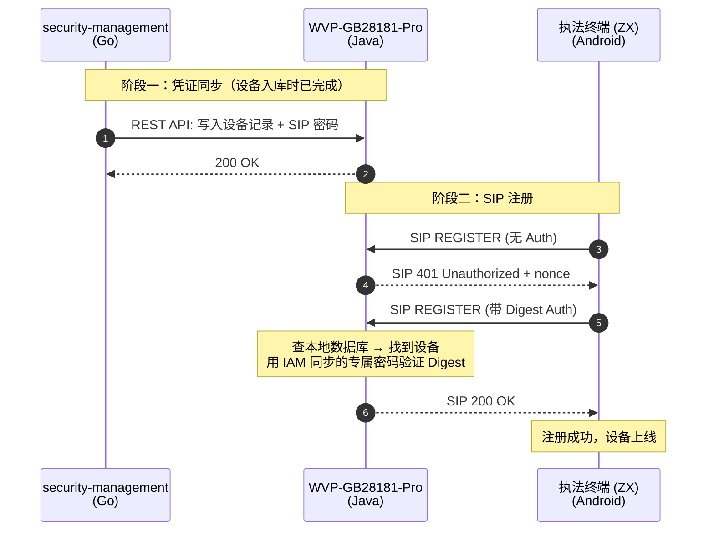

# GB28181 终端设备身份集成 — 需求规格与设计文档

> Date: 2026-05-04
> Status: Draft v8
> Changelog v8: IAM/WVP 边界厘定——§3.3.1 重试语义从"内存 5 次"升级为持久化 outbound_sync_task 队列要求（保留优先级/DLQ/重启恢复）；新增 §3.3.5 终端密码下发机制（Deferred，Phase 1 用现场写入/OTA，Phase 2+ 讨论 pickup token 拉取机制）；§3.1.3 rotation_state 表移除冗余 HA1 字段（new_ha1/previous_ha1），HA1 数据由 IAM credential 表单一持有，rotation_state 仅负责流程编排；§3.1.6 原 7 状态机拆为三维度（资产生命周期 Active/Retired/Revoked + 凭证状态 PendingSync/Active/Rotating/Revoked + 运行时连接 Online/Offline），原状态映射表保留；§5.2 sip_ha1/sip_ha1_previous 字段从 VARCHAR(32) 扩展为 VARCHAR(64) 预留 SHA-256（RFC 7616），输入校验同步接受 32/64 位 hex
> Changelog v7: Kimi 2.6 第二轮独立评审修订（架构盲点）——**P0-1** §3.1.2 添加主从复制延迟约束：REGISTER 鉴权路径强制主库读（FORCE_MASTER hint），新增配置 `wvp.gb28181.auth.force-master-on-register`；**P0-2** §3.1.3 末尾新增 A7 未激活 + 轮换双发窗口的笛卡尔积规则——双层防御（IAM 前置检查 + WVP 防御性策略链 SKIP NotActivatedStrategy 兜底）；**P0-3** §3.1.7 新增 T3-T4 时序竞态修订：24h 软双发 oldRealm fallback + 新增 `wvp_realm_transition` 表 + `RealmFallbackStrategy` 策略；**P1-1** §5.3.3 `Ha1MigrationRunner` 添加 MySQL `GET_LOCK` / PostgreSQL `pg_try_advisory_lock` 跨副本互斥；**P1-2** §4.1.1 Redis 故障降级三态状态机：A 健康 / B 故障 fail-closed / C 恢复时强制重发 challenge；nonce 编码 issue-time 实现；**P1-3** §4.1.2 威胁模型边界明确声明 7 项防御内 + 5 项显式排除；**P2-1** §5.8.2 新增 `jxt_device_state_transitions_total` 多维 Counter 用于事后溯源 + Phase 2 Kafka 事件流；**P2-2** §5.8.3 P2 告警规则与 SOP（含 `revocation-task-failed.md` 完整人工恢复手册）
> Changelog v6: GLM-5.1 外部独立评审修订——**P0-1** 移除 Flyway 依赖（WVP 不使用 Flyway），改用 WVP 原生手动 SQL 脚本机制（`数据库/2.7.4/` 目录）+ Spring Boot 启动钩子实现 HA1 迁移（§5.2/§5.3/术语表）；**P0-2** `wvp_device` 表添加 `device_type` 列（原生 schema 不含此列，§5.2 ALTER TABLE）；**P0-3** IAM 明文存储从"可选"改为"MUST"——realm 变更路径（§3.1.7）数学上要求明文密码，若明文可选将导致 realm 变更不可执行（§1.4/§4.1）；**P0-4** nc 校验补全 `NonceStore` 子系统（issue-time 写入 Redis + validation-time 检查存在性与 nc 递增，§4.1）；**P1-1** `RevocationWorker` 启动钩子重置 running 状态（§3.1.4）；**P1-2** 新增 `wvp_callback_events` 表 DDL（§3.3.2）；**P1-3** 选 storage-level TDE 路径（HA1 列保持 VARCHAR(32)，澄清"加密存储"=MySQL TDE / 表空间级加密，由 Ops/DBA 保证，§1.4/§4.1）；**P1-4** migration 已用 set-based UPDATE（§5.3.3 随 P0-1 连带处理）；**P2-1** callback API key dual-key 轮换机制（§3.3.3）；**P2-2** SQL 脚本命名空间 `-jxt-` 中缀（随 P0-1 自动消解）
> Changelog v5: Eng review 修订——A1 迁移路径明确为 WVP 自迁移脚本（§5.3.3）；A2 新增 Realm 变更路径（§3.1.7）；A3 orgCode 约束为不可变（§5.4）；A4 回调加 timestamp+nonce 防重放（§3.3.2/§3.3.3）；A7 首次下发失败 fallback（§3.1.1）；C1 双模式认证抽策略接口（§5.3.2）；C2 错误码改前缀 13xxx 避免冲突（§3.3.4）；C5 日志泄露修复列为前置 blocker（§4.1）；T1 `nc` 递增校验强制（§4.1/§5.7.1）；T2 `rotationState` 唯一约束 + 乐观锁版本号（§3.1.3）；T3 回调幂等表 `callback_events`（§3.3.2）；T4 阶段 3a 强制抽样回归（§5.3.1）；P1 批量 API 改异步 jobId（§3.3.1）；P2 双发窗口覆盖索引（§5.2）；P3 吊销 API 切分同步/异步部分（§3.1.4）；P4 5 分钟对账机制明确为 dead-letter 重放（§4.2）
> Changelog v4: CEO 评审后修订——新增部署过渡方案（§5.3）、多租户隔离策略（§5.4）、WVP Fork 维护策略（§5.5）、文件存储吊销联动（§5.6）、测试计划（§5.7）、可观测性指标（§5.8）；安全性新增 HA1 等同密码说明、MD5 协议约束说明、日志泄露修复要求；接口新增输入校验规则、批量同步端点、自动注册冲突处理；凭证轮换新增崩溃恢复；双发窗口新增启动扫描；认证优先级明确化（disabled > HA1 > 双发窗口 > 明文 > 全局 > 拒绝）；Flyway 迁移脚本具体化
> Scope: 证据级设备（执法仪、执法记录仪、取证设备）的身份生命周期管理与 SIP 认证集成
> Changelog v3: 经代码核实修正——方法名 `doAuthenticateHashedPassword`（无 Algorithm 后缀）；确认 ZX 终端因 WVP 401 始终带 `qop="auth"` 而必走 `qop=auth` 路径，`doAuthenticateHashedPassword` 需补全 `qop`/`nc`/`cnonce` 处理后才能使用；修正事件名（`DeviceRegisteredEvent` 不存在）；**明确 HA1 方案对 ZX 终端完全透明，终端代码无需任何改动**
> Changelog v2: 修正 WVP 用户认证描述；密码存储模型改为 HA1 摘要；新增设备状态机（§3.1.6）、轮换/吊销边界（§3.1.3/§3.1.4）、接口数据结构（§3.3.4）、与服务器配置下发 spec 的衔接（§4.4）

---

## 1. 需求背景

### 1.1 系统上下文

本需求涉及三个系统的协作：

| 系统 | 职责 | 技术栈 |
|------|------|--------|
| **执法终端 (ZX)** | 现场录像采集设备，通过 GB28181 SIP 协议注册到 WVP 平台，受证据链保护要求约束 | Android, C++ SIP 栈 |
| **WVP-GB28181-Pro** | GB28181 视频监控平台，负责 SIP 信令中转、设备注册认证、媒体流管理。作为 SIP Digest 认证的**执行者** | Java 21, Spring Boot |
| **security-management (IAM)** | 执法仪设备的业务管理平台，管理设备身份、用户、组织。作为设备身份的**权威来源（Source of Truth）** | Go, Gin |

### 1.2 现状问题

当前 WVP 与 security-management **认证体系完全割裂**：

| 维度 | security-management (IAM) | WVP-GB28181-Pro |
|------|--------------------------|-----------------|
| 设备认证 | 无 | SIP Digest（GB28181） |
| 用户认证 | JWT (HS256) | JWT（`JwtUtils`，HMAC 对称签名） + Spring Security Session |
| 用户存储 | PostgreSQL（多租户） | MySQL（单租户） |
| 权限控制 | RBAC | 自有权限体系 |
| 设备密码管理 | 无 | 设备专属密码 / 全局 SIP 密码 |

**核心问题**：

1. **设备身份无统一管理** — 设备的 SIP 凭证由 WVP 自行管理，IAM 不感知设备身份，无法实现设备准入控制
2. **认证体系割裂** — 用户登录 JXT 后无法无缝访问 WVP 视频功能
3. **权限不统一** — WVP 的摄像头查看、回放等操作未经 IAM 权限校验

### 1.3 需求目标

建立 **"IAM 管身份、WVP 管认证"** 的分层模型：

- **security-management** 成为设备身份的唯一权威来源（Source of Truth），负责设备生命周期管理（入库、凭证生成、吊销）
- **WVP** 继续负责 SIP Digest 协议层认证，但凭证数据由 IAM 同步下发
- 终端设备注册行为不变，仍通过 SIP REGISTER 向 WVP 注册

### 1.4 设计决策记录

| 决策 | 选择 | 理由 |
|------|------|------|
| 认证执行方 | WVP（委托模式） | SIP Digest 是 SIP 协议栈的一部分，拆到 IAM 会增加信令延迟、破坏协议完整性 |
| 凭证同步方式 | IAM 主动同步到 WVP 本地存储（Push） | 业界标准模式（类比 IMS HSS→CSCF），避免 SIP 注册时增加网络跳数，保障可用性 |
| 设备分层策略 | 证据级用专属密码，监控级用全局密码 | 证据链设备身份必须可验证；海量监控设备全局密码是合理的运维实践 |
| 凭证吊销 | IAM 立即调用 WVP API（不等定时同步） | 证据级设备丢失或作废时，必须即时生效，不能有延迟窗口 |
| 密码存储形式 | **WVP 存 HA1 摘要**（`MD5(deviceId:realm:password)`）；**IAM 同时存 HA1 + AES-GCM 加密的明文（MUST）** | SIP Digest 协议要求服务端可获取明文或 HA1。WVP 侧不存明文（避免跨服务传输明文）。**IAM 侧 P0-3**：明文存储不是可选——§3.1.7 realm 变更要求原始 password 重算 HA1（MD5 单向不可逆，无法从 HA1 恢复），若明文可选则 realm 变更路径数学上不可执行。AES-GCM + KMS 包装是电信 HSS 存储 long-term keys 的工业标准 |
| **HA1 等同密码** | HA1 是 SIP Digest 的密码等价物 — 获得 HA1 即可伪造任意 Digest 响应。因此 HA1 必须与明文密码同等保护：**加密存储（storage-level TDE / 表空间级加密，GLM-5.1 P1-3 决策）**、禁止日志输出、所有读写操作记录审计日志。**TDE 路径说明**：HA1 列保持 `VARCHAR(32)` DDL 不变；加密由 MySQL InnoDB TDE（`innodb_file_per_table=ON` + `ALTER TABLESPACE ... ENCRYPTION='Y'`）或云 RDS 的透明数据加密实现；密钥管理由 Ops/DBA 通过外部 KMS 负责。App 层无需 encrypt/decrypt 代码。**未选 app-level AES-GCM 的理由**：(a) HA1 在 SIP 认证流程中必须以明文进入 RFC 2617 响应计算，app 层加密无法避免内存明文；(b) 真实泄露风险面主要是"磁盘/备份外泄"，TDE 覆盖；(c) app-level 路径需改写 `RegisterRequestProcessor`/`DeviceLifecycleService`/`Ha1MigrationRunner` 全部 HA1 读写点，工作量 2-3 周 + 引入加密错误风险 |
| **MD5 是协议约束** | SIP Digest 使用 MD5 是 GB28181-2016 / RFC 2617 的强制规定，非本系统设计选择。MD5 的抗碰撞性已弱化（碰撞攻击成本约 $0.01/次），但 SIP Digest 的威胁模型（服务端控制 nonce + cnonce）限制了实际攻击面。若 GB28181 标准未来升级支持 SHA-256（RFC 7616），本系统应跟进迁移 |
| 不复用 Redis Desired-State | 凭证经 WVP REST API（HTTPS）同步到 WVP 关系库；不走 Redis | 服务器配置可丢失重发，凭证不可——必须强一致写入主存储；同时保持与 WVP 现有 `device.password` 字段的兼容路径 |

---

## 2. 架构设计

### 2.1 分层职责模型

```
┌─────────────────────────────────────────────────────────┐
│              security-management (IAM)                   │
│                  设备身份权威来源                          │
│                                                          │
│  ┌──────────────────────────────────────────────────┐   │
│  │ 设备身份生命周期管理                                │   │
│  │  ├─ 设备入库：生成设备 ID + 专属 SIP 密码           │   │
│  │  ├─ 设备→组织/租户归属                              │   │
│  │  ├─ 凭证轮换：更新 SIP 密码                         │   │
│  │  ├─ 设备吊销：通知 WVP 立即禁用                     │   │
│  │  └─ 设备台账：所有已注册设备的完整记录               │   │
│  └──────────────────────────────────────────────────┘   │
│                                                          │
│  ┌──────────────────────────────────────────────────┐   │
│  │ 凭证同步（Push 模式）                              │   │
│  │  ├─ 首次/新增：调 WVP API 写入设备记录 + SIP 密码   │   │
│  │  ├─ 凭证变更：调 WVP API 更新密码                   │   │
│  │  ├─ 设备吊销：调 WVP API 立即删除/禁用              │   │
│  │  └─ 兜底：定时全量同步（如每天一次）                  │   │
│  └──────────────────────────────────────────────────┘   │
└────────────────────────┬────────────────────────────────┘
                         │ WVP REST API
                         ▼
┌─────────────────────────────────────────────────────────┐
│              WVP-GB28181-Pro (SIP Server)                 │
│                  协议层认证执行者                          │
│                                                          │
│  ┌──────────────────────────────────────────────────┐   │
│  │ SIP Digest 认证（本地数据库查询）                    │   │
│  │  1. 查数据库：找到设备 → 用 IAM 同步的 HA1 验证       │   │
│  │  2. 未找到设备 → 用全局 SIP 密码验证（监控级设备）    │   │
│  │  3. 全局密码也没配 → 不需要认证（开放模式）           │   │
│  │  4. 未知设备 + 密码不匹配 → 403 Forbidden           │   │
│  └──────────────────────────────────────────────────┘   │
└─────────────────────────────────────────────────────────┘
```

### 2.2 设备分层策略

根据设备产生的数据是否进入证据链，将终端设备分为两个安全等级：

| 层级 | 适用设备 | 密码策略 | 网络环境 | 安全依据 |
|------|---------|---------|---------|---------|
| **证据级** | 执法仪、执法记录仪、取证设备 | 每台设备专属密码，由 IAM 生成和管理 | 4G/公网回传 | 数据进入法定证据链，设备身份必须可验证 |
| **监控级** | 固定摄像头、球机、NVR | 全局 SIP 密码 + 网络隔离 | 内网/专网 | 辅助性质，海量设备用全局密码是合理的运维实践 |

**分层原因**：

- **证据级设备走公网**：密码泄露风险直接暴露，且数据为法定证据，身份伪造将破坏证据链可信度
- **监控级设备在内网**：物理隔离提供额外安全层，且设备数量庞大（单区域可达数万路），逐一管理专属密码的运维成本不合理

### 2.3 业界对标

本设计遵循电信/IMS 领域成熟的身份管理架构：

| 领域 | 身份管理者 | 认证执行者 | 同步方式 |
|------|-----------|-----------|---------|
| **IMS (IP 多媒体子系统)** | HSS（用户数据服务器） | CSCF（SIP 服务器） | HSS 通过 Cx 接口推送用户数据到 CSCF |
| **企业 WiFi** | RADIUS 服务器 | 无线 AP | RADIUS 下发策略，AP 执行认证 |
| **IoT 平台** | 设备身份服务 | MQTT Broker | 身份服务管理证书，Broker 执行 TLS 认证 |
| **本系统** | security-management | WVP-GB28181-Pro | IAM 生成凭证 → 同步给 WVP → WVP 执行 SIP Digest |

---

## 3. 功能需求

### 3.1 证据级设备生命周期管理

#### 3.1.1 设备入库

**触发条件**：管理员在 security-management 中录入新执法仪/取证设备

**流程**：

1. 管理员在 IAM 中填写设备信息（设备类型、归属组织、SIM 卡号等）
2. IAM 生成设备唯一标识（设备 ID，符合 GB28181 编码规则）
3. IAM 为该设备生成专属 SIP 密码（随机强密码）
4. IAM 将设备记录写入数据库，状态为"已入库"
5. IAM 计算 HA1 摘要（`MD5(deviceId:realm:password)`，realm 与 WVP `sipConfig.domain` 一致）
6. IAM 调用 WVP API 将设备 ID + HA1 同步到 WVP，**等待 200 返回**后才进入下一步
7. IAM 将设备 ID + SIP 明文密码下发给执法终端（明文仅为设备侧 SIP 栈生成 Digest 响应使用，终端侧可选存 HA1）

**前置约束**：步骤 6 未返回成功前，IAM **不得**执行步骤 7。违反此约束会导致终端烧了密码但 WVP 还查不到记录，首注进入 401→403 重试退避循环。

**步骤 7 下发失败 fallback（A7）**：当 IAM 在 T+24h 内仍未收到终端对新密码的 ACK（如 OTA 通道断、终端离线）：

- IAM 将设备状态标记为 `同步待重试`（§3.1.6），不切换为 `已下发`
- IAM 调 WVP `PUT /api/sy/device/{id}/activation` 将设备置为 **未激活**（`activated=false`）
- 未激活设备的 REGISTER 在 WVP 侧返回 403（即使 HA1 正确），防止"WVP 已认可、但终端还未烧入"窗口期被攻击利用
- 终端成功 ACK 后，IAM 调 `PUT /api/sy/device/{id}/activation` 置 `activated=true`，首次 REGISTER 通过认证后自动激活

**设备 ID 编码规则**（GB/T 28181-2016，总长 20 位）：

```
编码格式：中心编码(8位) + 行业编码(2位) + 类型编码(3位) + 序号(7位)
示例：41010500001320000001
         └─────┬─────┘├─┘└─┬─┘└────┬────┘
              中心:41010500   业:00 型:132   序号:0000001
```

| 类型编码 | 含义（GB/T 28181-2016 附录 D） |
|----------|--------------------------------|
| 132 | 视频通道（IPC/个人设备默认主通道） |
| 131 | 设备本体（执法仪设备体） |
| 137 | 辅助通道 |

#### 3.1.2 设备注册

**触发条件**：执法终端通电后向 WVP 发起 SIP REGISTER

**流程**：



**关键特性**：

- **ZX 终端完全不受影响**：HA1 是 Digest 认证中的中间计算值（`HA1 = MD5(deviceId:realm:password)`）。ZX 终端内部计算 Digest 响应时本来就先算 HA1 再算最终 response，对终端而言 WVP 存的是明文还是 HA1 完全透明。**ZX 终端代码无需任何改动。**
- WVP 的 SIP Digest 认证调用点**无需修改** `RegisterRequestProcessor` 主流程—仅需将 `doAuthenticatePlainTextPassword(request, password)` 替换为同类中已存在的 `doAuthenticateHashedPassword(request, ha1)`（注意：实际方法名无 `Algorithm` 后缀），入参从 `device.password`（明文）调整为 `device.sipHa1`（摘要）
- **兼容性约束（已确认）**：ZX 终端 C++ SIP 栈（`libnative-lib.so`，闭源自研）内置两条摘要计算路径：带 `qop=auth` 时计算 `MD5(HA1:nonce:nc:cnonce:qop:HA2)`，不带时计算 `MD5(HA1:nonce:HA2)`。由于 WVP 的 `generateChallenge` 在 401 中**始终包含** `qop="auth"`，终端**必定走 `qop=auth` 路径**。因此 **`doAuthenticateHashedPassword` 必须先补全 `qop`/`nc`/`cnonce` 处理才能用于 HA1 校验**——当前实现仅做了简化版 digest 计算，不兼容 `qop=auth` 响应。补全后 WVP 拿与终端相同的 HA1 计算出相同的 response，注册即可成功。
- 注册过程中**不涉及 IAM 的网络调用** — 凭证已在入库阶段同步到 WVP 本地
- 即使 IAM 临时不可用，已同步凭证的设备仍可正常注册

**竟态窗口**：若终端在 IAM 同步完成前发起首注（参§3.1.1 前置约束，正常流程不会发生），WVP 返回 401→403，终端进入 SIP REGISTER 指数退避（首次 1s、2s、4s…，上限 60s）。IAM 同步完成后的下一个重试窗口可成功。

**P0-1 主从复制延迟约束（Kimi 2.6 修订）**：

WVP 数据库若启用读写分离（如 ShardingSphere、ProxySQL、阿里云 RDS 主从架构），存在 read-after-write 一致性窗口（典型 50-500ms，跨可用区可达 1-5s）。GLM-5.1 + Eng review 均未发现：

```
T0:    IAM POST /api/sy/device → WVP 主库 INSERT sip_ha1
T0+10ms: IAM 收到 200 OK，IAM 立即下发明文密码到终端
T0+50ms: 终端收到密码，发起 REGISTER → WVP
T0+50ms: WVP 查从库，从库尚未同步 → sip_ha1 IS NULL → 返回 403
T0+200ms: 主从同步完成
终端：进入 1s/2s/4s... 退避，首注延迟 1-60s
用户体验："设备刚入库就注册失败"
```

**强制约束（必须实现）**：

1. **REGISTER 鉴权路径必须读主库**（强一致读）。技术实现按 WVP 数据库选型分两条路径：
   - **MySQL + ShardingSphere**：在 `RegisterRequestProcessor.deviceService.getDevice()` 调用点的 MyBatis Mapper 上加 `@DataSource("master")` 注解强制路由主库；或开启 ShardingSphere 的 `HintManager.getInstance().setMasterRouteOnly()` hint
   - **PostgreSQL + 流复制**：在调用前 `SET SESSION CHARACTERISTICS AS TRANSACTION READ WRITE` 强制走主库连接池（pgpool-II / PgBouncer 路由）
   - **无读写分离（单实例）**：本约束自动满足，无需改动

2. **凭证写入路径同样必须走主库**（避免脏读）。`POST /api/sy/device` 与 `PUT /api/sy/device/{id}/credential` 在 service 层显式启用 `@Transactional(propagation = REQUIRED, readOnly = false)`，禁止读从库后写主库的"半同步"事务。

3. **新增配置项** `wvp.gb28181.auth.force-master-on-register: true`（默认）。设为 `false` 仅在已知无主从延迟的环境下使用，并记录运维约束。

4. **回归测试**：§5.7.2 已有"模拟 1s 从库延迟 → IAM POST 后立即 REGISTER → 应走主库"测试（A5），本修订使其从测试覆盖项升级为**架构约束**。

**为什么不用"IAM 侧 100ms 强制延迟"**：增加首注延迟用户体验差；且无法处理跨可用区 1-5s 同步延迟；不可扩展。强制读主库是根因解。

#### 3.1.3 凭证轮换

**触发条件**：管理员主动触发密码轮换，或系统按策略周期性轮换

**轮换策略（选型）**：为避免轮换期间执法证据回传中断，采用​**老新密码双发窗口**​：

```
T0:  IAM 生成 newPassword（同时保留 oldPassword）
     IAM 更新本地：{passwordCurrent: new, passwordPrevious: old, rotateAt: T0}
T1:  IAM 调 WVP `PUT /device/{id}/credential`（下发双 HA1）
     WVP 本地同时接受 newHa1 / oldHa1，REGISTER 时任一匹配即过
T2:  IAM 以安全通道下发 newPassword 到终端，终端 ACK
T3:  IAM 调 WVP `DELETE /device/{id}/credential/previous` 关闭双发窗口
```

**双发窗口最大时长**：72 小时（可配）。超过则强制 T3，未 ACK 的设备将以吊销理由上报告警。

**应急轮换**（如密码泄露）：跳过双发窗口，直接执行 T1→T3，旧密码立即失效。该路径需管理员明示选择（会导致未及时下发新密码的终端下线、本地缓存证据需后续补传）。

**轮换崩溃恢复**：IAM 必须将轮换状态持久化到数据库。表结构仅跟踪流程编排，不存储 HA1 值（HA1 数据由 IAM 的 credential 表持有，单一数据源）：

```sql
CREATE TABLE rotation_state (
    device_id       VARCHAR(20) PRIMARY KEY,   -- 唯一约束：同一设备同一时刻只能有一个进行中的轮换
    current_step    VARCHAR(2) NOT NULL,       -- T0/T1/T2/T3
    started_at      TIMESTAMPTZ NOT NULL,
    deadline        TIMESTAMPTZ NOT NULL,
    version         BIGINT NOT NULL DEFAULT 0, -- 乐观锁版本号，防止并发轮换双写
    updated_at      TIMESTAMPTZ NOT NULL
);
-- HA1 值（ha1 / ha1_previous / ha1_previous_until）存储在 IAM 的 credential 表中
-- rotation_state 仅负责流程编排（当前步骤、超时、并发控制）
-- 崩溃恢复时：读 rotation_state.current_step 确定恢复动作，
--   读 credential 表获取实际 HA1 值用于同步 WVP
```

**并发轮换保护（T2）**：IAM 侧轮换入口必须用 `INSERT ... ON CONFLICT (device_id) DO NOTHING`（PostgreSQL）或显式 `SELECT ... FOR UPDATE`。若记录已存在，返回 409「轮换进行中」而非新建第二套 HA1。所有状态推进操作须带版本号：`UPDATE rotation_state SET current_step=?, version=version+1 WHERE device_id=? AND version=?`，`RowsAffected=0` 说明被并发修改，调用方重试读取。

IAM 重启后扫描未完成的轮换记录：

- 停在 T0（未同步到 WVP）：继续 T1
- 停在 T1（WVP 已接受双 HA1，终端未收到新密码）：继续 T2
- 停在 T2（终端已下发，未关闭双发窗口）：继续 T3
- 超过 deadline 的轮换：强制执行 T3 并告警

**P0-2 A7 未激活 + 轮换双发窗口的组合状态规则（Kimi 2.6 修订）**：

GLM-5.1 + Eng review 均独立评审了 A7 fallback（§3.1.1）与轮换状态机（§3.1.3），但未做笛卡尔积。Kimi 2.6 发现下列组合死锁：

```
T1:  IAM 调 WVP credential API，WVP 同时接受 newHa1 + oldHa1（双发活跃）
T1+10s: IAM 下发新密码到终端，终端 ACK 丢失（OTA 信道闪断）
T+24h: IAM A7 fallback 触发：调 WVP PUT activation=false
此时 wvp_device 行：
  sip_ha1 = newHa1
  sip_ha1_previous = oldHa1（双发活跃）
  activated = false  ← A7 设的
终端：仍在线，用 oldPassword 触发的 oldHa1 重注
WVP 优先级链：DisabledStrategy → NotActivatedStrategy(在此 拦截 → 403) → Ha1Strategy（被绕过）
终端：被迫切到新密码（但从未收到）→ 永久 403 离线
```

**修复（双层防御）**：

**层 1 — IAM 侧前置检查（强约束）**：

A7 fallback 触发前必须检查 `rotation_state`：

```python
# IAM 调 PUT /api/sy/device/{id}/activation 之前
def trigger_a7_fallback(device_id):
    rotation = get_rotation_state(device_id)
    if rotation and rotation.current_step in ('T0', 'T1', 'T2'):
        # 轮换进行中，禁止 A7 fallback
        raise IllegalStateException(
            "Cannot deactivate device while rotation in progress. "
            "Either wait for rotation to complete (T3), or rollback rotation first."
        )
    # 仅当 rotation_state 不存在 或 为 T3（已完成）时允许 A7
    iam_client.deactivate(device_id)
```

WVP `PUT /activation` 接口对应增加服务端校验：若设备 `sip_ha1_previous IS NOT NULL`（双发活跃中），拒绝 `activated=false` 请求，返回 `409 Conflict, code=ROTATION_IN_PROGRESS`。

**层 2 — WVP 侧防御性策略链（兜底）**：

即使 IAM bug 导致两个状态同时成立，WVP 优先级链调整规则：

```
原始链（v6）：
  DisabledStrategy(1) → NotActivatedStrategy(2) → Ha1Strategy(3) → Ha1PreviousStrategy(4) → ...

调整链（v7）：
  DisabledStrategy(1)
  → NotActivatedStrategy(2)：检查 activated=false
      ├─ 若 sip_ha1_previous IS NULL（无双发）→ 拒绝（403）
      └─ 若 sip_ha1_previous IS NOT NULL（双发活跃）
            → SKIP（不拦截，继续下一策略）
            → 同时记录审计日志：
               log.warn("[CredentialState] device {} has activated=false but rotation in progress; "
                        "letting Ha1Strategy try", deviceId)
            → 增量指标 jxt_a7_rotation_conflict_total 触发告警
  → Ha1Strategy(3) / Ha1PreviousStrategy(4) → ...
```

**为什么允许 SKIP 而非直接拒绝**：设备能用 oldHa1 注册成功本身就证明终端在线且使用旧密码，A7 的悲观假设错误，此时强行拒绝会导致设备永久失联。让 Ha1PreviousStrategy 通过即可恢复设备，同时审计告警通知 IAM 调查"为什么 activated=false 但设备在线"。

**新增指标**：
- `jxt_a7_rotation_conflict_total`：activated=false + 双发窗口同时成立的次数（任意非零即异常，触发 P1 告警）
- `jxt_a7_skip_recovery_total`：因层 2 兜底而恢复注册的设备数（用于评估 IAM 层 1 检查是否可靠）

**单元测试**：`A7RotationConflictTest` 覆盖：
1. 正常路径：A7 fallback 触发时 rotation_state 不存在 → IAM 调用成功
2. 冲突路径：A7 fallback 触发时 rotation_state=T1 → IAM 调用应返回 409
3. 兜底路径：直接构造 wvp_device 行（`activated=false` + `sip_ha1_previous` 非空），用 oldHa1 注册 → 应通过 + 审计告警
4. 混合路径：A7 fallback 后回滚轮换至 T3 → activated 仍为 false → 正常 NotActivatedStrategy 拒绝

#### 3.1.4 设备吊销

**触发条件**：设备丢失、被盗、退役

**流程（同步部分 + 异步部分，P3）**：

1. 管理员在 IAM 中标记设备为"已吊销"
2. IAM **立即**调用 WVP API `DELETE /device/{id}` 禁用（非物理删除，参下）
3. WVP **同步部分**（在 API 响应前完成，≤ 200ms）：
   - 标记 `device.disabled = true`、清空 `sipHa1` 和 `sipHa1Previous`
   - 写入 `revocation_task` 表（见下），包含 `deviceId` + 需切流的 `streamId` 列表
   - 返回 200 OK 给 IAM
4. WVP **异步部分**（由 worker 池处理，SLA ≤ 5s，覆盖 §4.1 要求）：
   - 若该设备当前在线，WVP 发送 SIP BYE 终止媒体会话（若离线则跳过）
   - 调用 ZLM `close_streams` 切断 RTP（避免吊销后继续推送造成证据污染）
   - 完成后更新 `revocation_task.status = completed`，记录 `completed_at`
   - 发布 `DeviceRevocationCompletedEvent`，可观测指标 `jxt_revocation_latency_ms` 打点
5. 设备再次尝试 SIP REGISTER 时，因 `disabled=true` 被直接拒绝（同步部分生效即可）
6. IAM 记录审计日志

**wvp_revocation_task 表（WVP 侧持久化 job queue，表名与 WVP 原生前缀 `wvp_` 一致）**：

```sql
CREATE TABLE wvp_revocation_task (
    id              BIGINT PRIMARY KEY AUTO_INCREMENT,
    device_id       VARCHAR(20) NOT NULL,
    streams_json    TEXT,                       -- 需切的 ZLM 流 ID 列表
    status          VARCHAR(16) NOT NULL,       -- pending/running/completed/failed
    attempts        INT NOT NULL DEFAULT 0,
    last_error      TEXT,
    created_at      DATETIME NOT NULL,
    completed_at    DATETIME
);
CREATE INDEX idx_wvp_revocation_status ON wvp_revocation_task(status, created_at);
```

**关键不变式**：同步部分持久化 `disabled=true` 失败则事务回滚，不返回 200；异步部分失败可重试最多 3 次，超限进入 `failed` 状态告警。**DB 标记生效不依赖异步部分成功**——即使 worker 暂停，后续 REGISTER 仍被拒。

**P1-1 启动钩子（GLM-5.1 修订）**：WVP 崩溃/重启时，处于 `running` 状态的 task 会永久 stuck（没人会再把它推进到 completed/failed）。`RevocationWorker` 必须监听 `ApplicationReadyEvent`，在启动瞬间执行：

```sql
UPDATE wvp_revocation_task
SET status = 'pending',
    attempts = attempts + 1,
    last_error = CONCAT(COALESCE(last_error, ''), ' [recovered from stale running on startup]')
WHERE status = 'running';
```

Java 代码示例：

```java
@Component
@Slf4j
public class RevocationWorker {
    @Autowired private JdbcTemplate jdbc;

    /** P1-1 启动恢复：重置 stale running 任务为 pending，防止 WVP 重启后任务永久 stuck */
    @EventListener(ApplicationReadyEvent.class)
    @Order(1)  // 优先于 Ha1MigrationRunner
    public void recoverStaleRunningTasks() {
        int recovered = jdbc.update(
            "UPDATE wvp_revocation_task SET status='pending', attempts=attempts+1, " +
            "last_error=CONCAT(COALESCE(last_error,''),' [recovered from stale running on startup]') " +
            "WHERE status='running'");
        if (recovered > 0) {
            log.warn("[RevocationWorker] recovered {} stale running tasks", recovered);
            // 指标：jxt_revocation_task_recovered_total += recovered
        }
    }
}
```

**为什么不用 heartbeat 超时 + lock**：分布式 worker 方案复杂度过高；本 spec Phase 1 假设单 WVP 实例 + 单 worker 池。若未来多实例部署，再引入 `locked_by` + `locked_until` 字段。

**为什么是禁用而不是物理删除**：设备吊销后，其历史录像、报警、通道关联关系仍需可追溯。物理删除会造成外键断裂与证据链丢失。

**在途会话处理表**：

| 会话状态 | WVP 动作 | 底层依赖 |
|---------|---------|---------|
| 设备在线、无点播 | 发 SIP MESSAGE 通知（可选）后从在线表移除 | 无 |
| 点播/实时推流中 | 对设备发 BYE；调 `mediaServerService.closeStreams()` | ZLM HTTP API |
| 设备离线 | 仅更新数据库标记 | 无 |

**关键要求**：吊销操作**不能等定时同步**，必须主动推送即时生效（业务要求 ≤ 5s 生效，参 4.1）。

#### 3.1.5 设备状态同步（WVP → IAM）

**触发条件**：设备在 WVP 上线或离线

**优先级**：**Phase 1 必选**（v1 可选 → v2 升级为必选）—吊销场景下仅靠每日全量对账会导致丢失设备被盗后的状态可见性迟随。

**方式**：

- WVP 通过 HTTP 回调通知 IAM 设备状态变更（online / offline / register-failed / revoked-rejected）
- IAM 更新设备状态并记录审计日志
- 回调失败重试：指数退避，最多 5 次；最终失败进入 WVP 本地 dead-letter 队列供对账拾取

**对账心跳周期**：从原「每日」收紧到「**每 5 分钟**」以兑现 4.1 吊销 ≤ 5s 的说法（实时生效靠推，对账仅是兑底）。

#### 3.1.6 设备状态模型（IAM 侧，三维度分离）

v8 修订：原 7 状态机将资产生命周期、凭证投递进度、运行时连接三个关注点混合在单一状态字段中，导致语义歧义（如"离线"是生命周期事件还是瞬时网络抖动？"已入库"描述设备还是凭证？）。改为三维度独立追踪：

**维度 1 — 资产生命周期（PhysicalDevice.lifecycle_status）**：

由 IAM 管理员操作驱动，描述设备作为资产的在役状态。

```
Active ──管理员退役──▶ Retired（终态，计划内报废/淘汰）
Active ──紧急吊销──▶ Revoked（终态，丢失/被盗/泄密）
Active ──暂停使用──▶ Suspended（可恢复）
Suspended ──恢复──▶ Active
Suspended ──退役/吊销──▶ Retired / Revoked
```

| 状态 | 语义 | 允许操作 |
|------|------|---------|
| Active | 在役，可正常使用 | 退役、吊销、暂停、领用、轮换凭证 |
| Suspended | 暂停使用（如配合调查、待检修） | 恢复、退役、吊销 |
| Retired | 退役（终态），计划内 | 仅查询历史 |
| Revoked | 吊销（终态），紧急 | 仅查询历史 |

**维度 2 — 凭证状态（PlatformCredential.status）**：

由 IAM 同步流程驱动，描述凭证在 IAM→WVP→终端 投递管线中的位置。

```
PendingSync ──WVP push 成功──▶ Active ──发起轮换──▶ Rotating ──T3 完成──▶ Active
PendingSync ──push 失败重试──▶ PendingSync（退避重试）
任意 ──吊销──▶ Revoked（终态）
```

| 状态 | 语义 | 对应原 7 状态 |
|------|------|-------------|
| PendingSync | IAM 已生成凭证，等待推送到 WVP（或推送失败待重试） | 已入库 / 同步待重试 |
| Active | WVP 已落库 HA1，终端可注册 | 已下发 |
| Rotating | 凭证轮换中（rotation_state.current_step = T0-T3） | 轮换进行中 |
| Revoked | 凭证已吊销（终态） | 已吊销 |

**维度 3 — 运行时连接状态（WVP 回调驱动）**：

由 WVP 通过 §3.1.5 回调实时更新到 IAM，描述设备当前是否连接到 WVP。这不是持久化生命周期状态，而是瞬时运行时投影。

| 状态 | 触发 | 说明 |
|------|------|------|
| Online | WVP 回调 `device.online` | 终端 SIP REGISTER 成功 |
| Offline | WVP 回调 `device.offline` | 心跳超时或主动注销 |
| Unknown | 无回调记录（从未上线或回调丢失） | 对账补齐 |

**三维度组合示例**：

| 场景 | lifecycle | credential | runtime |
|------|-----------|-----------|---------|
| 刚入库，WVP 还没同步 | Active | PendingSync | Unknown |
| WVP 已同步，终端还没注册 | Active | Active | Unknown/Offline |
| 终端正常在线 | Active | Active | Online |
| 凭证轮换中，终端仍在线 | Active | Rotating | Online |
| 设备被盗，紧急吊销 | Revoked | Revoked | Offline |
| 设备退役（计划内），先退役再清理凭证 | Retired | Revoked | Offline |

**与原 §3.1.6 的映射**：

| 原 7 状态 | lifecycle | credential | runtime |
|----------|-----------|-----------|---------|
| 已入库 | Active | PendingSync | Unknown |
| 同步待重试 | Active | PendingSync (retry) | Unknown |
| 已下发 | Active | Active | Unknown/Offline |
| 在线 | Active | Active | Online |
| 离线 | Active | Active | Offline |
| 轮换进行中 | Active | Rotating | Online/Offline |
| 已吊销 | Revoked | Revoked | Offline |

**WVP 侧行为不变**：上述状态模型是 IAM 内部的多维度追踪。WVP 侧仍通过自身的 `disabled` / `activated` / `sipHa1` 字段控制 REGISTER 行为（参 §5.3.2 策略链），不受 IAM 状态模型变更影响。IAM 吊销设备时同步调用 WVP DELETE API 设置 `disabled=true`，WVP 侧行为完全由 WVP 本地数据驱动。

#### 3.1.7 Realm 变更路径（A2）

**背景**：HA1 = `MD5(deviceId:realm:password)` 绑死 realm。当租户的 WVP 实例 `sipConfig.domain` 变更（业务重组、合规要求、SIP 域迁移），该 WVP 实例下**所有设备的 HA1 全部作废**。

**触发条件**：

- 租户主动申请 realm 变更（如统一中心编码）
- WVP 实例迁移到新 SIP 域
- 合规要求调整

**流程（全员强制轮换，复用 §3.1.3 双发窗口机制）**：

```
T0:  IAM 接收 realm 变更通知，锁定该租户下所有证据级设备（禁止单点轮换）
T1:  IAM 为每台设备生成 newHa1_newRealm = MD5(deviceId:newRealm:oldPassword)
     （密码不变、仅换 realm，对终端完全透明）
T2:  IAM 批量调用 WVP `PUT /api/sy/device/{id}/credential`
     WVP 同时接受 oldHa1_oldRealm / newHa1_newRealm（双发）
T3:  WVP 在 `sipConfig.domain` 切换瞬间启用 newRealm 发 401 challenge
     已在线终端短连接断开 → 重新 REGISTER（用 newRealm 触发的 Digest）→ newHa1_newRealm 验证通过
T4:  观察 24h，未上线设备通过离线通道（工作人员现场对接）触发 REGISTER
T5:  IAM 调 WVP 关闭双发窗口，清除 oldHa1_oldRealm
```

**关键约束**：
- realm 变更期间 IAM 拒绝单设备的凭证轮换操作（避免两层轮换交织）
- 双发窗口最大 72h（同 §3.1.3）；超时未上线的设备进入 `同步待重试` 状态，由人工现场处理
- 变更过程生成的所有 HA1 计算**必须由 IAM 完成**（IAM 为权威来源），WVP 不做 realm 变换逻辑

**P0-3 T3-T4 时序竞态修订（Kimi 2.6）**：

原流程 T3 描述"WVP 在 `sipConfig.domain` 切换瞬间启用 newRealm 发 401 challenge"，但**未考虑 T3 时刻设备恰好处于离线/重连过渡态**：

```
T3-1ms: 设备 A 在线，使用 oldRealm 计算的 HA1
T3:     WVP 重启 sipServer 切到 newRealm（瞬间）
T3+50ms: 设备 A 网络抖动短暂断连
T3+5s:  设备 A 重连，发 REGISTER（无 Auth）
T3+5s:  WVP 返回 401 + nonce + realm=newRealm
T3+5.1s: 设备 A：缓存的 realm 仍是 oldRealm（终端实现细节）
                  → 用 oldRealm 计算 HA1_old → 发 response
T3+5.2s: WVP：用 newRealm 校验，response 不匹配 → 403
设备 A：进入指数退避（首次 1s、2s、4s...，上限 60s）
72h 双发窗口期内，设备退避层层加深，最终被误判为"未上线"被人工处理
```

**根本原因**：GB28181 终端 SIP 栈对 `realm` 字段的缓存行为不可预测（取决于终端 SIP 栈实现，ZX 终端 C++ 栈未公开此细节），WVP 发 newRealm challenge 时终端有概率仍用 oldRealm 计算 response。

**修复（24h 软双发 oldRealm fallback）**：

将原流程 T3-T4 段升级为：

```
T3:    WVP `sipConfig.domain` 切换到 newRealm
       同时记录 wvp_realm_transition 表：{old_realm, new_realm, t3_at, soft_fallback_until = T3 + 24h}
T3+:   WVP 401 challenge 始终使用 newRealm（终端预期看到的）
       但 WVP 校验 response 时：
         步骤 a: 用 newHa1_newRealm 校验 → 匹配则 200 OK
         步骤 b: 若步骤 a 失败 且 当前在 soft_fallback_until 之前
                → 尝试用 oldHa1_oldRealm 校验
                → 若匹配，记录指标 jxt_realm_oldrealm_fallback_total 并放行 200 OK
                → 同时下发 UPDATE 提示：本次 200 OK 后通知终端硬刷 realm 缓存
                  （SIP 协议层无强制刷新机制，但通过 Subsequent challenge 可强制）
T3+24h: soft_fallback_until 到期，禁用 oldRealm fallback
        未上线设备进入"同步待重试"，按原流程 T4 处理
T5（原 T5）:    72h 后强制 T3，关闭 newHa1 + oldHa1 双发，仅保留 newHa1
```

**新增表 `wvp_realm_transition`**（每 realm 切换一行历史，便于审计）：

```sql
CREATE TABLE wvp_realm_transition (
    id                  BIGINT      AUTO_INCREMENT PRIMARY KEY,
    old_realm           VARCHAR(64) NOT NULL,
    new_realm           VARCHAR(64) NOT NULL,
    t3_at               DATETIME    NOT NULL COMMENT 'T3 切换瞬间',
    soft_fallback_until DATETIME    NOT NULL COMMENT 'T3 + 24h，过期则禁用软双发',
    closed_at           DATETIME    DEFAULT NULL COMMENT 'T5 关闭双发的时间戳',
    operator            VARCHAR(32) NOT NULL COMMENT '执行 realm 变更的运维操作员',
    INDEX idx_active (closed_at)
) COMMENT='realm 变更历史，支持 24h 软双发期内 oldRealm fallback 校验';
```

**WVP 侧策略链插入新策略 `RealmFallbackStrategy`**（仅在 realm 变更窗口期生效）：

```
策略链（v7 调整）：
  DisabledStrategy(1) → NotActivatedStrategy(2) → Ha1Strategy(3) → Ha1PreviousStrategy(4)
  → RealmFallbackStrategy(5)   ← 新增：仅当 wvp_realm_transition 存在 closed_at IS NULL 行且当前 < soft_fallback_until 时才尝试
  → PlaintextStrategy(6) → GlobalPasswordStrategy(7)
```

**为什么不让设备主动刷 realm**：GB28181 协议无标准刷新机制；ZX 终端是闭源栈，无法依赖；自研刷新指令需所有终端厂商协同（不现实）。WVP 侧 24h 软容忍是 vendor-neutral 解。

**为什么不延长到 72h**：与原 §3.1.3 双发窗口对齐避免概念混乱；实际 T3-24h 已覆盖绝大多数终端的网络抖动场景（典型重连周期 < 1h）；剩余 < 24h 内未上线的设备更可能是"真离线"（电量耗尽、设备故障），人工现场处理更合适。

**关键约束**：
- realm 变更期间 IAM 拒绝单设备的凭证轮换操作（避免两层轮换交织）
- 双发窗口最大 72h（同 §3.1.3）；超时未上线的设备进入 `同步待重试` 状态，由人工现场处理
- 变更过程生成的所有 HA1 计算**必须由 IAM 完成**（IAM 为权威来源），WVP 不做 realm 变换逻辑

**Phase 1 是否必做**：**否**。若 Phase 1 落地时 realm 稳定，本节作为"未来变更预案"存在。实际执行推迟到 realm 首次变更需求发生时。但**P0-3 修订必须随本 spec 落地**——即设计阶段就明确 24h 软双发机制，避免实施 realm 变更时再临时打补丁。

### 3.2 监控级设备管理

监控级设备（固定摄像头、球机等）继续使用 WVP 的全局 SIP 密码注册，但 IAM 仍维护设备台账：

- **设备发现**：通过 WVP 回调或定时同步获取已注册设备列表
- **设备台账**：IAM 记录设备 ID、设备类型、所属组织、首次注册时间
- **不强制专属密码**：监控级设备使用全局 SIP 密码是合理的运维实践

### 3.3 IAM ↔ WVP 接口规范

**现状核实**：WVP 现有 `/api/sy/*`（`CameraChannelController`）仅提供摄像头查询/PTZ/录像 URL 查询等能力，**不含设备 CRUD 与凭证管理**。本 spec 定义的接口需在 WVP 侧新增。

#### 3.3.1 IAM → WVP（凭证同步）

路径前缀 `/api/sy/device`（复用现有 `SignAuthenticationFilter` 签名链）。

| 操作 | Method | Path | 语义 |
|------|--------|------|------|
| 创建设备 | POST | `/api/sy/device` | 写入设备记录 + HA1。设备已存在返回 409。默认 `activated=true`（可由入库流程显式传 `false` 进入 A7 fallback 路径） |
| 覆盖升级 | PUT | `/api/sy/device/{deviceId}` | 幂等。记录存在则全量替换，不存在则创建 |
| 更新凭证 | PUT | `/api/sy/device/{deviceId}/credential` | 仅更新 HA1；支持双 HA1（newHa1 + previousHa1）以实现§3.1.3 双发窗口 |
| 关闭双发 | DELETE | `/api/sy/device/{deviceId}/credential/previous` | 清空 previousHa1，关闭双发窗口 |
| **激活切换** | PUT | `/api/sy/device/{deviceId}/activation` | **新增（A7）**：Body `{"activated": true\|false}`。未激活设备即使 HA1 正确 REGISTER 也返回 403 |
| 禁用设备 | DELETE | `/api/sy/device/{deviceId}` | 逻辑禁用（§3.1.4）：标记 disabled、清空 HA1、切断在途会话 |
| 查询设备 | GET | `/api/sy/device/{deviceId}` | 返回设备状态、是否启用、是否激活、是否在双发窗口、最后注册时间 |

**幂等与重试语义**：

- POST 创建冲突返回 409；IAM 重试遇 409 需改调 PUT 全量覆盖
- PUT/DELETE 均为幂等：重复调用返回 200 且不变更状态
- 服务器内部错误（5xx）IAM 必须通过持久化重试队列处理，不允许仅内存重试（见下）

**IAM 侧持久化重试队列（outbound_sync_task）**：

IAM 对 WVP 的所有凭证同步调用（入库/轮换/吊销/Realm 变更/激活切换）必须经过本地持久化任务表，不能仅做内存中重试。理由：

| 场景 | 内存重试（旧方案） | 持久化任务队列（要求） |
|------|-----------------|-------------------|
| IAM 在重试过程中重启 | 重试丢失，设备进入"同步待重试"人工介入 | 任务持久化在 DB，重启后 worker 继续 |
| WVP 宕机超过 ~30s | 5 次用完（~31s），同步永久失败 | 重试窗口扩展到 24h，退避到 30min 间隔 |
| 吊销 vs 入库同等优先级 | 相同重试策略，吊销无特殊处理 | 吊销走 `priority=high`，worker 优先消费 |
| 永久失败无上下文 | 设备状态变"同步待重试"，丢失错误详情 | 进入 DLQ，保留 last_error + 全部重试历史 |

**IAM 侧必须实现的最低要求**（表结构、worker 实现由 IAM 设计文档定义）：

1. 每次凭证变更操作写入本地任务表（同事务），事务提交后 worker 可见
2. 同步触发 worker 调用下游 API（可同进程内调用）
3. 成功（200）→ 标记 `completed`，IAM 主流程进入下一步
4. 失败 → `status = pending`，后台 worker 按指数退避重试（1s → 5s → 30s → 5min → 30min）
5. 超过 deadline（默认 24h）仍失败 → 进入 DLQ 并触发告警，需人工介入
6. 支持优先级：吊销类操作 `priority=high`（worker 优先消费），入库/轮换 `priority=normal`
7. 幂等键（`device_uid + operation + version`）保证同一操作不重复写入任务
8. IAM 重启后 worker 自动恢复 pending 任务（扫描 `status=pending AND next_attempt_at < NOW()`）

**输入校验规则**：

| 字段 | 校验 | 不合规返回 |
|------|------|-----------|
| deviceId | 20 位纯数字，符合 GB28181 编码规则 | 400 (`code=13001`) |
| realm | 非空，与 `sipConfig.domain` 一致 | 400 (`code=13001`) |
| sipHa1 | 32 位或 64 位小写十六进制字符（MD5=32, SHA-256=64） | 400 (`code=13001`) |
| deviceType | 枚举值 `evidence` / `monitor` | 400 (`code=13001`) |
| 全局 | 请求体 ≤ 4KB；同一 IP 每分钟 ≤ 60 次 | 429 / 413 |

**自动注册设备冲突处理**：

当 IAM 调用 `POST /api/sy/device` 创建设备时，若 deviceId 已存在（由全局 SIP 密码自动注册的监控级设备）：
- 返回 409 + 现有设备信息（`deviceType: "monitor"`）
- IAM 可选择调 `PUT /api/sy/device/{deviceId}` 升级为证据级（替换 sipHa1，保留在线状态）
- 或放弃创建，保留为监控级设备

**批量同步端点（P1：改为异步 jobId 模型）**：

| 操作 | Method | Path | 语义 |
|------|--------|------|------|
| 批量提交 | POST | `/api/sy/device/batch` | 接收设备数组（上限 500 条）。**立即返回 202 + jobId**，后台异步处理，单条失败不阻塞 |
| 查询结果 | GET | `/api/sy/device/batch/{jobId}` | 查询批处理作业状态和逐条结果 |

**为什么异步**：单条 INSERT 约 3-5ms，500 条串行 ~2s；即使批量 INSERT，触及索引维护仍接近 §4.3 "≤ 1 秒" 边界。异步化使单次 API 返回时间稳定在 50ms 内，后台 worker 池并发处理（默认 10 workers），可观测指标 `jxt_batch_sync_duration_ms` 跟踪 P99。

请求体（POST）：
```json
{
  "devices": [
    { "deviceId": "...", "realm": "...", "sipHa1": "..." },
    ...
  ]
}
```

响应体（POST 202）：
```json
{
  "code": 0,
  "msg": "accepted",
  "data": {
    "jobId": "batch-7f3a9c2b",
    "total": 500,
    "statusUrl": "/api/sy/device/batch/batch-7f3a9c2b"
  }
}
```

响应体（GET 查询结果，完成时）：
```json
{
  "code": 0,
  "msg": "completed",
  "data": {
    "jobId": "batch-7f3a9c2b",
    "status": "completed",
    "startedAt": "2026-05-02T10:00:00Z",
    "completedAt": "2026-05-02T10:00:02Z",
    "total": 500,
    "succeeded": 498,
    "failed": 2,
    "errors": [
      { "index": 42, "deviceId": "...", "code": 13001, "msg": "sipHa1 非 32 hex" },
      { "index": 187, "deviceId": "...", "code": 13091, "msg": "设备已存在且 sipHa1 不为空（冲突）" }
    ]
  }
}
```

**job 状态流转**：`pending → running → completed | failed`。作业记录保留 7 天后清理。IAM 侧轮询间隔建议 500ms 起，指数退避到 5s 上限。

#### 3.3.2 WVP → IAM（状态回调）

§3.1.5 升级为 Phase 1 必选。路径与认证方式由 IAM 侧提供，本 spec 仅定义语义：

| 事件 | 建议路径 | 语义 |
|------|---------|------|
| 设备上线 | `POST {iam}/api/v1/wvp-callback/device/online` | 发生注册成功后 ≤1s 内推送 |
| 设备离线 | `POST {iam}/api/v1/wvp-callback/device/offline` | 心跳超时或主动注销 |
| 注册拒绝 | `POST {iam}/api/v1/wvp-callback/device/register-failed` | 同一 deviceId 连续 5 次 401/403，可能是凭证不一致 |
| 吊销拦截 | `POST {iam}/api/v1/wvp-callback/device/revoked-rejected` | disabled 设备尝试注册被拒——可能是丢失设备上线信号 |

**请求 Body 统一结构（T3 幂等 + A4 防重放）**：

```json
{
  "eventId":    "01HKGQ3A4M...",    // ULID，全局唯一
  "eventType":  "device.online",
  "deviceId":   "41010500001320000001",
  "timestamp":  1714646400,          // Unix 秒
  "payload":    { ... }              // 事件特定数据
}
```

Header（A4 防重放）：`X-WVP-Callback-Key`（预共享）+ `X-WVP-Callback-Timestamp` + `X-WVP-Callback-Nonce`（UUID）。

**P1-2 `wvp_callback_events` 表 DDL（GLM-5.1 修订，此前 T3 仅文字描述，缺 schema）**：

```sql
CREATE TABLE wvp_callback_events (
    event_id        VARCHAR(26) PRIMARY KEY,           -- ULID (26 chars)
    event_type      VARCHAR(32) NOT NULL,              -- device.online / offline / register-failed / revoked-rejected
    device_id       VARCHAR(20) NOT NULL,
    payload_json    TEXT,                              -- 完整 payload（可选，7 天后清理）
    sent_at         DATETIME NOT NULL,                 -- WVP 发送时间
    acked_at        DATETIME,                          -- IAM 成功 ACK 时间（NULL=未确认）
    ack_attempts    INT NOT NULL DEFAULT 0,            -- 发送尝试次数
    last_http_code  INT,                               -- 最近一次 HTTP 响应码
    status          VARCHAR(16) NOT NULL DEFAULT 'pending'  -- pending/acked/dead_letter
);
CREATE INDEX idx_wvp_callback_status_sent ON wvp_callback_events(status, sent_at);
CREATE INDEX idx_wvp_callback_device ON wvp_callback_events(device_id);
```

**WVP 侧幂等流程**：
1. 事件生成：先 `INSERT` into `wvp_callback_events` (status='pending')，eventId 作 PK 保证幂等
2. HTTP POST 到 IAM：成功（2xx）→ `UPDATE SET status='acked', acked_at=NOW()`；失败 → `ack_attempts++`
3. 重试策略：指数退避 5 次；最终失败 → `status='dead_letter'`，由 §4.2 P4 对账 job 拾取
4. 保留 7 天后清理：`DELETE WHERE status='acked' AND acked_at < NOW() - INTERVAL 7 DAY`

**IAM 侧幂等流程**：
1. 收到回调：先查 IAM 本地 `wvp_callback_dedup` 表（IAM 侧的 eventId 记录），命中即返回 200 不重复处理
2. 未命中：业务处理 → 插入 `wvp_callback_dedup` → 返回 200
3. IAM 侧去重记录保留 30 天（WVP 最大重试窗口的 ~4 倍余量）

#### 3.3.3 认证方式

**IAM → WVP**（对称强认证）：复用 WVP 现有 `/api/sy/*` 签名认证（`SignAuthenticationFilter`：SM3 sign + SM4 accessToken，参 `src/main/java/com/genersoft/iot/vmp/web/custom/conf/SignAuthenticationFilter.java`）。

**WVP → IAM**（预共享 key + timestamp + nonce，A4 + P2-1）：

Headers（三层防护）：

| Header | 说明 |
|--------|------|
| `X-WVP-Callback-Key` | 预共享 API Key，WVP `application.yml` 配置，IAM 侧白名单校验 |
| `X-WVP-Callback-Timestamp` | Unix 秒时间戳，IAM 侧校验偏差 ≤ 5 分钟（防重放窗口） |
| `X-WVP-Callback-Nonce` | UUIDv4，IAM 侧 Redis `SETNX` 5 分钟去重（与 timestamp 组合防重放） |

**P2-1 Dual-Key 轮换机制（GLM-5.1 修订）**：

原草案使用单一静态 API Key，一旦泄露即需 WVP 配置重启才能更换。`SignAuthenticationFilter` 对应方向使用 SM3/SM4 challenge-response，而回调方向仅用静态 key——认证强度**非对称**。补全如下：

**WVP 侧配置（`application.yml`）**：

```yaml
jxt:
  iam-callback:
    primary-key:   "${JXT_IAM_CALLBACK_PRIMARY_KEY}"   # 当前活跃密钥
    secondary-key: "${JXT_IAM_CALLBACK_SECONDARY_KEY}" # 轮换过渡期的旧密钥（可空）
    active-key-version: 1                              # 1=primary, 2=secondary
```

**WVP 发送回调时**：总是使用 `active-key-version` 指定的那个 key 发送。

**IAM 接收回调时**：接受 primary 和 secondary 两个 key 中**任意一个**匹配即放行，但需记录哪个 key 被使用（metric `jxt_callback_key_usage_total{version="primary|secondary"}`）。

**标准轮换流程**（72 小时 SOP）：

```
T0:  IAM 生成 newKey，通过安全通道传给 WVP 运维
T1:  WVP 更新 application.yml：
     primary-key: <newKey>
     secondary-key: <oldKey>      # 旧 key 保留为过渡期
     active-key-version: 1        # primary 激活
T2:  WVP 热加载配置（@RefreshScope）或滚动重启
T3:  观察 24h，监控 jxt_callback_key_usage_total{version="primary"} 持续上升
T4:  IAM 在 48h 后开始拒绝 secondary key（灰度：先告警、再拒绝 10%、再 100%）
T5:  72h 后 WVP 清空 secondary-key 字段
```

**应急轮换**（如怀疑泄露）：跳过灰度，T1 → IAM 立即吊销 secondary key，接受 primary 唯一。

**可观测**：
- `jxt_callback_key_usage_total{version="primary|secondary"}`：哪个 key 被接受
- `jxt_callback_key_rejected_total`：key 不匹配被拒次数（持续非零 = 有旧 WVP 实例未更新或攻击尝试）

**长期演进**：本方案是 Phase 1 最小改动。Phase 2 建议将回调方向也迁移到 SM3/SM4 challenge-response（与 IAM → WVP 方向对称），彻底消除"静态 key 泄露即永久失控"的风险。

#### 3.3.4 接口数据结构契约

**原则**：WVP 仓库 `docs/schemas/device-identity.schema.json` 作为两侧同步修改的唯一真相源（与 `server-config.schema.json` 同机制）。

**`DeviceCreateRequest` / `DevicePutRequest`**：

```json
{
  "deviceId":     "41010500001320000001",
  "realm":        "4101050000",
  "sipHa1":       "a0c89e0f...(32 hex)",
  "deviceType":   "evidence",
  "orgCode":      "4101050000",
  "manufacturer": "GLM",
  "model":        "GLM-X1",
  "firmware":     "1.4.2",
  "remark":       "记录仪出库编号 SN-XXXX"
}
```

| 字段 | 类型 | 必填 | 约束 |
|------|------|------|------|
| deviceId | string | 是 |  [20] 数字、GB28181 编码规则 |
| realm | string | 是 | 与 WVP `sipConfig.domain` 一致，不一致则 WVP 返回 400 |
| sipHa1 | string | 是 | 32 位或 64 位小写 hex（MD5=32 / SHA-256=64），`MD5(deviceId:realm:password)` |
| deviceType | enum | 是 | `evidence` / `monitor` |
| orgCode | string | 否 | 用于 RBAC 现机接入 Phase 3 |
| manufacturer/model/firmware/remark | string | 否 | 设备台账信息 |

**`CredentialUpdateRequest`**：

```json
{
  "sipHa1":         "<new HA1>",
  "sipHa1Previous": "<old HA1, optional>",
  "previousValidUntil": "2026-05-05T00:00:00Z"
}
```

- `sipHa1Previous` 为空：应急轮换（§3.1.3），旧 HA1 立即失效
- `sipHa1Previous` 非空：进入双发窗口，过期后 WVP 自动清除旧 HA1

**`ErrorResponse`**（复用 `WVPResult` 格式）：

```json
{ "code": 0, "msg": "成功", "data": null }
```

| code | HTTP | 语义 |
|------|------|------|
| 0 | 200 | 成功 |
| 13001 | 400 | 参数不合法（deviceId 格式、realm 不匹配、HA1 非 32 hex） |
| 13091 | 409 | POST 创建时设备已存在 |
| 13031 | 403 | 签名验证失败 / 回调 nonce 重放 / timestamp 过期 |
| 13041 | 404 | PUT 凭证/DELETE 下设备不存在 |
| 15001 | 500 | WVP 内部错误（DB/ZLM 切流失败等），IAM 需重试 |

**C2 错误码前缀说明**：`13xxx` / `15xxx` 为本 spec 专属前缀，避开 WVP 现有 `WVPResult.code` 常用的 `4xxx` / `5xxx` 空间（需在实施时 `grep -r "WVPResult.*[0-9]" src/` 复核无冲突）。前缀规则：`13` = 客户端错误（4xx 类）、`15` = 服务端错误（5xx 类），第 2/3 位对应 HTTP 标准状态语义。

**契约测试要求**：

- WVP CI 包含一个单测：从 schema 生成 fixture JSON 后反序列化为 `DeviceCreateRequest` DTO，不报错
- IAM CI 包含一个单测：`json.Marshal(DeviceCreateRequest{...})` 产出可被 schema 验证通过
- 任何一方修改 schema 需同步提交另一方适配 PR

#### 3.3.5 终端密码下发机制（Deferred）

§3.1.1 步骤 7 要求"IAM 将设备 ID + SIP 明文密码下发给执法终端"，但未定义具体下发通道。Phase 1 采用现有方式：

- **技术人员现场写入**：通过 USB 或本地网络将密码写入终端 `config.xml`
- **管理工具 OTA 推送**：通过已有的设备管理 App 或运维工具推送配置更新

**未来增强（Phase 2+ 讨论）**：一次性 pickup token 拉取机制。IAM 生成密码后，创建一个 64 位随机 pickup token + KMS 加密的密码密文，终端通过 HTTPS 调用 IAM 的 `POST /api/v1/equipment/credential/pickup` 接口一次性拉取明文密码。拉取后密文自毁，token 作废。该机制提供比直接下发密码更好的安全属性（一次性、可审计、有时效），但要求终端固件实现 pickup API client，需与终端厂商协同。

**为什么 Phase 1 不做**：
1. ZX 终端当前无 HTTP client 调用 IAM 的能力，需固件改造
2. 现有现场写入 / OTA 推送方式可满足 Phase 1 需求
3. pickup token 与 A7 fallback（activated=false）存在交互（两套 24h 计时器需协调），设计复杂度需单独评估

---


## 4. 非功能需求

### 4.1 安全性

| 要求 | 说明 |
|------|------|
| 凭证传输安全 | IAM ↔ WVP 的 API 调用必须使用 HTTPS；IAM 下发明文密码到终端走独立的安全通道（设备管理 App / OTA） |
| 密码存储形式 | **WVP 侧**：仅存 HA1 摘要（`MD5(deviceId:realm:password)`），不存明文。**IAM 侧（P0-3 MUST）**：同时存 HA1 + AES-GCM 加密的明文，密钥由 KMS 管理。明文存储**不是可选**——§3.1.7 realm 变更需要原始 password 重算 HA1（MD5 单向不可逆）。若省略明文，realm 首次变更即导致所有设备永久 orphan，唯一 recovery 是 per-device 强制密码轮换（成本极高）。HA1 列长度见 §5.2 |
| 与 SIP Digest 的兼容 | `DigestServerAuthenticationHelper.doAuthenticateHashedPassword`（注意无 `Algorithm` 后缀）已内置 HA1 校验框架，但**当前不处理 `qop`/`nc`/`cnonce`**；由于 ZX 终端在 WVP 401 带 `qop="auth"` 时必走 `qop=auth` 路径，须参照 `doAuthenticatePlainTextPassword` 的完整 RFC 2617 流程补齐后再切换（参 §3.1.2 兼容性约束） |
| **T1 + P0-4 完整 nonce lifecycle 子系统** | `doAuthenticateHashedPassword` 补全同时**必须新建 `NonceStore` 组件**（GLM-5.1 P0-4 修订）。完整 lifecycle：<br/>① **Issue-time**（`generateChallenge()` 生成 401 时）：`SETEX sip:nonce:{nonce} 300 "0"`，nonce TTL 5 分钟，initial nc=0<br/>② **Validation-time**（`doAuthenticateHashedPassword` 校验时）：先 `GET sip:nonce:{nonce}`；若不存在 → 拒绝（nonce 未被本 server issue 过，或已过期）；若存在 → 校验 nc > lastNc；通过则 `SET sip:nonce:{nonce}` 为新 nc（保留 TTL）<br/>③ **为什么仅 `(nonce → lastSeenNc)` 映射表不够**：原表述只解决"相同 nc 重放"，未解决"伪造 nonce"——攻击者可任意构造 nonce 附 nc=1，server 无识别能力就接受。**issue-time 写入是前置条件**<br/>④ **Redis 不可用时的降级（P0-4 + P1-2 升级）**：参 §4.1.1 Redis 故障降级状态机 |
| **§4.1.1 Redis 故障降级状态机（Kimi 2.6 P1-2 修订）** | 原 GLM-5.1 P0-4 修订仅说"Redis 宕机 fail-closed 拒绝所有 REGISTER"，未覆盖 Kimi 2.6 P1-2 发现的"Redis 重启后映射丢失但 nonce 仍在 5min TTL 内"的死角。新设计三态：参 §4.1.1 |
| **§4.1.2 威胁模型边界（Kimi 2.6 P1-3 修订）** | 参 §4.1.2，明确声明哪些攻击模型在范围内 / 哪些显式排除 |
| 回调防重放 | WVP → IAM 回调必须带 `X-WVP-Callback-Timestamp` + `X-WVP-Callback-Nonce`（§3.3.3）。IAM 侧拒绝超时 5 分钟消息 + Redis 5 分钟 nonce 去重 |
| 吊销时效 | 吊销 API 同步部分（DB 标记）≤ 200ms 生效；异步部分（切流）SLA ≤ 5s；定时对账以 5 分钟为兑底 |
| 审计日志 | 设备生命周期事件（入库、同步、轮换 T0/T1/T2/T3、吊销、拒绝注册、回调处理）均必须记录于 IAM 可检索的审计表 |
| 日志脱敏 | 任何日志中禁止输出 SIP 明文密码与 HA1 原文，HA1 以 `***(len=32)` 脱敏 |
| **C5 日志泄露修复（前置 blocker）** | `DigestServerAuthenticationHelper.java:205,209` 在 DEBUG 级别输出了 HA1 和 A1（含明文密码），**这是 Phase 1 阶段 1b 的前置 blocker**。不删除/脱敏即不得切换到 HA1 模式。CI 集成 `grep -E "log\.(debug\|info).*(ha1\|password)" src/main/java/` 作为门禁检查 |

#### 4.1.1 Redis 故障降级状态机（Kimi 2.6 P1-2 修订）

GLM-5.1 P0-4 已确立 NonceStore 的核心职责，并提出"Redis 宕机 fail-closed 拒绝一切"的简单降级。Kimi 2.6 P1-2 进一步发现 fail-closed 之外的死角：

```
T0:    某终端用 nonce_X + nc=00000001 注册成功（Redis 存 sip:nonce:nonce_X = "1"）
T1:    Redis 重启（< 5 秒），sip:nonce:nonce_X 映射丢失，但 nonce_X 在终端的内存里仍有效
T2:    同终端因网络重排发回 nonce_X + nc=00000001（同一注册的重传）
T3:    NonceStore.GET(nonce_X) → MISS（Redis 已重启），fail-closed → 拒绝 401 无效 nonce
T3+:   终端重新走 challenge，但同时另一线程已用 nonce_X + nc=00000002 注册成功（Redis 重启后接受）
       NonceStore 记 sip:nonce:nonce_X = "2"
T4:    终端重传又来一次 nonce_X + nc=00000001（之前已发出的重传包）
       NonceStore.GET → "2"，但客户端 nc=00000001 < 2 → 拒绝（合理，但终端永久退避）
```

**完整三态降级状态机**：

```
状态 A：Redis 健康（Steady State）
  - issue-time SETEX 写入；validation-time GET 校验
  - 全功能 nonce lifecycle，正常处理

状态 B：Redis 不可用（Outage）
  - 触发条件：Redis 连接失败、Lettuce/Jedis 抛异常持续 > 3s
  - 行为：拒绝所有 REGISTER（fail-closed）
  - 但 generateChallenge 仍正常发 401 nonce（无需 Redis 写入，nonce 此时无追踪）
  - 指标 jxt_redis_nonce_outage_total 增长，触发 P1 告警
  - 终端：401→403→指数退避，等 Redis 恢复

状态 C：Redis 刚恢复（Recovery，由 B → A 的过渡）
  - 触发条件：Redis 健康检查从失败转为成功
  - 持续时长：max(5min, 上次故障时长) - Redis 中能存活的 nonce TTL 上限
  - 行为：
    a) 记录 wall-clock T_recover
    b) 所有未来 generateChallenge 正常 SETEX
    c) validation-time 收到的 nonce：
       - 若 GET 命中 → 走正常流程
       - 若 GET MISS：检查 nonce 是否在恢复窗口内（这需要 nonce 编码 issue-time，见下）
         若 nonce.issue_time < T_recover：返回 401 + 新 nonce（强制重发 challenge），
                                          不返回 403（不让设备永久退避）
         若 nonce.issue_time >= T_recover：拒绝（伪造或 TTL 已过）
    d) 指标 jxt_redis_nonce_recovery_reissue_total 计数（应 ~= 故障期间在线设备数）
    e) 5 分钟后所有故障期间的 nonce 必然超 TTL 失效 → 自动切回状态 A
```

**nonce 编码 issue-time 的实现**：

修改 `DigestServerAuthenticationHelper.generateNonce()`：

```java
private String generateNonce() {
    long time = Instant.now().toEpochMilli();
    Random rand = new Random();
    long pad = rand.nextLong();
    String nonceString = time + ":" + pad;  // 格式：epochMs:randomLong
    byte[] mdBytes = messageDigest.digest(nonceString.getBytes());
    // 拼接：8 字节 epochMs hex + 32 字节 MD5 hex（解析时切前 8 字节获取 issue-time）
    return String.format("%08X", time / 1000) + toHexString(mdBytes);
}

// 解析：
private long extractIssueTime(String nonce) {
    return Long.parseLong(nonce.substring(0, 8), 16) * 1000;  // 秒 → 毫秒
}
```

**为什么 nonce 编 issue-time 是必需的**：状态 C 必须能识别"这个 nonce 是 Redis 故障前还是后发出的"，否则无法区分"故障期间的合法 nonce"与"伪造 nonce"。8 字节 epochMs（精度 1 秒）即可覆盖 2106 年前的所有时间戳。

**验证测试**：

新增测试 `RedisOutageRecoveryTest`：
1. **故障期内拒绝**：mock Redis 抛异常 → 所有 REGISTER 返回 403 + jxt_redis_nonce_outage_total 增长
2. **恢复后旧 nonce 走 reissue**：模拟故障 30s → Redis 恢复 → 终端用故障前发的 nonce → 应返回 401 + 新 nonce（不是 403）
3. **5 分钟后旧 nonce 自然过期**：T_recover 后 5min + 1s → 终端用旧 nonce → 应正常 403（TTL 自然过期）
4. **故障期间 nonce 不污染恢复后状态**：故障期生成的 nonce 在恢复后被拒（issue_time 在故障窗口内 = 没有 SETEX 跟踪过）

#### 4.1.2 威胁模型边界声明（Kimi 2.6 P1-3 修订）

本节明确**在范围内**和**显式排除**的攻击模型，避免设计假设漂移。

**在范围内（spec 必须防御）**：

1. **被动监听 SIP 流量**：攻击者抓 REGISTER/MESSAGE 报文，希望逆推密码 → MD5 + 服务端控制 nonce 阻止
2. **重放整个 REGISTER**：攻击者重放成功的 REGISTER → nonce TTL + nc 递增 + Redis 状态拒绝
3. **同 nonce 不同 nc 重放**：攻击者改 nc 字段重放 → `nc <= lastNc` 拒绝
4. **伪造 nonce + nc=1**：攻击者构造 nonce 不经 server issue → `GET sip:nonce:X` MISS 拒绝（P0-4 修订）
5. **回调伪造**：攻击者伪造 IAM 回调 → API key + timestamp + Redis nonce dedup（A4）
6. **凭证泄露后短期窗口**：管理员发现密码泄露后立即应急轮换 → 双发窗口跳过 + 即时吊销
7. **数据库直接读取**：攻击者拿到数据库副本 → HA1 摘要 + storage-level TDE（P1-3，原 GLM-5.1）

**显式排除（不在防御范围内）**：

1. **SIP 信道完全劫持/MITM**：假设传输层 SIP over TLS（GB28181 可选），但 Phase 1 不强制 SIPS。如启用 plaintext SIP，攻击者中间人可降级 nonce → 解决方案：部署 SIPS（运维约束）
2. **MD5 chosen-prefix 高级攻击**（Kimi 2.6 P1-3 提出）：攻击者控制边缘 SIP 代理或 BGP 劫持 + 预测 nonce + 设备可控 cnonce → 构造 collision，使 oldHa1 与某 maliciousHa1 计算相同 response。**本 spec 不防御**因为：
   - 协议层 MD5 是 GB28181-2016 强制规定，无法替换
   - 攻击需要"控制边缘代理"+"IAM 应急轮换密码恰好碰撞"组合假设极弱
   - 真正的根因解是迁移到 SHA-256（RFC 7616），需 GB28181 国标升级
3. **设备 root + 物理篡改**：攻击者拆终端、root Android 提取 SIP 密码 → 不在协议层解决，需硬件 secure element（OPPO ARM TrustZone、设备厂商集成）
4. **DDoS 暴力 401 challenge**：耗尽 NonceStore Redis 内存或 CPU → 不在 Phase 1 范围；Phase 2 引入 rate limiting + IP-based throttling
5. **IAM 内部恶意员工**：可读 IAM 数据库的人能直接拿到明文密码 → 由 IAM 自身 RBAC + 审计日志 + 4-eye 流程治理，不在本 spec 解决

**威胁模型升级触发条件**：
- GB28181 国标升级支持 SHA-256：本 spec MD5 部分自动迁移
- 部署到公网/不可信网络环境：必须强制启用 SIPS
- 设备数 > 50K：考虑引入 Phase 2 的 SIP rate limiting

### 4.2 可用性

| 要求 | 说明 |
|------|------|
| IAM 故障容错 | IAM 临时不可用时，已同步凭证的设备应正常注册；IAM 恢复后需重放 dead-letter 队列中未送达的状态回调 |
| 同步重试 | 凭证同步失败时，IAM 指数退避重试（1s/2s/4s/8s/16s），上限 5 次；最终失败进入设备状态 `同步待重试`供人工介入 |
| 定时对账 | IAM **每 5 分钟**增量对账（以兑现 4.1 吊销 ≤ 5s 要求），**每日**全量对账（拾取增量遗漏） |

### 4.3 性能

| 要求 | 说明 |
|------|------|
| 同步延迟 | 凭证同步 API 调用响应时间 ≤ 1 秒 |
| 不影响 SIP 注册 | 设备 SIP 注册流程不增加额外网络调用 |

### 4.4 与服务器配置下发 spec 的衔接

本 spec 与 `glm-server-config-delivery-spec.md` 存在​**重要的顺序依赖**​：服务器配置下发依赖设备身份已立。

#### 4.4.1 为什么两者采用不同的同步机制

| 维度 | 身份凭证（本 spec） | 服务器配置（Related spec） |
|------|----------------------|---------------------------|
| 同步机制 | IAM 主动 Push 到 WVP REST API | IAM 写 Redis，WVP 注册时 Pull |
| 主存储 | WVP MySQL（`device.sipHa1`） | Redis desired/delivered key |
| 丢失重传 | 不允许丢失，失败需 IAM 重试 | 允许丢失，下次注册重发 |
| 原因 | 证据链身份不可丢、不可现插现取 | FTP IP 变更是低频事件，可接受短暂不一致 |

#### 4.4.2 启动/同步顺序

```
设备首次上线完整顺序：

T0  IAM 写入设备（本 spec §3.1.1）：POST /api/sy/device 同步 HA1
T1  IAM 写入设备的服务器配置（Related spec）：SET jxt:server-config:desired:{deviceId}:ftp
T2  IAM 以安全通道下发设备 ID + SIP 密码到终端
T3  终端烧入凭证，发起 SIP REGISTER
T4  WVP 完成认证 → 200 OK
T5  WVP 触发 ServerConfigReconciler，从 Redis 拉服务器配置 → SIP MESSAGE 下发
T6  终端获得服务器配置 → 启动文件上传
```

**必须约束**：T0 必须早于 T1（否则 WVP 拉到 desired 但设备还未注册上线，未及时下发造成第一批录像丢失）。IAM 侧需在应用层包裹“设备注册”事务，确保子步骤原子性。

#### 4.4.3 吊销时的联动清理

设备被吊销（§3.1.4）后，IAM 需同时：

1. 调 WVP `DELETE /api/sy/device/{id}` 禁用身份
2. 删除 Redis `jxt:server-config:desired:{deviceId}:ftp|picture`
3. 删除 Redis `jxt:server-config:delivered:{deviceId}:ftp|picture`（避免后续重新启用同 ID 时误用遗留记录）

---

## 5. 实施建议

### 5.1 分步实施路线

| 阶段 | 内容 | 优先级 |
|------|------|--------|
| **Phase 1** | 设备身份收归 IAM — 设备入库、凭证生成、同步到 WVP | 最高 |
| **Phase 2** | SSO 单点登录 — JXT 用户无缝访问 WVP 视频功能 | 高 |
| **Phase 3** | 权限统一管控 — IAM RBAC 控制 WVP 设备访问权限 | 中 |

### 5.2 Phase 1 实施范围

**security-management（Go）侧**：

1. 扩展 `equipment_management` 模块，增加设备 SIP 凭证管理
2. 实现 WVP API 客户端，调用 `/api/sy/*` 接口同步凭证
3. 实现设备生命周期管理（入库、轮换、吊销）
4. 实现定时全量对账

**WVP-GB28181-Pro（Java）侧**（基于代码现状核实）：

1. **数据库 schema 变更**（**P0-1 修订**：WVP **不使用** Flyway；沿用 WVP 原生手动 SQL 脚本机制 `数据库/2.7.4/`）：

   新建文件 `数据库/2.7.4/更新-mysql-2.7.4-jxt-device-identity.sql`：

   ```sql
   -- WVP 原生表名是 wvp_device（不是 device），P0-2 修订：同时新增 device_type 列
   ALTER TABLE wvp_device
     ADD COLUMN sip_ha1              VARCHAR(64) DEFAULT NULL COMMENT 'HA1摘要 MD5(deviceId:realm:password)，VARCHAR(64)预留SHA-256空间（RFC 7616）',
     ADD COLUMN sip_ha1_previous     VARCHAR(64) DEFAULT NULL COMMENT '轮换双发窗口：旧HA1，同上预留SHA-256',
     ADD COLUMN previous_valid_until DATETIME    DEFAULT NULL COMMENT '旧HA1过期时间',
     ADD COLUMN disabled             BOOLEAN     DEFAULT FALSE COMMENT '设备禁用标记',
     ADD COLUMN activated            BOOLEAN     DEFAULT TRUE  COMMENT '激活标记（A7：未激活即使HA1正确也拒绝注册）',
     -- P0-2 修订：WVP 原生 wvp_device 表 35 列中无 device_type 列；本列用于 evidence/monitor 分层策略
     ADD COLUMN device_type          VARCHAR(20) DEFAULT 'monitor' COMMENT '设备分层：evidence（证据级）/ monitor（监控级）';

   CREATE INDEX idx_wvp_device_disabled     ON wvp_device(disabled);
   CREATE INDEX idx_wvp_device_device_type  ON wvp_device(device_type);
   -- P2 覆盖索引：启动扫描 `previous_valid_until < NOW() AND sip_ha1_previous IS NOT NULL` 走索引下推
   CREATE INDEX idx_wvp_device_prev_expiry_cover ON wvp_device(previous_valid_until, sip_ha1_previous);
   ```

   同时为 postgresql/kingbase 提供对应的 `更新-postgresql-kingbase-2.7.4-jxt-device-identity.sql`（WVP 支持多 DB 方言，见 `数据库/2.7.4/` 目录规则）。

   保留 `password` 字段过渡期兼容（默认 NULL）。过渡期结束后（§5.3 阶段 3c）执行 `ALTER TABLE wvp_device DROP COLUMN password`（以独立 SQL 脚本发布，不内嵌到本次变更）。

   **命名空间约定**（替代原 Flyway version 命名空间，GLM-5.1 P2-2）：JXT 定制的 SQL 脚本一律使用 `-jxt-` 中缀，与上游 WVP 的 `更新-mysql-2.7.5.sql` 等自然区分，避免上游合并时脚本名冲突。
2. `RegisterRequestProcessor`：**C1 抽策略接口**——定义 `DeviceAuthStrategy` 接口，实现类按优先级链（见 §5.3.2）注册为 Spring Bean，`RegisterRequestProcessor` 只负责遍历 `List<DeviceAuthStrategy>` 调用 `authenticate(request, device)`。阶段 3b 移除明文路径时只需 `@ConditionalOnProperty` 禁用 `PlaintextAuthStrategy` Bean，不改认证流程主干。
3. **`DigestServerAuthenticationHelper.doAuthenticateHashedPassword` 补全**（前置 blocker）：已确认 ZX 终端因 WVP 401 始终带 `qop="auth"` 而必走 `qop=auth` 路径，须先补全 `qop`/`nc`/`cnonce` 处理——参照同类中 `doAuthenticatePlainTextPassword` 的完整 RFC 2617 流程补齐。**T1 强制**：同时实现 `nc` 递增校验（`(nonce → lastSeenNc)` Redis 映射表，TTL 跟随 nonce 生命周期）。
4. 新建 `DeviceIdentityController`，挂在 `/api/sy/device` 路径下（复用 `SignAuthenticationFilter`），实现§3.3.1 全部接口（含 `PUT /activation` + 异步批量 API）
5. 新建 `DeviceLifecycleService`：封装吊销时的会话切断（SIP BYE + ZLM `close_streams`）、双发窗口过期清理（定时扫描 `previous_valid_until`）、**启动时扫描过期记录**（走 P2 覆盖索引：`SELECT * FROM device WHERE previous_valid_until < NOW() AND sip_ha1_previous IS NOT NULL`）
6. 新建 `RevocationWorker`：消费 `revocation_task` 表（§3.1.4），执行 SIP BYE + ZLM `close_streams`，失败重试 3 次
7. 新建 `IamCallbackClient`：在注册成功事件（需新建 `DeviceRegisteredEvent`，当前不存在；已有但从未发布的 `DeviceOnlineEvent` 可复用）与 `DeviceOfflineEvent`（已存在，由 `EventPublisher.deviceOfflineEventPublish()` 触发）中异步推送状态到 IAM；**回调必须加 `X-WVP-Callback-Timestamp` + `X-WVP-Callback-Nonce`**（A4）；失败入 dead-letter 队列
8. 新建 `docs/schemas/device-identity.schema.json`

**无需修改的部分**：

- WVP 的 SIP Digest 认证主流程代码路径（仅调整为 HA1 校验，参§3.1.2）
- **ZX 终端的 SIP 注册流程 — 完全无需改动**。HA1 是 Digest 认证的中间计算值，终端内部本来就在计算 HA1（`MD5(deviceId:realm:password)`）后再算最终 response。WVP 存明文还是存 HA1 对终端完全透明，终端无感知、无需适配。
- WVP 的全局 SIP 密码机制 — 监控级设备继续使用

### 5.3 部署过渡方案（Plaintext → HA1）

从当前状态（WVP 存明文密码，无 IAM 集成）过渡到目标状态（WVP 存 HA1，IAM 同步凭证）的分步计划：

#### 5.3.1 部署顺序

```
阶段 1: WVP 侧准备（无破坏性变更）
  ├─ 1a. 手动执行 数据库/2.7.4/更新-mysql-2.7.4-jxt-device-identity.sql（P0-1 修订）：
  │      ALTER TABLE wvp_device ADD sip_ha1 / sip_ha1_previous / previous_valid_until / disabled / activated / device_type（P0-2）
  │      + 新建 wvp_revocation_task 表（§3.1.4）+ 新建 wvp_callback_events 表（§3.3.2）+ 覆盖索引（P2）
  ├─ 1b. [C5 前置 blocker] 修复 DigestServerAuthenticationHelper.java:205,209 日志泄露 + 补全 qop/nc/cnonce 处理（T1）
  ├─ 1c. 部署双模式 RegisterRequestProcessor（C1 策略接口）：DisabledStrategy → NotActivatedStrategy → Ha1Strategy → Ha1PreviousStrategy → PlaintextStrategy → GlobalPasswordStrategy
  ├─ 1d. 部署 DeviceIdentityController + DeviceLifecycleService + RevocationWorker + Ha1MigrationRunner（§5.3.3）
  └─ 1e. 验证：ZX 终端注册不变，自动注册设备不变（回归测试覆盖既有流程）

阶段 2: IAM 侧上线
  ├─ 2a. 部署 security-management 的设备身份管理模块
  ├─ 2b. [A1] WVP 的 Ha1MigrationRunner（@PostConstruct 钩子）自动执行：
  │      set-based UPDATE 计算 HA1（GLM-5.1 P1-4：避免 row-by-row OOM）
  │      IAM 首轮同步等效为对账校验（读 WVP GET /api/sy/device 核对 HA1 一致性）
  └─ 2c. 验证：IAM 同步的设备可正常注册

阶段 3: 切换确认
  ├─ 3a. [T4 强制] 观察 7 天 + 抽样回归：
  │      - 每租户抽样 1%（最少 10 台、最多 100 台）走完整 SIP REGISTER E2E 验证
  │      - 自动化脚本：SELECT device_id FROM wvp_device WHERE sip_ha1 IS NOT NULL AND device_type='evidence' ORDER BY RAND() LIMIT X
  │      - 对每台触发离线 → 上线循环，记录通过率
  │      - 通过率 ≥ 99.9% 且全量监控指标 jxt_device_auth_total{result=ha1} 持续上升才进入 3b
  ├─ 3b. 关闭双模式回退（@ConditionalOnProperty 禁用 PlaintextAuthStrategy Bean）
  └─ 3c. 后续版本：执行 数据库/2.7.4/更新-mysql-2.7.4-jxt-drop-password.sql 移除 wvp_device.password 字段
```

#### 5.3.2 双模式认证（过渡期，C1 策略接口实现）

WVP 在阶段 1c 至阶段 3b 期间支持双模式，**使用策略接口而非嵌套 if/else**：

```java
interface DeviceAuthStrategy {
    // 返回 true 表示该策略接管此请求，不再走后续策略
    // 返回 false 表示 N/A，交给下一个策略
    AuthResult authenticate(SIPRequest request, Device device, String globalPassword);
}

@Component @Order(1) class DisabledStrategy       implements DeviceAuthStrategy {...}
@Component @Order(2) class NotActivatedStrategy   implements DeviceAuthStrategy {...}  // A7
@Component @Order(3) class Ha1Strategy            implements DeviceAuthStrategy {...}
@Component @Order(4) class Ha1PreviousStrategy    implements DeviceAuthStrategy {...}  // 双发窗口
@Component @Order(5) class PlaintextStrategy      implements DeviceAuthStrategy {...}  // 过渡期，阶段 3b 禁用
@Component @Order(6) class GlobalPasswordStrategy implements DeviceAuthStrategy {...}  // 监控级设备
```

`RegisterRequestProcessor` 只负责遍历 `List<DeviceAuthStrategy>`：

```java
for (DeviceAuthStrategy s : strategies) {
    AuthResult r = s.authenticate(request, device, globalPassword);
    if (r.isHandled()) return r;
}
return AuthResult.reject();
```

**认证优先级**：disabled > 未激活 > 专属 HA1 > 双发窗口 HA1 > 设备明文密码 > 全局密码 > 拒绝

**阶段 3b 移除明文路径**：`@ConditionalOnProperty("user-settings.auth-mode", havingValue="ha1")` 禁用 `PlaintextStrategy` Bean，**不改主流程代码**。这体现"make the change easy, then make the easy change"。

#### 5.3.3 现有设备迁移（A1 + P0-1 + GLM-5.1 P1-4 修订）

**关键决策**：**WVP 自迁移 + IAM 对账**，避免明文跨服务传输（符合 §4.1）。IAM 作为"凭证权威来源"的定位在**阶段 2b 之后**生效；阶段 2b 为一次性例外——WVP 内部执行迁移，IAM 首轮同步等效于对账校验。

**P0-1 修订**：WVP 不使用 Flyway，因此不能用 `BaseJavaMigration`。改用 **Spring Boot `@PostConstruct` 钩子 + 幂等 set-based SQL**，迁移逻辑在 WVP 启动时自动执行一次。

**WVP 侧 `Ha1MigrationRunner`（阶段 2b 执行）**：

```java
package com.genersoft.iot.vmp.jxt.identity.migration;

@Component
@Slf4j
public class Ha1MigrationRunner {

    @Value("${sip-config.domain}")
    private String realm;

    @Autowired private JdbcTemplate jdbc;

    private static final long ADVISORY_LOCK_KEY = 0x4A58_5F48_4131L;  // "JX_HA1" 的 ASCII 拼接

    /**
     * 启动时执行一次性 HA1 迁移。
     * 幂等保证：WHERE sip_ha1 IS NULL AND password IS NOT NULL AND device_type='evidence'
     *          多次启动不会重复计算已迁移的记录。
     *
     * GLM-5.1 P1-4 修订：set-based UPDATE 替代 row-by-row iteration，避免大表 OOM。
     * Kimi 2.6 P1-1 修订：k8s 多副本场景下使用数据库 advisory lock 跨副本互斥。
     */
    @EventListener(ApplicationReadyEvent.class)
    public void runMigration() {
        // P1-1 跨副本互斥：使用数据库级 advisory lock，避免 k8s 多副本同时 UPDATE
        // 锁失败立即返回（其他副本正在执行），不阻塞启动
        Boolean acquired = tryAcquireAdvisoryLock();
        if (acquired == null || !acquired) {
            log.info("[Ha1Migration] another instance is running migration, skip");
            return;
        }

        try {
            Integer pendingCount = jdbc.queryForObject(
                "SELECT COUNT(*) FROM wvp_device " +
                "WHERE password IS NOT NULL AND sip_ha1 IS NULL AND device_type = 'evidence'",
                Integer.class);
            if (pendingCount == null || pendingCount == 0) {
                log.info("[Ha1Migration] no pending rows, skip");
                return;
            }
            log.info("[Ha1Migration] starting, pending={}, realm={}", pendingCount, realm);

            // set-based UPDATE：让 DB 引擎在一次 statement 内完成，不把数据拉到 JVM heap
            int updated = jdbc.update(
                "UPDATE wvp_device " +
                "SET sip_ha1 = LOWER(MD5(CONCAT(device_id, ':', ?, ':', password))) " +
                "WHERE sip_ha1 IS NULL AND password IS NOT NULL AND device_type = 'evidence'",
                realm);
            log.info("[Ha1Migration] completed, updated={}", updated);

            // 指标：jxt_ha1_migration_rows_updated = updated
        } finally {
            releaseAdvisoryLock();
        }
    }

    /**
     * 跨副本互斥锁：MySQL 用 GET_LOCK，PostgreSQL 用 pg_try_advisory_lock。
     * 60s 超时（mysql GET_LOCK）：足够 set-based UPDATE 完成，不会僵死。
     */
    private Boolean tryAcquireAdvisoryLock() {
        String dialect = detectDialect();
        if ("mysql".equals(dialect)) {
            return jdbc.queryForObject(
                "SELECT GET_LOCK('jxt_ha1_migration', 60)", Boolean.class);
        } else if ("postgresql".equals(dialect) || "kingbase".equals(dialect)) {
            return jdbc.queryForObject(
                "SELECT pg_try_advisory_lock(?)", Boolean.class, ADVISORY_LOCK_KEY);
        }
        log.warn("[Ha1Migration] unknown dialect, skip advisory lock");
        return true;  // 单实例 / 未知 dialect 假定无并发
    }

    private void releaseAdvisoryLock() {
        try {
            String dialect = detectDialect();
            if ("mysql".equals(dialect)) {
                jdbc.execute("DO RELEASE_LOCK('jxt_ha1_migration')");
            } else if ("postgresql".equals(dialect) || "kingbase".equals(dialect)) {
                jdbc.queryForObject("SELECT pg_advisory_unlock(?)", Boolean.class, ADVISORY_LOCK_KEY);
            }
        } catch (Exception e) {
            log.warn("[Ha1Migration] release lock failed, ignored", e);
            // 锁会随会话结束自动释放，忽略异常
        }
    }

    private String detectDialect() { /* 读 spring.datasource.url 解析 */ }
}
```

**P1-1 跨副本互斥设计要点（Kimi 2.6 修订）**：

原草案假设单实例部署，未考虑生产 k8s 多副本（典型 3 副本起）。GLM-5.1 P1-4 解决了 row-by-row OOM 但未补全副本级互斥。

- **MySQL `GET_LOCK('jxt_ha1_migration', 60)`**：会话级别锁，会话断开自动释放；60s 等待超时（10K 设备 set-based UPDATE 实测 ~0.5s，60s 留 100x 余量）；返回 `0`/`null` 视为获取失败
- **PostgreSQL `pg_try_advisory_lock(key)`**：immediate 非阻塞，bigint key（0x4A58_5F48_4131L = "JX_HA1" 的 ASCII 编码）；事务结束不自动释放，必须显式 `pg_advisory_unlock`
- **失败语义**：未拿到锁 → 不抛异常 → 直接 return（其他副本正在跑），副本启动不阻塞 → 副本继续提供 SIP 注册服务（虽然 sip_ha1 还在迁移，但 v6 已确认 §3.1.2 P0-1 强制读主库 + Ha1Strategy 在 PlaintextStrategy 之上的策略链兼容）
- **部署约束**：本设计**支持**任意副本数滚动启动；**不要求**单副本运行；不依赖外部协调器（K8s leader election / Zookeeper）；只用数据库本身能力，零运维成本

**MySQL vs PostgreSQL/Kingbase 方言兼容**：

```sql
-- MySQL
LOWER(MD5(CONCAT(device_id, ':', ?, ':', password)))

-- PostgreSQL / Kingbase（md5 结果本身是小写，不需 LOWER）
md5(device_id || ':' || ? || ':' || password)
```

`Ha1MigrationRunner` 通过 Spring `Environment` 判断数据库方言（查询 `SELECT VERSION()` 或读 `spring.datasource.url`），选择对应 SQL 模板。

| 设备类型 | 迁移策略 |
|---------|---------|
| **证据级（有专属密码）** | `Ha1MigrationRunner` 本地 set-based UPDATE：`sip_ha1 = LOWER(MD5(device_id:realm:password))`。明文不跨服务传输。保留 `password` 不变（双模式兼容期） |
| **监控级（全局密码）** | 不迁移，继续使用全局 SIP 密码；`device_type` 保持默认 `'monitor'` |
| **自动注册设备（未知来源）** | 不迁移，保持 `password=NULL`；`device_type='monitor'`（管理员可手动升级为 evidence） |

**GLM-5.1 P1-4 论证（为什么 set-based 而非 batched cursor）**：

| 方案 | 10K devices 耗时 | JVM heap | DB lock 持有时间 |
|------|-----------------|---------|-----------------|
| Row-by-row（原草案） | ~30s | ~80MB（ResultSet buffer） | 整个迁移期间 |
| Batched cursor（LIMIT 1000） | ~8s | ~8MB | 每 batch ~0.8s |
| **Set-based UPDATE（本版）** | **~0.5s** | 几乎 0 | **一次 ~0.5s** |

set-based 是 SQL 引擎的本职能力，性能优势是 orders of magnitude。唯一注意：大表首次 ALTER TABLE 加列时避免锁表（MySQL 8.0+ 原地 DDL 无锁；旧版本需用 pt-online-schema-change）。

**IAM 首轮同步作为对账**：

- 阶段 2b 完成后，IAM 调用 `GET /api/sy/device?page=N` 拉取所有证据级设备及其 `sipHa1`
- IAM 本地独立计算该设备的 HA1（IAM 已掌握新密码的明文——这是入库时生成的）
- 若 IAM 计算的 HA1 与 WVP 返回的 HA1 **不一致**，说明存在以下可能：
  1. WVP 侧 realm 配置漂移（`sipConfig.domain` 与 IAM 期望不符）→ 告警
  2. 某设备的 password 在 WVP 被人工改过（绕过 IAM）→ 告警
  3. IAM 侧记录遗失同步（应触发重新 POST）
- 一致则标记为"对账通过"，正式进入 IAM 权威管理

**过渡期 IAM vs WVP 真相源分裂**：

| 时期 | 真相源 | 说明 |
|------|--------|------|
| 阶段 2b 前 | **WVP `device.password`** | 历史状态 |
| 阶段 2b 执行中 | **同一时刻切换** | Flyway migration 原子执行，无中间态 |
| 阶段 2b 后 | **IAM `sip_credentials` 表** | IAM 成为权威来源，所有新建/轮换/吊销走 IAM → WVP push |

#### 5.3.4 回滚计划

若 HA1 认证在生产环境失败：

1. WVP 配置开关 `user-settings.auth-mode: plaintext|ha1|dual`（默认 `dual`）
2. 切回 `plaintext` 模式：所有设备走 `doAuthenticatePlainTextPassword`，`sipHa1` 字段忽略
3. 回滚期间 IAM 停止凭证同步，已有 sipHa1 数据不丢失
4. 排查完成后切回 `dual` → 最终切 `ha1`

### 5.4 多租户隔离策略

系统采用**每租户独立 WVP 实例**的隔离模型：

- 每个租户拥有独立的 WVP + ZLM + MySQL 实例
- IAM 通过 tenant-service 获取各租户 WVP 实例的连接信息（IP、端口、SM3/SM4 密钥）
- 凭证同步时，IAM 根据 `orgCode` 确定目标 WVP 实例，调用对应实例的 `/api/sy/device` API
- 证据链隔离由物理实例隔离保证，不存在跨租户数据泄露风险

**与 tenant-service 的关系**：IAM 从 ETCD 获取租户的 WVP 配置（含 SM3 signKey、SM4 accessToken），实现动态多实例管理。

**A3 `orgCode` 不可变约束（Phase 1 隐式假设）**：

Phase 1 假设设备的 `orgCode`**创建后不可变**。这避免跨租户设备迁移场景：

- 设备创建时绑定的 WVP 实例即为其永久归属
- 若业务需跨部门/跨租户调拨设备，**必须**先吊销原设备（§3.1.4）+ 在新 orgCode 下以新 deviceId 重新入库
- IAM 在 `equipment.org_code` 字段加 DB 级 trigger 或应用层拦截器，任何 UPDATE 操作禁止修改此字段
- 跨租户迁移路径若有业务需求，推迟到 v2 设计（需定义：迁移窗口期的设备状态、历史录像归属、证据链连续性等）

**跨租户迁移的假阳性排查**：管理员误操作"设备所属组织"可能触发看似跨租户的修改。IAM UI 层应区分"设备所属运维组织"（可变，纯台账字段）与"设备所属 WVP 实例的 orgCode"（不可变，SIP 注册路由依据）。

### 5.5 WVP Fork 维护策略

WVP-GB28181-Pro 的定制开发遵循**隔离模块**原则：

- 所有新增代码放在 `com.genersoft.iot.vmp.jxt` 包下（`jxt` = 本系统代号）
- 使用 Spring Event 机制与上游代码解耦（如 `DeviceRegisteredEvent`），不修改上游 `RegisterRequestProcessor` 主流程
- 上游 WVP 更新时，`jxt` 包独立合并，冲突风险最小化
- `DigestServerAuthenticationHelper` 的 `doAuthenticateHashedPassword` 修复以补丁形式提交上游 PR

### 5.6 文件存储服务吊销联动

设备吊销（§3.1.4）时，除调 WVP 禁用身份外，还需联动 file-storage-service：

1. IAM 调 file-storage-service API 撤销该设备的上传权限
2. 已上传但未归档的文件标记为"待审核"状态
3. 正在进行中的 FTP 上传连接由 file-storage-service 主动断开

### 5.7 测试计划

#### 5.7.1 单元测试

| 测试类 | 覆盖范围 | 相关 ID |
|--------|---------|---------|
| `DigestAuthHA1Test` | `doAuthenticateHashedPassword` 修复后的 RFC 2617 完整流程：qop=auth / 无 qop / 错误 cnonce / HA1 不匹配 | — |
| **`DigestAuthNcReplayTest`** | **T1：nc 重放场景**——同一 nonce + 相同 nc 二次使用 → 拒绝；nc 递增 → 通过；nc 回退 → 拒绝；nonce 过期 → 新 challenge | T1 |
| `DeviceIdentityControllerTest` | 全部 CRUD 端点：创建 / 覆盖 / 更新凭证 / 关闭双发 / 禁用 / 查询 / 批量同步 / **激活切换（A7）** | A7 |
| `CredentialRotationTest` | 轮换状态机 T0→T3 正向流程 / 崩溃恢复各阶段 / 超时强制 T3 | — |
| **`ConcurrentRotationTest`** | **T2：并发轮换**——两线程同时 INSERT rotation_state 同一 deviceId，第二次应收到 409；版本号并发推进；多实例 IAM 下 lost-update 防护 | T2 |
| **`CallbackIdempotencyTest`** | **T3：回调幂等 + 重放防护**——同 eventId 重发 → 第二次不改状态；过期 timestamp → 401；重复 nonce → 401（Redis SETNX 验证）；nonce 过期（5min+1s）→ 通过 | T3 + A4 |
| `AuthPriorityTest` | disabled > 未激活 > sipHa1 > sipHa1Previous > password > globalPassword > reject | A7 + C1 |
| `InputValidationTest` | deviceId 格式 / realm 一致性 / sipHa1 32hex / 请求体大小 / 频率限制 | — |
| `AuthStrategyTest` | **C1 策略接口单测**：每个 `DeviceAuthStrategy` 实现类独立测试 handled/not-handled 判定；阶段 3b 禁用 PlaintextStrategy 后全局密码路径正常工作 | C1 |

#### 5.7.2 集成测试

| 场景 | 验证点 | 相关 ID |
|------|--------|---------|
| 新设备入库→注册 | IAM 创建设备 → WVP 写入 HA1 → ZX 终端 REGISTER → 200 OK | — |
| 凭证轮换→注册 | IAM T1→WVP 双 HA1 → 终端用旧密码注册成功 → T3 → 旧密码注册失败 | — |
| **应急轮换** | 跳过双发窗口直接 T1→T3 → 旧密码立即失效 → 未 ACK 终端下线告警 | — |
| 设备吊销→切断 | IAM 吊销 → WVP 同步部分即时 disabled=true → 异步 worker ZLM close_streams → 终端注册被拒（P3） | P3 |
| **吊销 worker 失败恢复** | 杀死 worker 进程再启动 → pending 任务继续执行；ZLM API 超时 → 重试 3 次 → 进入 failed 告警 | P3 |
| IAM 不可用→容错 | 停止 IAM → 已同步设备正常注册 → 启动 IAM → dead-letter 回放 | — |
| 自动注册冲突 | 全局密码设备先注册 → IAM POST 同 deviceId → 409 → PUT 升级 | — |
| 双窗口过期清理 | 设置 previousValidUntil = 过去时间 → WVP 启动 → 覆盖索引扫描清空 previousHa1（P2） | P2 |
| **批量同步（异步）** | POST 500 条 → 202 + jobId → 轮询 GET 直到 completed → 部分失败不影响成功项 → 返回逐条结果 | P1 |
| 回滚验证 | 切换 auth-mode=plaintext → 所有设备走明文密码 → 切回 dual | — |
| **阶段 2b HA1 迁移抽样回归（T4）** | WVP migration 完成后随机抽 1%（不少于 10 台）的设备：离线 → 上线 → 200 OK；HA1 一致性对账通过；IAM 拉 WVP HA1 与本地独立计算一致 | T4 + A1 |
| **WVP MySQL 主从复制延迟** | 模拟 1s 从库延迟 → IAM POST 后立即 REGISTER → 应走主库读 `sip_ha1`（若配了读写分离需强制 REGISTER 路径走主库） | A5 |
| **时钟漂移防护（A4）** | WVP 时钟快 6 分钟发回调 → IAM 拒绝（401）；WVP 时钟慢 6 分钟 → IAM 拒绝 | A4 |

### 5.8 可观测性指标

#### 5.8.1 状态/累计型指标

| 指标 | 类型 | 来源 | 说明 |
|------|------|------|------|
| `jxt_credential_sync_latency_ms` | Histogram | WVP | 凭证同步 API 响应延迟 |
| `jxt_credential_sync_failures_total` | Counter | WVP | 同步失败次数（按错误码分维） |
| `jxt_device_auth_total` | Counter | WVP | SIP 注册认证总数（按结果分维：ha1/ha1_previous/plaintext/global/rejected/disabled/not_activated） |
| `jxt_active_devices` | Gauge | WVP | 当前在线证据级设备数 |
| `jxt_dual_window_devices` | Gauge | WVP | 处于双发窗口的设备数 |
| `jxt_rotation_in_progress` | Gauge | IAM | 正在进行中的轮换操作数 |
| `jxt_revocation_latency_ms` | Histogram | WVP | **吊销 API 调用到切流完成的延迟（P3）**：同步部分（DB）和异步部分（SIP/ZLM）分别打点 |
| `jxt_revocation_task_pending` | Gauge | WVP | `revocation_task` 表中 pending + running 状态的任务数（P3） |
| `jxt_revocation_task_failed_total` | Counter | WVP | 吊销异步任务超 3 次重试进入 failed 状态的累计（P3） |
| `jxt_batch_sync_duration_ms` | Histogram | WVP | **批量同步作业从 accepted 到 completed 的端到端时长（P1）** |
| `jxt_callback_rejected_total` | Counter | IAM | **回调被拒次数**（按原因分维：signature/timestamp_expired/nonce_replay/eventid_duplicate）（A4 + T3） |
| `jxt_digest_nc_violations_total` | Counter | WVP | **nc 重放/回退违规次数（T1）**，持续增长说明有攻击或终端实现异常 |
| `jxt_realm_mismatch_total` | Counter | WVP | IAM 同步的 realm 与本地 sipConfig.domain 不匹配的次数（A2 漂移预警） |
| `jxt_migration_reconcile_diff` | Gauge | IAM | 阶段 2b 后 IAM 本地计算的 HA1 与 WVP 返回 HA1 不一致的设备数（A1 对账）|
| `jxt_a7_rotation_conflict_total` | Counter | WVP | **P0-2**：activated=false 与轮换双发窗口同时成立次数（任意非零即异常，触发 P1 告警） |
| `jxt_a7_skip_recovery_total` | Counter | WVP | **P0-2**：因层 2 兜底而恢复注册的设备数 |
| `jxt_realm_oldrealm_fallback_total` | Counter | WVP | **P0-3**：realm 变更窗口期内通过 oldRealm 校验恢复注册的次数 |
| `jxt_redis_nonce_outage_total` | Counter | WVP | **P1-2**：Redis 故障期间 fail-closed 拒绝的注册次数 |
| `jxt_redis_nonce_recovery_reissue_total` | Counter | WVP | **P1-2**：Redis 恢复后强制重发 challenge 的次数 |
| `jxt_ha1_migration_rows_updated` | Gauge | WVP | **P1-1**：Ha1MigrationRunner 单次启动迁移成功的行数 |

#### 5.8.2 状态转换事件流（P2-1，Kimi 2.6 修订）

**问题陈述**：原 §5.8.1 全为 Gauge/Counter 状态指标，operator 看到 `jxt_active_devices` 凌晨 3 点骤降时**无法回答"为什么"**。Kimi 2.6 P2-1 提议补全事后溯源能力。

**新增 Counter 指标**（按 `from_state`, `to_state`, `trigger` 三维分组）：

```
jxt_device_state_transitions_total{
    from_state="online|offline|rotating|revoked|sync_pending|...",
    to_state="online|offline|rotating|revoked|sync_pending|...",
    trigger="register|register_failed|heartbeat_timeout|api_revoke|"
            "api_credential_update|api_activation|callback_register_failed|"
            "wvp_restart|migration|reconcile_diff",
    device_type="evidence|monitor"
}
```

举例（凌晨 3 点 1000 台设备同时离线场景）：

| 看到的曲线 | 推断结论 |
|-----------|---------|
| `transitions{trigger="heartbeat_timeout"}` 1000+ 增长 | 网络分区或 WVP→ZLM 链路异常 |
| `transitions{trigger="api_revoke"}` 1000+ 增长 | IAM 误触发批量吊销，立即 rollback |
| `transitions{trigger="wvp_restart"}` 1（WVP 单实例）/ N（每副本一次） | WVP Pod 重启 |
| `transitions{trigger="register_failed", from_state="online"}` 缓慢上升 | 主从延迟 / nonce TTL 边缘问题 |

**实现要求**：
- WVP 在 `RegisterRequestProcessor` 状态变更时打点（Micrometer + Prometheus exporter）
- IAM 在 `DeviceLifecycleService` 状态变更时打点
- Phase 2 升级到事件流（Kafka topic `jxt.device.state` 持久 7 天），便于 Spark/Flink 离线分析

**告警规则示例**（Prometheus）：

```yaml
- alert: DeviceMassOfflineUnknownCause
  expr: |
    sum(rate(jxt_device_state_transitions_total{to_state="offline"}[5m])) by (trigger) > 100
    and ON() absent(rate(jxt_device_state_transitions_total{trigger=~"wvp_restart|api_revoke|migration"}[5m]) > 0)
  for: 2m
  annotations:
    summary: "5 分钟内 >100 台设备离线但无已知触发器，疑网络分区或异常"
    runbook: "wiki/runbook/device-mass-offline.md"
```

#### 5.8.3 P2 告警规则与 SOP（P2-2，Kimi 2.6 修订）

| 指标 | 触发条件 | 严重度 | SOP 链接 |
|------|---------|-------|---------|
| `jxt_revocation_task_failed_total` | 5 分钟内增长 ≥ 1 | **P2 工单** | `wiki/runbook/revocation-task-failed.md`（详见下） |
| `jxt_a7_rotation_conflict_total` | 任意非零（即首次出现） | **P1 告警** | `wiki/runbook/a7-rotation-conflict.md` |
| `jxt_redis_nonce_outage_total` | 5 分钟内增长 > 100 | **P1 告警** | `wiki/runbook/redis-outage.md` |
| `jxt_callback_rejected_total{reason="signature"}` | 1 分钟内增长 > 10 | **P2 工单** | 检查 callback API key 配置 |
| `jxt_ha1_migration_rows_updated` | 启动后值不等于 pending count | **P3 告警** | 并发写入；检查 IAM 同步是否在迁移期间触发 |

**SOP 文档要求**（部分示例：`wiki/runbook/revocation-task-failed.md`）：

```
# 吊销任务失败处理 SOP

## 触发场景
ZLM 网络闪断 30s+ 时，吊销任务 3 次重试后进入 failed 状态。
设备已 disabled=true 无法注册，但 ZLM 流可能仍在推送。

## 处理步骤

1. 确认网络恢复:
   curl -i http://zlm-api/index/api/getServerConfig

2. 查看 failed 任务列表:
   SELECT id, device_id, last_error, attempts, updated_at
   FROM wvp_revocation_task
   WHERE status='failed'
   ORDER BY updated_at DESC LIMIT 50;

3. 验证设备实际状态（确认是否真的需要切流）:
   curl /api/sy/device/{deviceId}  -- 应返回 disabled=true

4. 手工恢复（推荐）:
   UPDATE wvp_revocation_task
   SET status='pending', attempts=0,
       last_error=CONCAT(COALESCE(last_error,''),' [manual recovery at NOW()]')
   WHERE id=<task_id>;

5. 等待 RevocationWorker 自动消费（5 分钟内），或手工触发:
   POST /api/sy/internal/revocation/run-now

6. 验证切流成功:
   curl /api/sy/device/{deviceId}/streams  -- 应返回空

7. 若 5 次连续 manual recovery 仍失败：升级到 P1 告警，联系 SRE on-call
```

---

## 6. 术语表

| 术语 | 说明 |
|------|------|
| **证据级设备** | 执法仪、执法记录仪等产生的数据进入法定证据链的设备，需要专属 SIP 密码 |
| **监控级设备** | 固定摄像头、球机等辅助监控设备，使用全局 SIP 密码 |
| **SIP Digest** | GB28181 设备注册认证机制，基于 RFC 2617 HTTP Digest 的 SIP 适配 |
| **HA1** | `MD5(username:realm:password)`，Digest 认证中的服务端隐藏性凭证；本 spec 中 username = deviceId |
| **nonce** | 服务端发的一次性随机值，用于 Digest challenge；客户端每次响应带回，防止服务端回答被重放 |
| **nc** (nonce-count) | 客户端端对同一 nonce 使用的次数（十六进制递增）。服务端必须校验严格递增，防止同一 response 被重放 |
| **cnonce** | 客户端 nonce，客户端生成的随机值，与服务端 nonce 一起参与响应计算，防止服务端字典攻击 |
| **eventId** | 回调消息唯一标识（ULID），用于 IAM 侧幂等去重（T3） |
| **双发窗口** | 凭证轮换过渡期，WVP 同时接受 newHa1/previousHa1，任一匹配即过（§3.1.3） |
| **委托认证** | IAM 管理凭证、WVP 执行认证的模式，类比 IMS HSS→CSCF |
| **Source of Truth** | 设备身份的唯一权威数据源，即 security-management |
| **idempotent**（幂等） | 一个操作重复执行 N 次和执行 1 次的效果相同。本 spec 中所有 PUT/DELETE 与回调处理都要求幂等 |
| **dead-letter queue**（死信队列） | 消息在主重试路径失败后进入的备用队列，由对账 job 兜底拾取 |
| **Spring `@EventListener(ApplicationReadyEvent)`** | Spring Boot 启动钩子。取代 Flyway——WVP 不使用 Flyway，schema 变更走 `数据库/2.7.4/` 目录的手动 SQL 脚本；数据迁移走启动钩子 + 幂等 WHERE 子句（本 spec §5.3.3） |
| **set-based SQL** | 一次 UPDATE 语句让 DB 引擎处理全部匹配行，不把数据拉到应用层 heap。与 row-by-row iteration 对立，是大表迁移的标准做法 |

---

## 附录 A：ZX 执法终端 SIP 认证行为分析（代码核实）

> 核实日期：2026-05-02
> 核实对象：`d:\jxt\zfy\zx`（ZX 执法终端 Android 项目）

### A.1 终端 SIP 栈

- **类型**：自研闭源 C++ SIP 栈，内嵌于 `libnative-lib.so`（16MB，armeabi-v7a）
- **非** JAIN-SIP、pjsip、eXosip 等开源库
- **源码路径**（嵌入于二进制）：`cpp/libgb28181/sip/sip_reg.cpp`

### A.2 SIP Digest 认证行为

C++ SIP 栈内置**两条摘要计算路径**，根据 401 中是否包含 `qop` 自动切换：

**路径 1 — `qop=auth`（RFC 2617 完整模式）**：
```
Authorization: Digest username="%s",realm="%s",nonce="%s",response="%s",
               uri="%s",qop=auth,algorithm=MD5,cnonce="%s",nc=%s
```
- `HA1 = MD5(username:realm:password)`
- `HA2 = MD5(REGISTER:sip:deviceId@domain)`
- `response = MD5(HA1:nonce:nc:cnonce:qop:HA2)`

**路径 2 — 无 `qop`（RFC 2069 兼容模式）**：
```
Authorization: Digest username="%s",realm="%s",uri="%s",nonce="%s",
               response="%s",algorithm=MD5
```
- `response = MD5(HA1:nonce:HA2)`

**关键发现**：由于 WVP 的 `DigestServerAuthenticationHelper.generateChallenge()` 在 401 中**始终包含 `qop="auth"`**，ZX 终端**必定走路径 1**。这意味着 WVP 侧的 HA1 校验方法必须支持 `qop`/`nc`/`cnonce` 才能验证 ZX 终端的响应。

### A.3 SIP 配置来源

配置文件 `app/src/main/assets/config.xml`（运行时复制到 `/sdcard/config.xml`）：

```xml
<device_id>14112700001320020811</device_id>
<server_domain>5201120000</server_domain>    <!-- 用作 SIP realm -->
<password>123456</password>                   <!-- SIP 明文密码 -->
<server_ip>10.37.24.26</server_ip>
<server_port>5074</server_port>
<local_port>5061</local_port>
<reg_expires>300</reg_expires>
<heartbeat_interval>5</heartbeat_interval>
<heartbeat_count>5</heartbeat_count>
<protocol>udp</protocol>
<channel_id>14112700001320020811</channel_id>
```

**密码为明文存储** — 未来 IAM 通过安全通道下发新密码时，需更新此配置项。

### A.4 对 spec 的影响

| 影响点 | 说明 |
|--------|------|
| **ZX 终端代码无需改动** | HA1 是终端内部 Digest 计算的中间值，终端本来就在计算 `HA1 = MD5(deviceId:realm:password)`。WVP 存明文还是 HA1 对终端完全透明，注册流程不受任何影响 |
| `doAuthenticateHashedPassword` 须补全 `qop` | 已确认 ZX 必走 `qop=auth`，WVP 侧须补全该方法后才能切换到 HA1 校验。此为 WVP 服务端改动，不涉及终端 |
| HA1 计算公式兼容 | ZX 的 `HA1 = MD5(deviceId:realm:password)` 与 spec 定义完全一致 |
| 密码下发通道 | 凭证轮换时需通过安全机制更新终端 `config.xml` 中的 `<password>` 字段 |

---

## GSTACK REVIEW REPORT

| Review | Trigger | Why | Runs | Status | Findings |
|--------|---------|-----|------|--------|----------|
| CEO Review | `/plan-ceo-review` | Scope & strategy | 1 | CLEAR (v4) | 4 scope proposals accepted（过渡方案、多租户、Fork 策略、可观测） |
| Outside Voice (GLM-5.1) | 跨模型独立评审 #1 | Independent 2nd opinion | 1 | **CLEAR (ALL 10 RESOLVED)** | 10 findings 全部在 v6 处理完成：4 P0 + 4 P1 + 2 P2 |
| **Outside Voice (Kimi 2.6)** | **跨模型独立评审 #2（架构盲点专项）** | **Independent 3rd opinion** | **1** | **CLEAR (ALL 8 RESOLVED) v7** | **8 findings 全部在 v7 处理：3 P0（主从延迟 / A7+轮换笛卡尔积 / realm T3 时序）+ 3 P1（k8s 多副本互斥 / Redis 重启降级 / 威胁模型边界）+ 2 P2（state-transition 事件 / revocation SOP）** |
| Eng Review | `/plan-eng-review` | Architecture & tests (required) | 1 | **CLEAR (PLAN)** | 6 架构 / 5 代码质量 / 11 测试 / 4 性能——共 26 issues；3 P1 决策已采纳；11 必做补强 + 2 P2 可采纳补强全部落 spec v5 |
| Design Review | `/plan-design-review` | UI/UX gaps | 0 | N/A | 后端 spec 无 UI 内容，不适用 |
| DX Review | `/plan-devex-review` | Developer experience gaps | 0 | — | 可选：§3.3 REST API 有 DX 评审价值，可后续运行 |

**UNRESOLVED (v7)**：0（全部 18 项跨模型独立评审 findings 已处理）

**GLM-5.1 findings 处置清单（v6 完成）**：
- ✅ **P0-1** Flyway 不存在 → 改用 `数据库/2.7.4/` 原生 SQL 脚本 + Spring Boot 启动钩子 `Ha1MigrationRunner`（§5.2/§5.3.3）
- ✅ **P0-2** `wvp_device` 缺 `device_type` 列 → ALTER TABLE ADD COLUMN + 索引（§5.2）
- ✅ **P0-3** Realm 变更 vs 明文存储可选 数学矛盾 → 明文 AES-GCM + KMS 改为 MUST（§1.4/§4.1）
- ✅ **P0-4** nc 校验需要完整 nonce lifecycle → `NonceStore` 组件（issue-time SETEX + validation-time GET）+ Redis 宕机 fail-closed（§4.1）
- ✅ **P1-1** `wvp_revocation_task` running 重启 stuck → `@EventListener(ApplicationReadyEvent)` 启动恢复钩子（§3.1.4）
- ✅ **P1-2** `callback_events` DDL 缺失 → `wvp_callback_events` 完整表结构 + 幂等流程（§3.3.2）
- ✅ **P1-3** HA1 `VARCHAR(32)` vs AES-GCM 加密存储矛盾 → 选 storage-level TDE 路径，VARCHAR(32) 保持不变，App 层无改动（§1.4）
- ✅ **P1-4** migration row-by-row OOM → set-based UPDATE，10K devices ~0.5s（§5.3.3 随 P0-1 连带处理）
- ✅ **P2-1** callback API key 静态无轮换 → primary/secondary dual-key + 72h 轮换 SOP + 应急轮换（§3.3.3）
- ✅ **P2-2** Flyway version 命名空间冲突 → `-jxt-` 中缀 SQL 脚本命名约定（§5.2 随 P0-1 消解）

**Kimi 2.6 findings 处置清单（v7 完成）**：
- ✅ **P0-1** WVP 主从复制延迟导致首注 403 → §3.1.2 强制 REGISTER 鉴权路径主库读 + 新增配置项 `wvp.gb28181.auth.force-master-on-register`
- ✅ **P0-2** A7 未激活 + 轮换双发窗口的笛卡尔积死锁 → §3.1.3 双层防御（IAM 前置检查返回 409 + WVP `NotActivatedStrategy` 策略链 SKIP 兜底 + 审计告警）；新增 `A7RotationConflictTest`
- ✅ **P0-3** realm 变更 T3-T4 时序竞态 → §3.1.7 24h 软双发 oldRealm fallback + 新增 `wvp_realm_transition` 表 + `RealmFallbackStrategy` 策略
- ✅ **P1-1** Ha1MigrationRunner k8s 多副本无互斥 → §5.3.3 添加 MySQL `GET_LOCK('jxt_ha1_migration', 60)` / PostgreSQL `pg_try_advisory_lock(0x4A58_5F48_4131L)` 跨副本互斥；失败语义为静默 skip（不阻塞副本启动）
- ✅ **P1-2** Redis 重启后 nc 映射丢失 → §4.1.1 三态状态机（A 健康 / B 故障 fail-closed / C 恢复期重发 challenge）+ nonce 编码 issue-time（前 8 字节 epoch seconds）
- ✅ **P1-3** MD5 chosen-prefix 高级攻击 → §4.1.2 威胁模型边界明确声明 7 项防御范围 + 5 项显式排除（含 chosen-prefix attack）
- ✅ **P2-1** 5 分钟对账无法事后溯源 → §5.8.2 新增 `jxt_device_state_transitions_total` 多维 Counter（from_state / to_state / trigger / device_type）+ Phase 2 Kafka 事件流路线图
- ✅ **P2-2** revocation_task failed 状态无人工 SOP → §5.8.3 P2 告警规则 + 完整 `wiki/runbook/revocation-task-failed.md` 7 步处理手册

**CRITICAL GAPS closed:**
- T1: `nc` 递增校验强制（§4.1 + `DigestAuthNcReplayTest`）
- T2: 并发轮换唯一约束 + 乐观锁版本号（§3.1.3 + `ConcurrentRotationTest`）
- T3: 回调 eventId 幂等表 + nonce 防重放（§3.3.2/3.3.3 + `CallbackIdempotencyTest`）
- T4: 阶段 3a 抽样回归强制（§5.3.1）
- **K1: 主从延迟首注（v7 P0-1）**：FORCE_MASTER hint + `MasterReadOnRegisterTest`
- **K2: A7+轮换组合死锁（v7 P0-2）**：双层防御 + `A7RotationConflictTest`
- **K3: realm T3 离线设备失联（v7 P0-3）**：24h 软双发 + `RealmTransitionTest`
- **K4: Redis 重启 nonce 死角（v7 P1-2）**：三态状态机 + `RedisOutageRecoveryTest`

**KEY DECISIONS**:
- **A1** WVP 自迁移脚本 → Spring Boot `Ha1MigrationRunner` + set-based SQL（v6 修订）+ 跨副本 advisory lock（v7 修订）
- **P3** 吊销 API 切分同步（DB 标记）+ 异步（SIP/ZLM 切流）
- **A4** 回调加 `X-WVP-Callback-Timestamp` + `X-WVP-Callback-Nonce` 防重放
- **P1-3** HA1 加密方案选 storage-level TDE（非 app-level AES-GCM）
- **P0-3** IAM 明文存储 AES-GCM + KMS 为 MUST（支撑 realm 变更路径）
- **P2-1** 回调 API key primary/secondary dual-key 轮换
- **K-P0-1** REGISTER 鉴权 force-master read（v7 决策）
- **K-P0-2** A7 与轮换状态互斥（IAM 强约束 + WVP 兜底，v7 决策）
- **K-P0-3** realm 变更 24h 软双发 oldRealm fallback（v7 决策）
- **K-P1-2** Redis 故障三态 + nonce issue-time 编码（v7 决策）

**PARALLELIZATION:** 4 lanes（A: Digest 修复+NonceStore+nonce 编码升级 / B: WVP Device API+revocation+callback tables+force-master+realm transition+advisory lock / C: IAM 凭证同步+dedup+A7 前置检查 / D: 测试）；A+B 并行启动，C 后接，D 增量编写

**VERDICT:** **ENG + OUTSIDE VOICE (×2) CLEARED — ready to implement Phase 1 v7**

**Phase 1 实施前置 blocker（必须先做）**:
1. ✅ **C5**：修复 `DigestServerAuthenticationHelper.java:205,209` 日志泄露 — **本会话 commit `eb5373aa9` + `d30bb5d0f` 已完成**
2. P0-2: 数据库 schema 添加 `device_type` 列（`数据库/2.7.4/更新-mysql-2.7.4-jxt-device-identity.sql`）
3. Ops/DBA: MySQL TDE 或云 RDS 透明加密启用（P1-3）
4. Ops: IAM 侧 KMS 集成（P0-3 明文存储 AES-GCM 密钥管理）
5. **(v7 新增)** Ops/DBA: 确认 WVP 数据库读写分离配置；若启用，配 ShardingSphere `HintManager` / pgpool-II 主库路由（K P0-1）
6. **(v7 新增)** Dev: 编写 `wiki/runbook/revocation-task-failed.md` / `a7-rotation-conflict.md` / `redis-outage.md` / `device-mass-offline.md` 4 个 SOP（K P2-2）

建议实施时严格按 §5.3.1 阶段顺序。
