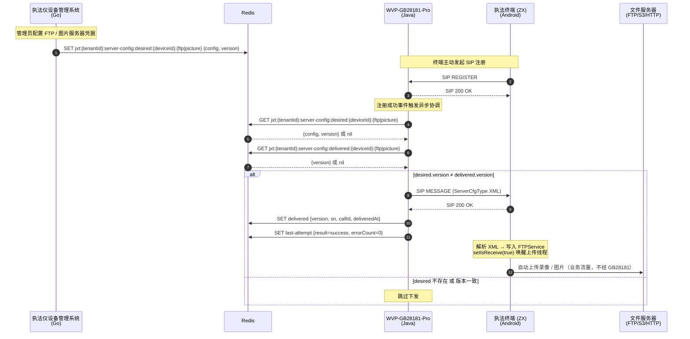
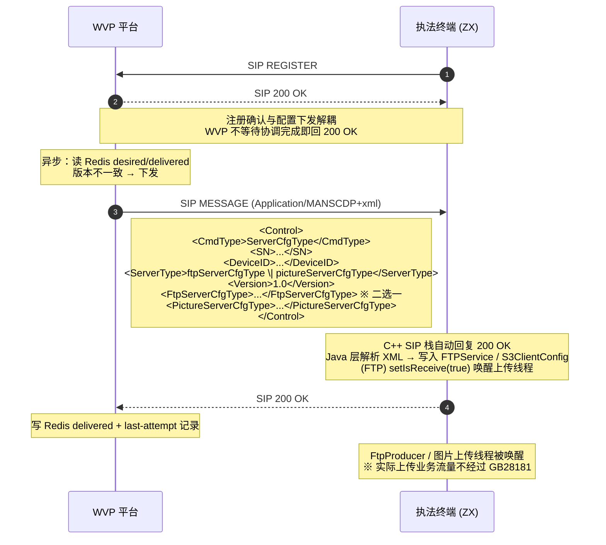

# 服务器配置下发（FTP / 图片服务器）- 需求规格与设计文档

> Date: 2026-05-01
> Status: Draft v3 (Desired-State Reconciliation Model)
> **⚠️ UNFROZEN**: §2.2.2 `pictureServerCfgType` XML 字段已根据终端源码分析文档 `gb28181_ftp_interface_analysis.md` 修正，但需与终端开发最终确认。
> Reference: `gb28181_ftp_interface_analysis.md`（ZX 终端侧源码分析）
> Supersedes: `glm-server-config-delivery-spec.md` v2 (HTTP Push Model)

---

## 1. 需求背景

### 1.1 系统上下文

本需求涉及三个系统的协作：

| 系统 | 职责 | 技术栈 |
|------|------|--------|
| **执法终端 (ZX)** | 现场录像采集设备，通过 GB28181 SIP 协议注册到 WVP 平台，收到服务器配置后自动上传录像/图片文件 | Android, C++ SIP 栈 |
| **WVP-GB28181-Pro** | GB28181 视频监控平台，负责 SIP 信令中转，管理终端设备的注册、心跳、媒体流。在设备注册时自动读取并下发期望配置 | Java 21, Spring Boot |
| **执法仪设备管理系统 (security-management)** | 执法仪设备的业务管理平台，管理设备信息、用户、FTP/图片服务器凭据等业务数据。是服务器配置的**数据来源**，将期望配置写入 Redis | Go, Gin |

### 1.2 触发流程（期望状态协调模型）

采用 **Desired-State Reconciliation** 模式：设备管理系统存储"期望配置"，WVP 在设备注册时自动比对并下发差异。



**关键角色分工**：

- **执法仪设备管理系统**：拥有 FTP/图片服务器的凭据（IP、端口、用户名、密码），知道哪些设备需要下发哪种配置。它是期望配置的**写入者**。
- **WVP-GB28181-Pro**：在设备 SIP 注册成功后，自动读取 Redis 中的期望配置，与已交付记录比对，有差异则通过 SIP MESSAGE 下发。它是配置的**交付执行者**。
- **执法终端 (ZX)**：配置的**接收者**，收到后存储凭据并启动对应的上传管道。
- **Redis**：作为微服务间的**共享配置存储**，存储期望配置（设备管理系统写）和已交付记录（WVP 写）。

**触发时机**：WVP 在终端设备 SIP REGISTER 成功后自动触发协调。终端侧不会主动请求配置，完全由平台侧在注册事件驱动。

### 1.3 需求概述

将服务器配置下发从"一次性命令推送"模型升级为"期望状态协调"模型：

- **设备管理系统**将 FTP / 图片服务器期望配置写入 Redis（带版本号）
- **WVP** 在终端设备 SIP REGISTER 成功后，读取 Redis 中的期望配置
- 通过版本号比较判断是否需要下发，有差异则构造 SIP MESSAGE 推送
- 推送成功后更新 Redis 中的已交付记录
- 无需暴露 HTTP 接口，消除跨服务调用、认证、幂等等复杂度

**协议性质**：私有协议扩展，**不在 GB/T 28181 国标范围内**。`CmdType=ServerCfgType` + `ServerType=ftpServerCfgType|pictureServerCfgType` + `<FtpServerCfgType>` / `<PictureServerCfgType>` XML 载荷。

### 1.4 设计决策记录

| 决策 | 选择 | 理由 |
|------|------|------|
| 触发模式 | WVP 注册时自动拉取（期望状态） | WVP 天然拥有设备生命周期事件，无需跨服务通知 |
| 数据共享 | Redis | WVP 已有 Redis，无新基础设施；设备管理系统写，WVP 读 |
| Diff 方式 | 版本号比较 | 简单高效，依赖写入方保证版本号单调递增 |
| 触发时机 | 仅 SIP REGISTER | 实现最简；在线设备等自然重注册收敛 |
| HTTP API | 不保留 | 去掉跨服务调用，消除认证/幂等/传输安全问题 |
| 在线设备更新 | 等待自然重注册 | FTP IP 变更是低频事件，可接受短暂不一致 |

## 2. 功能需求

### 2.1 Redis 期望配置数据模型

#### 2.1.0 跨服务 Schema（唯一真相源）

Redis 是设备管理系统（Go）与 WVP（Java）之间的唯一接口。为防止双方独立定义字段造成漂移，本节以 **JSON Schema** 作为两个服务共同遵循的唯一真相源。

**原则**：

- FTP 与图片服务器**使用不同的负载结构**，因为终端解析的字段完全不同（FTP 使用 IP+Port+UserId+UserPasswd，图片/S3 使用 ProtocolType+IP+Port+Bucket+AccessKey+SecretKey）
- Schema 文件存放于 WVP 仓库 `docs/schemas/`，作为双方 PR 需同步修改的契约文档
- 两个服务**各自手写** DTO（不强制代码生成），但都要编写合同测试验证与 schema 一致

**FTP 配置 JSON Schema**：

```json
{
  "$schema": "https://json-schema.org/draft/2020-12/schema",
  "title": "FtpServerConfigDesired",
  "type": "object",
  "required": ["ipv4Address", "port", "userId", "userPasswd", "version"],
  "properties": {
    "ipv4Address": {"type": "string", "format": "ipv4"},
    "port":        {"type": "integer", "minimum": 1, "maximum": 65535},
    "userId":      {"type": "string", "minLength": 1, "maxLength": 64},
    "userPasswd":  {"type": "string", "minLength": 1, "maxLength": 128},
    "version":     {"type": "integer", "minimum": 1}
  },
  "additionalProperties": false
}
```

**图片/S3 服务器配置 JSON Schema**：

> 字段名以终端源码 `S3ClientConfig` 解析为准（参考 `gb28181_ftp_interface_analysis.md` §2.2）。

```json
{
  "$schema": "https://json-schema.org/draft/2020-12/schema",
  "title": "PictureServerConfigDesired",
  "type": "object",
  "required": ["protocolType", "ipv4Address", "cloudTransDataPort", "cloudPoolId", "cloudAccessKey", "cloudSecretKey", "version"],
  "properties": {
    "protocolType":     {"type": "string", "enum": ["http", "https"], "description": "S3 协议类型"},
    "ipv4Address":      {"type": "string", "format": "ipv4"},
    "cloudTransDataPort": {"type": "integer", "minimum": 1, "maximum": 65535},
    "cloudPoolId":      {"type": "string", "minLength": 1, "maxLength": 256, "description": "S3 bucket 名称"},
    "cloudAccessKey":   {"type": "string", "minLength": 1, "maxLength": 128},
    "cloudSecretKey":   {"type": "string", "minLength": 1, "maxLength": 256},
    "version":          {"type": "integer", "minimum": 1}
  },
  "additionalProperties": false
}
```

**契约测试要求**：

- 设备管理系统（Go）CI 中包含一个单测：`json.Marshal(FtpServerConfig{...})` 产出的字节串能被 FTP schema 验证通过；`json.Marshal(PictureServerConfig{...})` 能被 Picture schema 验证通过
- WVP（Java）CI 中包含一个单测：读取 schema 生成 fixture JSON 后反序列化为对应 DTO，不报错
- 双方任何一方 PR 修改该 schema 须同步提交另一方的适配 PR

#### 2.1.1 期望配置（设备管理系统写入）

**FTP 与图片服务器使用不同的负载结构**，Redis key 后缀也不同。

**FTP 服务器配置**：

```
Key:   jxt:{tenantId}:server-config:desired:{deviceId}:ftp
Value: {
  "ipv4Address": "192.168.1.100",
  "port": 52488,
  "userId": "admin",
  "userPasswd": "dcw@ivs-100!",
  "version": 3
}
TTL:  无（永久，直到被删除或更新）
```

**图片/S3 服务器配置**：

> 字段对齐终端 `S3ClientConfig`（参考 `gb28181_ftp_interface_analysis.md` §2.2）。

```
Key:   jxt:{tenantId}:server-config:desired:{deviceId}:picture
Value: {
  "protocolType": "http",
  "ipv4Address": "101.240.16.185",
  "cloudTransDataPort": 9000,
  "cloudPoolId": "my-bucket",
  "cloudAccessKey": "ACCESS_KEY",
  "cloudSecretKey": "SECRET_KEY",
  "version": 3
}
TTL:  无（永久，直到被删除或更新）
```

**FTP 配置字段说明**：

| 字段 | 类型 | 必填 | 说明 |
|------|------|------|------|
| ipv4Address | String | 是 | FTP 服务器 IPv4 地址 |
| port | int | 是 | FTP 服务器端口（1–65535） |
| userId | String | 是 | FTP 登录用户名 |
| userPasswd | String | 是 | FTP 登录密码 |
| version | int | 是 | 版本号，单调递增，设备管理系统保证 |

**图片/S3 配置字段说明**：

| 字段 | 类型 | 必填 | 说明 |
|------|------|------|------|
| protocolType | String | 是 | S3 协议类型（http / https） |
| ipv4Address | String | 是 | S3 服务器 IPv4 地址 |
| cloudTransDataPort | int | 是 | S3 数据端口（1–65535） |
| cloudPoolId | String | 是 | S3 bucket 名称 |
| cloudAccessKey | String | 是 | S3 访问密钥 |
| cloudSecretKey | String | 是 | S3 密钥 |
| version | int | 是 | 版本号，单调递增，设备管理系统保证 |

**版本号约定**：

- 设备管理系统每次更新配置时递增 version（建议使用时间戳毫秒数或数据库自增 ID）
- WVP 仅比较 version 是否相同，不解析版本号大小语义
- 删除 Redis key 等价于"该设备无需此类型配置"

#### 2.1.2 已交付记录（WVP 写入）

**FTP 已交付记录**：

```
Key:   jxt:{tenantId}:server-config:delivered:{deviceId}:ftp
Value: {
  "version": 3,
  "sn": 12345,
  "callId": "abc@192.168.1.1",
  "deliveredAt": "2026-05-01T10:30:00Z"
}
TTL:  30 天（自动清理废弃设备记录）
```

**图片服务器已交付记录**：

```
Key:   jxt:{tenantId}:server-config:delivered:{deviceId}:picture
Value: { 同结构 }
TTL:  30 天
```

**字段说明**：

| 字段 | 类型 | 说明 |
|------|------|------|
| version | int | 上次成功交付的期望配置版本号 |
| sn | int | SIP MESSAGE 中的 SN（用于日志对账） |
| callId | String | SIP Call-ID（用于日志对账） |
| deliveredAt | String (ISO 8601) | 交付成功时间 |

**TTL 过期行为**：`delivered` key 的 30 天 TTL 过期后，Redis 自动删除该记录。设备重新注册时，WVP 读到 `delivered = nil`，视为未交付，将重新下发当前 `desired` 中的配置（即使版本号相同）。这是**预期行为**：长期离线设备重上线时重新确认配置属于防御性策略，对终端无副作用（覆盖写入相同配置）。

该 key 记录每次交付尝试的结果（含成功与失败），用于运维诊断与退避控制。

```
Key:   jxt:{tenantId}:server-config:last-attempt:{deviceId}:{ftp|picture}
Value: {
  "version": 3,
  "attemptedAt": "2026-05-01T10:30:00Z",
  "result": "success" | "timeout" | "error",
  "errorMsg": "...",          // result 非 success 时填充
  "errorCount": 2              // 连续失败计数，成功后归 0
}
TTL:  7 天
```

**用途**：

- 运维查询 "设备 X 为什么没收到配置"，一条 Redis GET 即可得到最近结果
- 协调器在连续失败时依据 `errorCount` 执行退避（见 §2.4）

### 2.2 SIP MESSAGE 下发

WVP 在协调判断需要下发时，构造以下 SIP MESSAGE 发送给终端：

- **SIP Method**：MESSAGE
- **Content-Type**：`Application/MANSCDP+xml`

#### 2.2.1 FTP 配置 XML

```xml
<?xml version="1.0"?>
<Control>
  <CmdType>ServerCfgType</CmdType>
  <SN>{runtime-generated}</SN>
  <DeviceID>35020000201311000070</DeviceID>
  <ServerType>ftpServerCfgType</ServerType>
  <Version>1.0</Version>
  <FtpServerCfgType>
    <Ipv4Address>192.168.1.100</Ipv4Address>
    <FTPPort>52488</FTPPort>
    <UserId>admin</UserId>
    <UserPasswd>dcw@ivs-100!</UserPasswd>
  </FtpServerCfgType>
</Control>
```

XML 节点与终端解析代码完全对齐：

| XML 节点 | 终端写入目标 |
|----------|------------|
| `FtpServerCfgType/Ipv4Address` | `FTPService.setFtpserviceIp()` |
| `FtpServerCfgType/FTPPort` | `FTPService.setFtpservicePort()` |
| `FtpServerCfgType/UserId` | `FTPService.setFtpserviceName()` |
| `FtpServerCfgType/UserPasswd` | `FTPService.setFTPServicePWD()` |

#### 2.2.2 图片/S3 服务器配置 XML

> 字段对齐终端 `S3ClientConfig` 解析代码（参考 `gb28181_ftp_interface_analysis.md` §2.2）。

```xml
<?xml version="1.0"?>
<Control>
  <CmdType>ServerCfgType</CmdType>
  <SN>{runtime-generated}</SN>
  <DeviceID>35020000201311000070</DeviceID>
  <ServerType>pictureServerCfgType</ServerType>
  <Version>1.0</Version>
  <PictureServerCfgType>
    <ProtocolType>http</ProtocolType>
    <Ipv4Address>101.240.16.185</Ipv4Address>
    <CloudTransDataPort>9000</CloudTransDataPort>
    <CloudPoolId>my-bucket</CloudPoolId>
    <CloudAccessKey>ACCESS_KEY</CloudAccessKey>
    <CloudSecretKey>SECRET_KEY</CloudSecretKey>
  </PictureServerCfgType>
</Control>
```

XML 节点与终端解析代码完全对齐：

| XML 节点 | 终端写入目标 |
|----------|------------|
| `PictureServerCfgType/ProtocolType` | `S3ClientConfig.setProtocolType()` |
| `PictureServerCfgType/Ipv4Address` | `S3ClientConfig.setIpv4Address()` |
| `PictureServerCfgType/CloudTransDataPort` | `S3ClientConfig.setCloudTransDataPort()` |
| `PictureServerCfgType/CloudPoolId` | `S3ClientConfig.setBucketName()` |
| `PictureServerCfgType/CloudAccessKey` | `S3ClientConfig.setCloudAccessKey()` |
| `PictureServerCfgType/CloudSecretKey` | `S3ClientConfig.setCloudSecretKey()` |

> **注意**：终端 v1.9.1 中 S3 上传通道（`S3GygaUpdateService`）为已编写但未启用的功能（`isS3update` 始终为 false，Service 从未启动）。配置下发后终端会正确解析并写入 `S3ClientConfig` 静态字段，但当前版本不会触发 S3 上传。此配置下发为未来 S3 上传启用做准备。

### 2.3 终端响应处理

终端收到 `ServerCfgType` 后：

1. C++ SIP 栈自动回复 SIP `200 OK`（RFC 3261 标准行为）
2. Java 层解析 XML，写入对应 KV 存储（`FTPService` / 图片服务对应类）
3. FTP 路径下设置 `FTPService.setIsReceive(true)`，唤醒自动上传生产者线程
4. **不发送任何应用层 GB28181 XML 响应**

WVP 侧只需等待 SIP 层面的 `200 OK`，无需处理应用层响应。

### 2.4 协调流程

WVP 在 SIP REGISTER 成功后执行以下协调逻辑：

```
SIP REGISTER 成功
  │
  ▼
ServerConfigReconciler.reconcile(deviceId)
  │
  ▼
for each serverType in [FTP, PICTURE]:   ← 互不影响，FTP 失败不阻止 PICTURE
  │
  ├── 0. 退避检查
  │     last_attempt = GET jxt:{tenantId}:server-config:last-attempt:{deviceId}:{serverType}
  │     if last_attempt.result != success and last_attempt.errorCount >= 3
  │        and now - last_attempt.attemptedAt < 5min
  │     → 跳过本次（退避，避免频繁重注册时 DDoS 终端）
  │
  ├── 0.5. 容错保障（Redis 故障 + JSON 反序列化）
  │     整个 reconcileOne 方法使用 try-catch 包裹：
  │     ├── Redis 连接异常 → 跳过该 serverType，记录 WARN 日志
  │     │   （不抛出异常，不影响注册主流程，下次注册时自然重试）
  │     ├── desired JSON 反序列化失败（格式错误、缺少必填字段、类型不匹配）
  │     │   → 跳过该 serverType，记录 WARN 日志（包含 deviceId、serverType、原始内容摘要）
  │     │   → 不写 last-attempt（避免故障状态覆盖正常状态）
  │     │   → 下次注册时自然重试
  │     └── 其他未预期异常 → 同上，跳过 + WARN 日志
  │     last_attempt = GET jxt:{tenantId}:server-config:last-attempt:{deviceId}:{serverType}
  │     if last_attempt.result != success and last_attempt.errorCount >= 3
  │        and now - last_attempt.attemptedAt < 5min
  │     → 跳过本次（退避，避免频繁重注册时 DDoS 终端）
  │
  ├── 1. 读 Redis
  │     desired  = GET jxt:{tenantId}:server-config:desired:{deviceId}:{serverType}
  │     delivered = GET jxt:{tenantId}:server-config:delivered:{deviceId}:{serverType}
  │
  ├── 2. 判断是否需要下发
  │     ├── desired 不存在 → 跳过（该设备无此类型配置需求）
  │     ├── desired.version == delivered.version → 跳过（已交付最新版本）
  │     └── 需要下发 → 继续
  │
  ├── 3. 构造并发送 SIP MESSAGE
  │     SIPCommander.serverConfigCmd(device, serverType, desired.config)
  │
  ├── 4. 处理响应
  │     ├── SIP 200 OK →
  │     │     SET delivered <{version, sn, callId, deliveredAt}>
  │     │     SET last-attempt <{version, attemptedAt, result=success, errorCount=0}>
  │     │     日志: server_config_done result=success
  │     │
  │     ├── SIP 超时（5s）→
  │     │     SET last-attempt <{result=timeout, errorCount=prev+1}>
  │     │     日志: server_config_done result=timeout
  │     │     （下次注册时自动重试，但受退避约束）
  │     │
  │     └── SIP 错误 →
  │           SET last-attempt <{result=error, errorMsg, errorCount=prev+1}>
  │           日志: server_config_done result=error
  │           （下次注册时自动重试，但受退避约束）
  │
  └── 5. 下一个 serverType（独立处理）
```

**重要约定**：

- FTP 和 PICTURE 两种配置**串行处理但互不影响**：FTP 下发完后才启动 PICTURE，但 FTP 的失败/超时**不会跳过** PICTURE（两者业务独立）
- 串行理由：终端侧解析不保证线程安全，同设备同时发送两个 `ServerCfgType` 可能交叉写入
- 协调流程**不阻塞** SIP REGISTER 的 200 OK 响应（注册确认与配置下发解耦）
- 协调流程在独立线程/Virtual Thread 中执行，注册主流程不受影响

**退避策略**（N5）：

- 连续失败 < 3 次：每次注册都重试
- 连续失败 ≥ 3 次且距上次尝试 < 5 分钟：跳过，不产生 SIP MESSAGE
- 超过 5 分钟后任何一次注册重新尝试，成功后 errorCount 归 0

### 2.5 运维强制刷新接口（N2/N8）

针对以下场景需要跳过版本比较与退避限制，强制重新下发：

- 终端出厂复位后配置丢失（desired==delivered 但终端实际未生效）
- 运维应急切换 FTP 服务器，需在下次自然重注册前刷新某台设备

**接口**：

- **Method**：`POST`
- **Path**：`/api/v1/admin/server-config/sync/{deviceId}`
- **Auth**：WVP 内置 API Key（`api-key` 请求头），仅设备管理系统专用 Key 可调
- **Query**：`?serverType=ftp|picture|all`（可选，默认 `all`）

**API Key 管理**：

- Key 通过 `application.yml` 配置：`wvp.server-config.admin.api-keys`，支持多个 Key（数组）
- Key 值为随机生成的 32 位十六进制字符串（如 `a1b2c3d4e5f6a7b8c9d0e1f2a3b4c5d6`）
- 生产环境通过环境变量注入：`WVP_SERVER_CONFIG_ADMIN_API_KEYS`
- 认证失败记录 WARN 日志（包含来源 IP、请求路径，不记录 Key 值）

**输入校验**：

| 参数 | 校验规则 | 失败响应 |
|------|---------|---------|
| `deviceId` | 非空，符合 GB28181 编码规则（20 位数字） | `400 Bad Request, msg=无效的设备ID` |
| `serverType` | 枚举值：`ftp`、`picture`、`all`（不区分大小写） | `400 Bad Request, msg=无效的服务器类型` |
| `api-key` 请求头 | 非空，匹配配置中的 Key 列表 | `401 Unauthorized, msg=无效的API Key` |

**并发约束**：

强制刷新与 SIP REGISTER 触发的协调共用同一个 per-deviceId 串行执行器，保证同一设备不会同时收到两个 SIP MESSAGE。实现方式：使用 `ConcurrentHashMap<String, ReentrantLock>` 按 deviceId 加锁，协调器内部使用同一把锁。

**语义**：

- 删除指定 `serverType` 的 `delivered` key 与 `last-attempt` key（清零退避计数）
- 立即触发一次协调流程（不必等待下次 SIP REGISTER）
- 设备不在线 → 仅清除记录，返回 `code=200, msg=记录已重置，将于下次注册时下发`
- 设备在线 → 同步等待交付结果（5s 超时），返回与 SIP REGISTER 路径一致的结果语义

**响应示例**：

```json
{ "code": 0, "msg": "成功", "data": { "triggered": ["ftp", "picture"] } }
```

**不在此接口范围内的事**：

- 不接受配置参数（只刷新现有 desired）——配置变更仍走 "设备管理系统写 Redis" 路径
- 不提供批量版本（批量变更走设备管理系统批量写 Redis + 召回调本接口逐台）

## 3. 技术设计

### 3.1 设计方案：SipSubscribe 模式

终端仅回复 SIP 层 `200 OK`，不回复应用层 XML，故使用 WVP 现有 **`SipSubscribe`** 模式（与 PTZ 控制命令 `fronEndCmd` 一致），而非 `MessageSubscribe`。

#### 为什么不用 MessageSubscribe？

WVP 中存在两种 SIP 响应订阅机制，适用场景截然不同：

| 机制 | 触发条件 | 适用场景 | 典型命令 |
|------|---------|---------|---------|
| **SipSubscribe** | 终端回复 SIP 层 `200 OK`（RFC 3261 标准行为） | 终端仅做 SIP 层确认，不返回应用层 XML 响应 | PTZ 控制、设备重启、**本需求** |
| **MessageSubscribe** | 终端回复 SIP MESSAGE 携带应用层 XML（如 `<Response>` 或 `<Notify>`） | 终端需要返回业务数据（状态、查询结果等） | 设备状态查询、目录查询、录像查询 |

**不使用 MessageSubscribe 的原因**：

1. **终端不会发送应用层 XML 响应**：终端收到 `ServerCfgType` 后，仅由 C++ SIP 协议栈自动回复 SIP `200 OK`，Java 业务层直接解析 XML 并写入 `FTPService` KV 存储，**不会构造任何 GB28181 XML 响应消息**。
2. **MessageSubscribe 会永久等待**：`MessageSubscribe` 以 `callId` 为 key 等待终端发送一条新的 SIP MESSAGE 作为响应。如果终端不发送，该订阅将一直挂在内存中直到超时清理，造成资源浪费。
3. **SipSubscribe 已满足需求**：终端的 SIP `200 OK` 已经确认了 MESSAGE 送达，本需求只需知道"配置是否送达终端"，无需"终端是否成功应用配置"（后者在当前协议下无法获取）。

### 3.2 数据流

```
SIP REGISTER 成功事件
  │
  ▼
DeviceRegisteredEvent（现有事件）
  │
  ▼
ServerConfigReconciler.onDeviceRegistered(deviceId)（新增）
  │  异步执行，不阻塞注册流程
  │
  ▼
for each serverType:
  │
  ├── Redis GET jxt:{tenantId}:server-config:desired:{deviceId}:{serverType}
  ├── Redis GET jxt:{tenantId}:server-config:delivered:{deviceId}:{serverType}
  │
  ├── 版本匹配 → 结束
  │
  └── 需要下发 →
        │
        ▼
      SIPCommander.serverConfigCmd(device, serverType, config, okEvent, errorEvent)
        │  生成 SN
        │  构造 ServerCfgType XML
        │  createMessageRequest(device, xml)
        │  transmitRequest(request, errorEvent, okEvent)
        │
        ▼
      [SIP MESSAGE ──────────────────▶ 终端]
        │                                │
        │  [SIP 200 OK ◀─────────────── │]
        │                                │
        ▼
      okEvent / errorEvent / timeout
        │
        ├── okEvent →
        │     Redis SET delivered:{deviceId}:{serverType}
        │     Redis SET last-attempt:{deviceId}:{serverType} {result=success, errorCount=0}
        │     日志: server_config_done result=success
        │
        ├── timeout →
        │     Redis SET last-attempt:{deviceId}:{serverType} {result=timeout, errorCount=prev+1}
        │     日志: server_config_done result=timeout
        │
        └── errorEvent →
              Redis SET last-attempt:{deviceId}:{serverType} {result=error, errorMsg, errorCount=prev+1}
              日志: server_config_done result=error
```

### 3.3 超时处理

| 场景 | 处理 |
|------|------|
| `okEvent` 在 5s 内到达 | 写 delivered，记日志 |
| `errorEvent` 在 5s 内到达 | 不写 delivered，记日志（下次注册重试） |
| 5s 超时无响应 | 反注册 SipSubscribe 防内存泄漏，记日志（下次注册重试） |

**与原规格的差异**：无需 `DeferredResult`，无需分布式锁。协调在注册事件回调中异步执行，不存在同设备并发下发的问题（SIP REGISTER 是串行事件）。

**强制约定**：超时时必须显式反注册 `SipSubscribe`（`removeOkSubscribe` + `removeErrorSubscribe`），防止内存泄漏。

### 3.4 SN 生成策略

- SN 为 32 位正整数，范围 `[1, Integer.MAX_VALUE)`
- 平台级 `AtomicInteger`，CAS 自增，溢出后回绕到 1
- 启动时从 Redis `wvp:sip:sn:counter` 恢复；每 1000 次自增后异步持久化一次
- XML 中 `<SN>` 节点取此运行期值，禁止硬编码

### 3.5 Redis 客户端约定

- WVP 使用现有 Redis 连接（`RedisTemplate` 或 `StringRedisTemplate`）
- Key 前缀 `jxt:{tenantId}:server-config:` 为跨服务约定，设备管理系统和 WVP 共同遵守
- desired 和 delivered 的 Value 均为 JSON 字符串
- 读操作使用 `GET`，写操作使用 `SET` + `SETEX`（delivered 带 30 天 TTL）
- 密码字段在 Redis 中以明文存储（Redis 部署在受控内网 Docker bridge 网络）

### 3.6 多租户 Redis 数据隔离

当前架构中，每个租户部署独立的 WVP+ZLM 实例，但所有租户共享同一个 Redis。因此 Redis key 必须包含租户标识以实现数据隔离。

**Key 命名规则**：

```
jxt:{tenantId}:server-config:desired:{deviceId}:ftp
jxt:{tenantId}:server-config:desired:{deviceId}:picture
jxt:{tenantId}:server-config:delivered:{deviceId}:ftp
jxt:{tenantId}:server-config:delivered:{deviceId}:picture
jxt:{tenantId}:server-config:last-attempt:{deviceId}:{ftp|picture}
```

**tenantId 来源**：WVP 实例的 `tenantId` 从配置文件 `application.yml` 读取：

```yaml
jxt:
  tenant-id: "tenant_001"    # 当前 WVP 实例所属租户
```

**隔离保证**：

- WVP 构造 Redis key 时必须拼接 `tenantId`，确保只读写本租户的数据
- 设备管理系统写入 Redis 时同样拼接 `tenantId`，确保配置写入正确的租户命名空间
- 不同租户的 WVP 实例即使 `deviceId` 相同也不会互相干扰（因为 key 中 `tenantId` 不同）
- `ServerConfigRedisService` 内部统一处理 key 前缀拼接，业务代码无需感知租户隔离细节

## 4. 代码变更清单

| 文件 | 操作 | 说明 |
|------|------|------|
| `gb28181/transmit/cmd/impl/SIPCommander.java` | 新增方法 | `serverConfigCmd(device, serverType, config, okEvent, errorEvent)` — 构造 XML + 发送 SIP MESSAGE |
| `service/ServerConfigReconciler.java` | 新建 | 期望状态协调器：读 Redis、退避检查、版本比对、触发下发、写 last-attempt |
| `service/ServerConfigRedisService.java` | 新建 | Redis 读写封装：desired/delivered/last-attempt 三类 key |
| `gb28181/event/DeviceRegisteredListener.java` | 新增函数或新建 | 设备注册成功事件中调用 `reconciler.reconcile(deviceId)` |
| `gb28181/controller/AdminServerConfigController.java` | 新建 | §2.5 强制刷新接口：`POST /api/v1/admin/server-config/sync/{deviceId}` |
| `conf/ServerConfigProperties.java` | 新建 | 配置类：reconcile.enabled、超时、退避参数 |
| `common/ServerType.java` | 新建 | 枚举：`FTP` / `PICTURE` |
| `common/FtpServerConfigPayload.java` | 新建 | FTP 配置载荷 DTO（ipv4Address, port, userId, userPasswd） |
| `common/PictureServerConfigPayload.java` | 新建 | 图片/S3 配置载荷 DTO（protocolType, ipv4Address, cloudTransDataPort, cloudPoolId, cloudAccessKey, cloudSecretKey） |
| `common/DeliveredRecord.java` | 新建 | 已交付记录 DTO（version, sn, callId, deliveredAt） |
| `common/LastAttemptRecord.java` | 新建 | 最后尝试记录 DTO（version, attemptedAt, result, errorMsg, errorCount） |
| `docs/schemas/server-config.schema.json` | 新建 | §2.1.0 跨服务 JSON Schema 真相源 |

**无需新增数据库表。** 仅 §2.5 运维强制刷新一个 HTTP Controller。审计依赖结构化日志（见 §9）。

### 4.1 SIPCommander.serverConfigCmd

```java
public void serverConfigCmd(Device device,
    ServerType serverType,             // 枚举: FTP / PICTURE
    ServerConfigPayload config,
    SipSubscribe.Event okEvent,
    SipSubscribe.Event errorEvent)
    throws InvalidArgumentException, SipException, ParseException
```

- 内部根据 `serverType` 分支生成 `<FtpServerCfgType>` 或 `<PictureServerCfgType>`
- **FTP 字段映射**：Redis `port` → XML `<FTPPort>`，Redis `ipv4Address` → XML `<Ipv4Address>`，Redis `userId` → XML `<UserId>`，Redis `userPasswd` → XML `<UserPasswd>`
- **图片/S3 字段映射**：Redis `protocolType` → XML `<ProtocolType>`，Redis `ipv4Address` → XML `<Ipv4Address>`，Redis `cloudTransDataPort` → XML `<CloudTransDataPort>`，Redis `cloudPoolId` → XML `<CloudPoolId>`，Redis `cloudAccessKey` → XML `<CloudAccessKey>`，Redis `cloudSecretKey` → XML `<CloudSecretKey>`
- 使用 `headerProvider.createMessageRequest(device, xml, ...)` 创建请求
- 使用 `sipSender.transmitRequest(ip, request, errorEvent, okEvent, null)` 发送

### 4.2 ServerConfigReconciler

```java
@Component
public class ServerConfigReconciler {

    /**
     * 设备注册成功后调用，异步协调期望配置。
     * 不阻塞注册主流程。
     */
    public void reconcile(String deviceId) {
        // Virtual Thread 异步执行
        for (ServerType type : ServerType.values()) {
            reconcileOne(deviceId, type);
        }
    }
}
```

### 4.3 注册事件集成点

WVP 中设备注册成功后的事件发布点（需确认具体类）：

- 现有 `DeviceRegisteredEvent` 或 `DeviceOnlineEvent` 事件
- 在对应事件处理器中注入 `ServerConfigReconciler`，调用 `reconcile(deviceId)`
- 协调在 Virtual Thread 中执行，不阻塞注册流程

## 5. 信令交互时序



## 6. 非功能性需求

| 项目 | 要求 |
|------|------|
| 触发时机 | SIP REGISTER 成功后异步执行，不阻塞注册主流程 |
| 并发安全 | FTP 和 PICTURE 串行下发；注册事件天然串行，无需分布式锁 |
| 超时 | SIP 200 OK 等待 5s；超时不写 delivered，下次注册重试 |
| Redis TTL | desired 无 TTL；delivered TTL 30 天 |
| 日志 | 结构化日志，详见 §9 |
| 向后兼容 | 不影响现有 SIP 命令处理流程；新增 `<Version>` 节点终端可忽略 |
| 传输协议 | 与设备注册时使用的传输协议一致（TCP/UDP） |
| 配置开关 | `wvp.server-config.reconcile.enabled`（默认 `true`），可关闭协调功能 |

## 7. 限制与约束

1. **私有协议**：`ServerCfgType` / `ftpServerCfgType` / `pictureServerCfgType` 是 ZX 终端的私有扩展，非 GB/T 28181 标准。仅适用于已对接此私有协议的终端设备。
2. **单向确认（隐性风险，N3）**：仅以 SIP 层 200 OK 为交付依据，**无法确认终端是否成功解析和应用了配置**。期望态模型下，如果终端 SIP 栈返回 200 OK 但 Java 层处理失败（解析异常 / 存储满 / 包丢失），WVP 会错误地认为该版本已交付，导致该设备**静默错配**。
   - **本期缓解**：`last-attempt` 记录仅提供发送侧诊断；运维发现错配可使用 §2.5 强制刷新接口重发。
   - **未来演进路径**（不在本期）：
     - 隐式 ACK：以首次 FTP/图片上传成功作为“配置已生效”的间接证据，补入 `delivered.confirmedAt`
     - 显式摘要：终端在 SIP KEEPALIVE 中携带当前 FTP 配置 SHA-256 摘要，WVP 对账发现不一致则重发
     - 主动查询：交付后发送查询 SIP MESSAGE 要求终端返回当前配置（需终端协议升级）
3. **近似 Diff**：终端不上报当前配置，WVP 比较"期望版本 vs 已交付版本"作为近似 diff。假设终端不会在 WVP 不知道的情况下修改自己的 FTP 配置。
4. **终端复位场景（N10）**：终端出厂复位后本地配置被清空，但设备重新注册时 WVP 看到 desired==delivered 会跳过下发，导致永久错配。
   - **运维应对**：复位后调用 §2.5 强制刷新接口一次，或在设备管理系统处理 "设备复位" 事件时自动调用
   - **未来调拨**：终端在 SIP REGISTER body 中携带配置摘要 → WVP 可自动识别复位（需终端协议升级）
5. **在线设备延迟收敛**：配置变更后，已在线设备需等待下次 SIP REGISTER（通常因心跳超时或设备重启触发）才能收到新配置。不适合要求秒级生效的场景；应急场景使用 §2.5。
6. **图片/S3 上传通道当前未启用**：终端 v1.9.1 中 S3 上传通道（`S3GygaUpdateService`）为已编写但未启用的功能。配置下发后终端会正确解析并写入 `S3ClientConfig`，但当前版本不会触发 S3 上传。此配置下发为未来 S3 上传启用做准备。
7. **SIP 明文**：SIP MESSAGE 中密码以明文传输，受限于终端协议，无法在传输层加密。详见 §8。
8. **Redis 明文**：Redis 中密码以明文存储。Redis 部署在受控内网 Docker bridge 网络，外部不可访问。

## 8. 安全要求

### 8.1 Redis 访问安全

| 措施 | 说明 |
|------|------|
| 网络隔离 | Redis 仅在 Docker bridge 网络 `media-net` 内可访问，不暴露宿主机端口 |
| 密码保护 | Redis 配置 `requirepass`，WVP 和设备管理系统通过环境变量注入密码 |
| Key 前缀隔离 | `jxt:{tenantId}:server-config:` 前缀由两个服务共享，其他前缀互不干扰 |

### 8.2 SIP 传输安全

SIP MESSAGE 明文不可避免（终端协议限制），文档与运维须知中明示该风险，建议部署在受控内网。

### 8.3 日志层

- **任何日志中均不输出密码/密钥原文**：包括 `userPasswd`（FTP）、`cloudAccessKey`（S3）、`cloudSecretKey`（S3）
- 统一脱敏格式：`userPasswd=***(len=N)`、`cloudAccessKey=***(len=N)`、`cloudSecretKey=***(len=N)`，N 为原长度

### 8.4 代码约定

- `FtpServerConfigPayload.userPasswd` 字段的 `toString()` 固定输出 `***(len=N)`
- `PictureServerConfigPayload.cloudAccessKey` 和 `cloudSecretKey` 字段的 `toString()` 固定输出 `***(len=N)`
- Lombok `@ToString` 不可用于含密码/密钥的类（或用 `@ToString.Exclude` 标注密码字段）

## 9. 日志规范

不建立独立审计 DB 表，仅依赖结构化日志（运维 ELK/Loki 可检索）。

### 9.1 日志事件

每次下发产生 3 条日志，统一以 `server_config_` 前缀便于 grep：

| 事件 | 触发时机 | 级别 |
|------|---------|------|
| `server_config_check` | 注册事件触发协调，读取 Redis 后 | INFO |
| `server_config_sent` | SIP MESSAGE 已通过 `sipSender.transmitRequest()` 发出 | INFO |
| `server_config_done` | `okEvent` / `errorEvent` / 超时任一触发，写入最终结果 | INFO（成功/超时）/ WARN（失败） |

### 9.2 字段约定

所有事件均包含以下结构化字段：

```
event=server_config_check
device=35020000201311000070
server_type=ftp
desired_version=3
delivered_version=2
action=deliver               # deliver | skip
```

`server_config_sent` 额外包含（以 FTP 为例，图片/S3 类似）：

```
sn=12345
call_id=<sip-call-id>
ipv4_address=192.168.1.100
port=52488
user_id=admin
user_passwd=***(len=12)
```

图片/S3 类型额外字段：

```
protocol_type=http
ipv4_address=101.240.16.185
cloud_trans_data_port=9000
cloud_pool_id=my-bucket
cloud_access_key=***(len=10)
cloud_secret_key=***(len=16)
```

`server_config_done` 额外包含：

```
result_code=0
result_msg=成功
duration_ms=143
delivered_version=3
```

### 9.3 实现要求

- 日志写入**不得阻塞下发流程**：使用 Logback `AsyncAppender` 或 Virtual Thread
- `server_config_*` 级别为 INFO/WARN，不允许丢弃

## 10. 可观测性

### 10.1 Metrics（Micrometer）

| 名称 | 类型 | 标签 |
|------|------|------|
| `wvp_server_config_reconcile_total` | Counter | `server_type`（ftp/picture）, `action`（deliver/skip） |
| `wvp_server_config_deliver_total` | Counter | `server_type`, `result`（success/timeout/error） |
| `wvp_server_config_deliver_duration_seconds` | Histogram | `server_type`, `result` |

### 10.2 Tracing

- 协调入口创建 span `server.config.reconcile`
- 标签：`device.id`、`server.type`、`desired.version`、`delivered.version`
- 子 span：`redis.read`、`sip.send`、`sip.wait_ok`、`redis.write`

## 11. 版本与兼容性

### 11.1 协议版本

XML 载荷 `<Control>` 下新增可选节点 `<Version>1.0</Version>`：

- 终端当前实现忽略未知节点 → 添加安全
- 后续若 `pictureServerCfgType` 字段调整或新增 `serverType` 枚举值，可通过 `<Version>` 差异化行为
- 终端如需识别版本，由终端侧后续升级支持；本期版本号仅为预留位

### 11.2 设备管理系统侧要求

设备管理系统需实现以下功能（本规格定义接口约定，具体实现不在 WVP 范围内）：

1. **写入期望配置**：将 FTP / 图片服务器配置写入 Redis `jxt:{tenantId}:server-config:desired:{deviceId}:ftp|picture`
2. **版本号管理**：每次配置变更时递增 version
3. **配置删除**：设备不再需要配置时，删除对应 Redis key
4. **批量写入**：支持批量设置多台设备的期望配置（如 FTP IP 变更场景）

### 11.3 Redis 数据版本

- `desired` 的 `version` 字段由设备管理系统保证单调递增
- `delivered` 的 `version` 与对应的 `desired.version` 一致
- 版本号比较仅判断相等性（`==`），不依赖大小语义
- 设备管理系统更新配置时**不得**降低 version（避免回退导致重复下发）
- 建议使用时间戳毫秒数作为版本号（如 `time.Now().UnixMilli()`），天然单调递增

### 11.4 实施路径

v2（HTTP Push）从未实现，直接采用 v3（Desired-State）方案：

1. **设备管理系统**实现 Redis 写入逻辑（§附录 B）
2. **WVP** 部署新版本（包含 ServerConfigReconciler + AdminServerConfigController）
3. §2.5 运维强制刷新接口用于手动触发配置同步

## 12. 测试要求

### 12.1 版本比较逻辑

| 场景 | desired | delivered | 期望结果 |
|------|---------|-----------|---------|
| 首次下发 | version=3 | 不存在 | 下发 |
| 版本相同 | version=3 | version=3 | 跳过 |
| 版本不同 | version=4 | version=3 | 下发 |
| desired 不存在 | 不存在 | version=3 | 跳过 |
| delivered TTL 过期 | version=3 | 不存在（已过期） | 下发（预期行为） |
| desired 和 delivered 均不存在 | 不存在 | 不存在 | 跳过 |

### 12.2 退避策略验证

| 场景 | last_attempt | 期望结果 |
|------|-------------|---------|
| 连续失败 2 次 | errorCount=2, 1min 前 | 正常下发 |
| 连续失败 3 次，5min 内 | errorCount=3, 2min 前 | 跳过（退避） |
| 连续失败 3 次，超过 5min | errorCount=3, 6min 前 | 正常下发（退避窗口过期） |
| 上次成功 | errorCount=0 | 正常下发 |
| last-attempt 不存在 | 不存在 | 正常下发（无历史记录） |

### 12.3 XML 构造校验

- FTP XML：验证 `<FtpServerCfgType>` 包含 `<Ipv4Address>`、`<FTPPort>`、`<UserId>`、`<UserPasswd>`，值与 Redis desired 一致
- 图片/S3 XML：验证 `<PictureServerCfgType>` 包含 `<ProtocolType>`、`<Ipv4Address>`、`<CloudTransDataPort>`、`<CloudPoolId>`、`<CloudAccessKey>`、`<CloudSecretKey>`，值与 Redis desired 一致
- `<SN>` 为正整数，非硬编码
- `<DeviceID>` 使用正确的设备 ID

### 12.4 强制刷新 API 测试

| 场景 | 请求 | 期望响应 |
|------|------|---------|
| 正常调用（设备在线） | POST /sync/{deviceId}?serverType=ftp | 200, delivered 记录已更新 |
| 正常调用（设备离线） | POST /sync/{deviceId}?serverType=all | 200, msg="记录已重置，将于下次注册时下发" |
| 无效 deviceId | POST /sync/invalid123 | 400, msg="无效的设备ID" |
| 无效 serverType | POST /sync/{deviceId}?serverType=xxx | 400, msg="无效的服务器类型" |
| 缺少 api-key | POST /sync/{deviceId} (无 header) | 401, msg="无效的API Key" |
| 错误 api-key | POST /sync/{deviceId} (header: api-key: wrong) | 401, msg="无效的API Key" |

### 12.5 Redis 故障降级

| 场景 | 期望行为 |
|------|---------|
| Redis 连接失败（GET desired） | 跳过下发，记录 WARN 日志，不影响注册流程 |
| Redis 连接失败（SET delivered） | SIP 已成功但记录丢失，记录 WARN 日志，下次注册可能重复下发 |
| Redis 连接失败（GET last-attempt） | 跳过退避检查，直接尝试下发 |

### 12.6 JSON 反序列化失败

| 场景 | 期望行为 |
|------|---------|
| desired JSON 格式错误（非 JSON） | 跳过该 serverType，WARN 日志 |
| desired 缺少必填字段（如无 version） | 跳过该 serverType，WARN 日志 |
| desired 字段类型错误（如 port="abc"） | 跳过该 serverType，WARN 日志 |
| desired 为空字符串 | 跳过该 serverType，WARN 日志 |

### 12.7 契约测试

- WVP（Java）单测：读取 JSON Schema 文件，生成 fixture JSON，反序列化为 `FtpServerConfigPayload` / `PictureServerConfigPayload`，验证不报错且字段完整
- 设备管理系统（Go）单测：构造 FTP/S3 配置结构体，`json.Marshal` 后能被对应 schema 验证通过

## 附录 A：与 v2 规格（HTTP Push Model）的差异

| 维度 | v2 (HTTP Push) | v3 (Desired-State) |
|------|----------------|---------------------|
| 触发方式 | 设备管理系统调 HTTP API | WVP 在 SIP REGISTER 时自动读 Redis |
| 配置存储 | 无持久化 | Redis（desired + delivered） |
| 离线处理 | 返回 404，调用方重试 | 天然解决（注册时才检查） |
| 新设备 | 需调用方监听上线事件 | 自动（注册即触发） |
| 批量变更 | 逐台调 HTTP 接口 | 写一次 Redis，设备注册时自动收敛 |
| HTTP API | 业务下发 API（POST /server-config） | 仅运维强制刷新（POST /admin/.../sync） |
| 认证/幂等 | 需要（复杂） | 仅 admin 接口需要 API Key，无幂等需求 |
| 分布式锁 | 需要（Redis 锁） | 不需要（注册事件串行 + 单设备协调串行） |
| WVP 实现量 | 大（Controller + Service + 锁 + 幂等） | 中（协调器 + Redis 读取 + SIP 发送 + 极简 admin Controller） |
| 设备管理系统实现量 | 中（调 HTTP + 重试） | 小（写 Redis） |

## 附录 B：设备管理系统侧 Redis 写入规范

> 本节供设备管理系统（Go）开发参考，不在 WVP 实现范围内。

### Redis Key 命名

```
jxt:{tenantId}:server-config:desired:{deviceId}:ftp
jxt:{tenantId}:server-config:desired:{deviceId}:picture
```

### 数据结构

```go
// FTP 服务器配置
type FtpServerConfig struct {
    IPv4Address string `json:"ipv4Address"`
    Port        int    `json:"port"`
    UserID      string `json:"userId"`
    UserPasswd  string `json:"userPasswd"`
    Version     int64  `json:"version"`            // 单调递增
}

// 图片/S3 服务器配置
type PictureServerConfig struct {
    ProtocolType     string `json:"protocolType"`     // http / https
    IPv4Address      string `json:"ipv4Address"`
    CloudTransDataPort int   `json:"cloudTransDataPort"`
    CloudPoolId      string `json:"cloudPoolId"`       // S3 bucket 名称
    CloudAccessKey   string `json:"cloudAccessKey"`
    CloudSecretKey   string `json:"cloudSecretKey"`
    Version          int64  `json:"version"`           // 单调递增
}
```

### 写入示例

```go
func SetDeviceFTPServerConfig(tenantID, deviceID string, config FtpServerConfig) error {
    key := fmt.Sprintf("jxt:%s:server-config:desired:%s:ftp", tenantID, deviceID)
    config.Version = time.Now().UnixMilli() // 毫秒时间戳作为版本号
    value, err := json.Marshal(config)
    if err != nil {
        return fmt.Errorf("marshal ftp server config: %w", err)
    }
    return redis.Set(ctx, key, string(value), 0) // 无 TTL
}

func SetDevicePictureServerConfig(tenantID, deviceID string, config PictureServerConfig) error {
    key := fmt.Sprintf("jxt:%s:server-config:desired:%s:picture", tenantID, deviceID)
    config.Version = time.Now().UnixMilli()
    value, err := json.Marshal(config)
    if err != nil {
        return fmt.Errorf("marshal picture server config: %w", err)
    }
    return redis.Set(ctx, key, string(value), 0)
}
```

### 删除配置

当设备被解绑或不再需要服务器配置时，删除 Redis key：

```go
func DeleteDeviceServerConfig(tenantID, deviceID string, serverType string) error {
    key := fmt.Sprintf("jxt:%s:server-config:desired:%s:%s", tenantID, deviceID, serverType)
    return redis.Del(ctx, key)
}
```

WVP 协调器读到 `desired` 不存在时自动跳过，无需额外通知。WVP 不会主动删除 `delivered` 记录（依赖 30 天 TTL 自动过期）。

### 批量更新

FTP 服务器 IP 变更时，需批量更新所有相关设备的期望配置：

```go
func BatchUpdateFTPServerConfig(tenantID string, deviceIDs []string, newIP string, newPort int) error {
    pipe := redis.Pipeline()
    for _, deviceID := range deviceIDs {
        key := fmt.Sprintf("jxt:%s:server-config:desired:%s:ftp", tenantID, deviceID)
        // 读 → 改 IP/Port → 递增 version → 写回
        config := readExistingFTPConfig(key)
        config.IPv4Address = newIP
        config.Port = newPort
        config.Version = time.Now().UnixMilli()
        value, _ := json.Marshal(config)
        pipe.Set(ctx, key, string(value), 0)
    }
    _, err := pipe.Exec(ctx)
    return err
}
```

批量更新后，每台设备在下一次 SIP REGISTER 时自动获取新配置。
