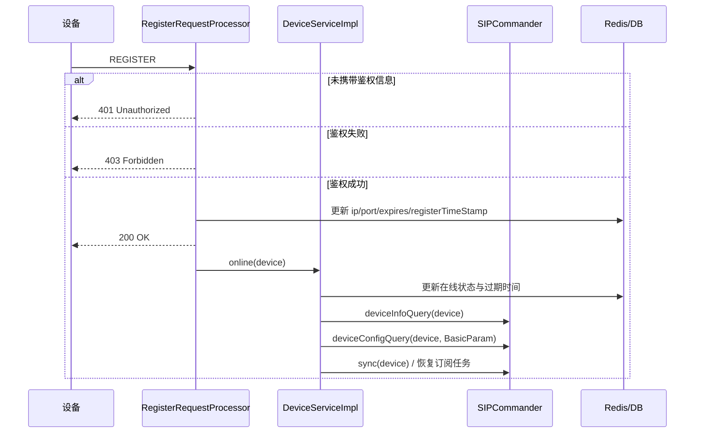
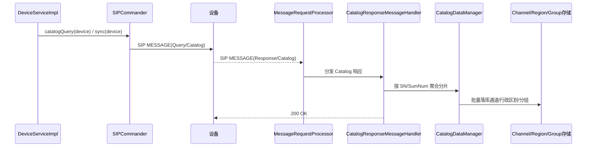
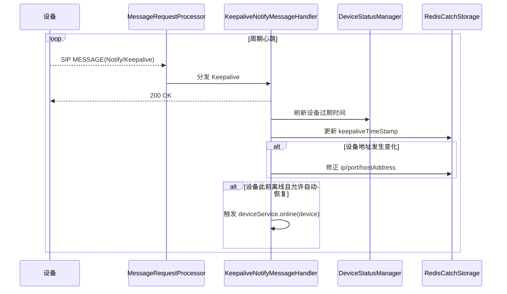
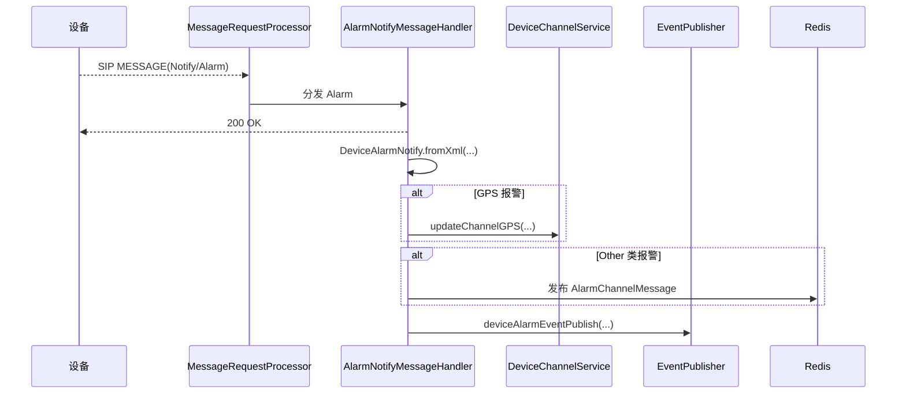
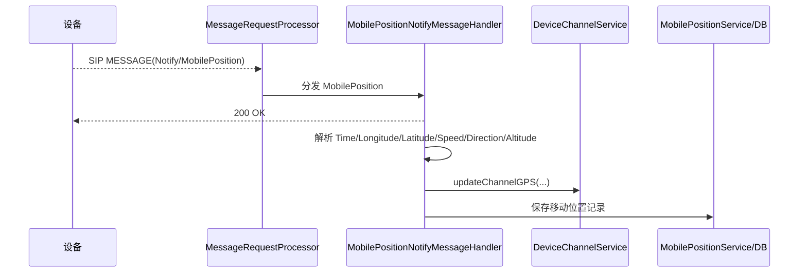
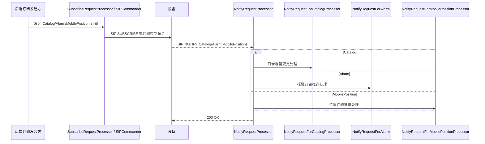
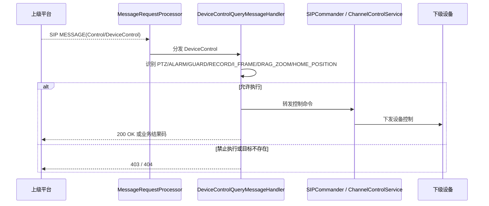

# WVP-GB28181-Pro 终端设备与后端接口梳理（GPT54H 专题版）

> 本文档基于项目源码整理，聚焦“**终端设备/部标终端 与 后端之间**”的真实接口面。
>
> 与此前“前后端接口文档”不同，本文档不以 Web 页面调用为中心，而是从**设备接入、设备上报、后端下发控制、媒体会话、兼容接口**的角度梳理实际交互链路。

---

## 1. 文档范围

### 1.1 本文档覆盖的接口类型

- **设备协议接入面**
  - GB28181 SIP `REGISTER`、`MESSAGE`、`NOTIFY`、`SUBSCRIBE`、`INVITE`、`ACK`、`BYE`、`CANCEL`
  - JT1078/JT808 TCP 接入、报文解码、会话管理、报文分发

- **后端控制面**
  - 后端暴露给业务侧的 HTTP 接口，这些接口最终驱动设备执行查询、控制、点播、回放、订阅等动作

- **兼容接口面**
  - `/api/v1/device/**`
  - `/api/v1/stream/**`
  - `/api/v1/control/**`

### 1.2 本文档不展开的内容

- Web 页面布局与前端组件逻辑
- ZLMediaKit 内部 hook 细节
- 纯平台级联对上级平台的所有细枝末节
- 与设备无直接关系的系统管理接口

### 1.3 主要源码依据

- **GB28181 控制器**
  - `src/main/java/com/genersoft/iot/vmp/gb28181/controller/*`
- **GB28181 SIP 处理链**
  - `src/main/java/com/genersoft/iot/vmp/gb28181/transmit/event/request/impl/*`
  - `src/main/java/com/genersoft/iot/vmp/gb28181/transmit/event/request/impl/message/*`
  - `src/main/java/com/genersoft/iot/vmp/gb28181/transmit/event/response/impl/*`
- **GB28181 下行命令面**
  - `src/main/java/com/genersoft/iot/vmp/gb28181/transmit/cmd/ISIPCommander.java`
  - `src/main/java/com/genersoft/iot/vmp/gb28181/transmit/cmd/impl/SIPCommander.java`
- **设备生命周期服务**
  - `src/main/java/com/genersoft/iot/vmp/gb28181/service/impl/DeviceServiceImpl.java`
- **JT1078 控制器与服务**
  - `src/main/java/com/genersoft/iot/vmp/jt1078/controller/*`
  - `src/main/java/com/genersoft/iot/vmp/jt1078/service/*`
  - `src/main/java/com/genersoft/iot/vmp/jt1078/cmd/JT1078Template.java`
  - `src/main/java/com/genersoft/iot/vmp/jt1078/codec/netty/TcpServer.java`
  - `src/main/java/com/genersoft/iot/vmp/jt1078/proc/request/*`

---

## 2. 设备与后端的交互全景

### 2.1 交互面分类

| 交互面 | 典型协议/路径 | 作用 |
|------|------|------|
| 设备接入面 | SIP `REGISTER`、JT1078 TCP | 设备/终端上线、鉴权、建链 |
| 设备上报面 | SIP `MESSAGE` / `NOTIFY`、JT1078 上行报文 | 心跳、目录、位置信息、报警、属性、应答 |
| 后端下发面 | SIP `MESSAGE` / `INVITE` / `INFO` / `BYE`、JT1078 下行命令 | 查询、控制、点播、回放、录制、订阅、配置 |
| 业务控制面 | `/api/device/**`、`/api/play/**`、`/api/jt1078/**` | 由页面/第三方调用，最终驱动设备 |
| 兼容接口面 | `/api/v1/**` | 面向旧系统或第三方兼容调用 |

### 2.2 核心结论

- **GB28181 设备**主要通过 `SIPProcessorObserver` 注册的各类请求处理器进入后端。
- **设备上线/离线、目录同步、移动位置订阅、报警订阅恢复**，集中由 `DeviceServiceImpl` 维护。
- **后端对设备的主动控制能力**，统一抽象在 `ISIPCommander` 中。
- **JT1078 终端**不是走 SIP，而是通过 `TcpServer` + Netty + `SessionManager` 建立长连接会话。
- **业务侧看到的 HTTP 接口**，本质上是“设备控制代理层”，不是设备直接调用的入口。

---

## 3. GB28181 协议面接口

## 3.1 SIP 请求入口处理器

目录：`src/main/java/com/genersoft/iot/vmp/gb28181/transmit/event/request/impl`

| 处理器 | 处理方法 | 说明 |
|------|------|------|
| `RegisterRequestProcessor` | `REGISTER` | 设备注册、注销、鉴权、续订、上线/离线触发 |
| `MessageRequestProcessor` | `MESSAGE` | 设备/平台消息总入口，按 XML 根节点分发到子处理器 |
| `NotifyRequestProcessor` | `NOTIFY` | NOTIFY 总入口 |
| `NotifyRequestForAlarm` | `NOTIFY` | 报警类 NOTIFY |
| `NotifyRequestForCatalogProcessor` | `NOTIFY` | 目录类 NOTIFY |
| `NotifyRequestForMobilePositionProcessor` | `NOTIFY` | 移动位置 NOTIFY |
| `SubscribeRequestProcessor` | `SUBSCRIBE` | 订阅请求处理，主要是目录/移动位置订阅 |
| `InviteRequestProcessor` | `INVITE` | SIP 邀请请求处理 |
| `AckRequestProcessor` | `ACK` | ACK 处理 |
| `ByeRequestProcessor` | `BYE` | 会话结束处理 |
| `CancelRequestProcessor` | `CANCEL` | 邀请取消处理 |

## 3.2 REGISTER：设备注册/注销/续订

实现文件：`RegisterRequestProcessor.java`

### 3.2.1 实际行为

- 从 `FromHeader` 中提取设备 ID
- 严格模式下检查设备 ID 是否满足国标编码规则
- 根据设备自身密码或公共密码执行 Digest 鉴权
- 未携带授权头时返回 `401`
- 鉴权失败返回 `403`
- 注册成功返回 `200 OK`
- 根据 `Expires` 判断是**注册**还是**注销**
- 根据 `ViaHeader` 识别设备传输协议是 `TCP` 还是 `UDP`
- 更新设备的 `ip`、`port`、`hostAddress`、`localIp`、`expires`、`registerTimeStamp`
- 注册成功后调用 `deviceService.online(device)`
- 注销成功后调用 `deviceService.offline(device)`

### 3.2.2 关键代码事实

- 注册入口观察者：`sipProcessorObserver.addRequestProcessor("REGISTER", this)`
- 鉴权逻辑：`DigestServerAuthenticationHelper`
- 注册成功后设备生命周期入口：`DeviceServiceImpl.online()`
- 注销成功后设备生命周期入口：`DeviceServiceImpl.offline()`

## 3.3 MESSAGE：设备消息总入口

实现文件：`MessageRequestProcessor.java`

### 3.3.1 分发逻辑

`MESSAGE` 请求进入后：

- 先根据 `FromHeader` 提取 `deviceId`
- 再结合 `Call-ID` / `CSeq` / `SsrcTransaction` 做设备匹配
- 在 Redis 中查设备，在平台服务中查上级平台
- 解析 XML 根节点名称
- 根据根节点分发到对应 `IMessageHandler`

### 3.3.2 MESSAGE 一级分发类型

目录：`transmit/event/request/impl/message`

| 根节点类型 | 处理类 | 说明 |
|------|------|------|
| `Query` | `QueryMessageHandler` | 设备向后端发起查询类消息 |
| `Notify` | `NotifyMessageHandler` | 设备主动通知类消息 |
| `Response` | `ResponseMessageHandler` | 设备对后端查询/控制的响应 |
| `Control` | `ControlMessageHandler` | 控制类消息 |

## 3.4 MESSAGE 子处理器明细

### 3.4.1 Query 类处理器

目录：`message/query/cmd`

| 处理器 | 作用 |
|------|------|
| `AlarmQueryMessageHandler` | 报警查询类消息处理 |
| `CatalogQueryMessageHandler` | 目录查询类消息处理 |
| `DeviceInfoQueryMessageHandler` | 设备信息查询类消息处理 |
| `DeviceStatusQueryMessageHandler` | 设备状态查询类消息处理 |
| `RecordInfoQueryMessageHandler` | 录像查询类消息处理 |

### 3.4.2 Notify 类处理器

目录：`message/notify/cmd`

| 处理器 | 作用 |
|------|------|
| `AlarmNotifyMessageHandler` | 报警通知处理 |
| `BroadcastNotifyMessageHandler` | 广播通知处理 |
| `KeepaliveNotifyMessageHandler` | 心跳通知处理 |
| `MediaStatusNotifyMessageHandler` | 媒体状态通知处理 |
| `MobilePositionNotifyMessageHandler` | 位置信息通知处理 |

### 3.4.3 Response 类处理器

目录：`message/response/cmd`

| 处理器 | 作用 |
|------|------|
| `AlarmResponseMessageHandler` | 报警查询应答 |
| `BroadcastResponseMessageHandler` | 广播应答 |
| `CatalogResponseMessageHandler` | 目录查询/目录同步应答 |
| `ConfigDownloadResponseMessageHandler` | 设备配置查询应答 |
| `DeviceControlResponseMessageHandler` | 设备控制应答 |
| `DeviceInfoResponseMessageHandler` | 设备信息查询应答 |
| `DeviceStatusResponseMessageHandler` | 设备状态查询应答 |
| `MobilePositionResponseMessageHandler` | 移动位置应答 |
| `PresetQueryResponseMessageHandler` | 预置位查询应答 |
| `RecordInfoResponseMessageHandler` | 录像信息应答 |

### 3.4.4 Control 类处理器

目录：`message/control`

| 处理器 | 作用 |
|------|------|
| `ControlMessageHandler` | 控制类 MESSAGE 处理入口 |

### 3.4.5 MESSAGE 的两级分发机制

从源码实现看，`MESSAGE` 不是单层 switch，而是典型的“两级分发”：

| 分发层级 | 识别字段 | 入口类 | 分发结果 |
|------|------|------|------|
| 一级分发 | XML 根节点名 | `MessageRequestProcessor` | `Query` / `Notify` / `Response` / `Control` |
| 二级分发 | `CmdType` | `MessageHandlerAbstract` | 具体业务处理器 |

### 3.4.5.1 一级分发的关键行为

- `MessageRequestProcessor` 先通过 `FromHeader` 提取 `deviceId`
- 再结合 `Call-ID` 查询 `SsrcTransaction`，兼容部分设备 `From` 不是设备 ID 的情况
- 同时检查 Redis 设备缓存和上级平台缓存
- 如果设备与平台同时命中，则根据远端 `hostAddress:port` 再判定究竟是设备消息还是级联平台消息
- 如果无法识别设备/平台，直接回复 `404`
- 解析 XML 根节点后，用 `messageHandlerMap.get(rootElement.getName())` 进入一级处理器

### 3.4.5.2 二级分发的关键行为

- `MessageHandlerAbstract.handForDevice()` / `handForPlatform()` 从 XML 中取 `CmdType`
- 用 `messageHandlerMap.get(cmd)` 继续分发到 `cmd` 对应处理器
- 如果没有命中处理器，则走 `handMessageEvent(element, data)`，尝试用 `CmdType + SN` 命中异步回调订阅
- `CatalogQueryMessageHandler` 有一个特殊分支：当“设备消息”实际上来自级联平台时，会转走 `handForPlatform()`

### 3.4.8 独立 NOTIFY 请求链路

除了 `MESSAGE` 根节点中的 `Notify` 外，项目还存在独立的 SIP `NOTIFY` 请求处理器：`NotifyRequestProcessor`。

两者区别如下：

| 链路 | SIP 方法 | 入口类 | 典型场景 |
|------|------|------|------|
| MESSAGE 内嵌 Notify | `MESSAGE` | `MessageRequestProcessor -> NotifyMessageHandler` | 设备主动上报心跳、报警、位置、媒体状态等 |
| 独立 NOTIFY | `NOTIFY` | `NotifyRequestProcessor` | 后端先发起订阅，设备随后通过 `NOTIFY` 推送目录、报警、移动位置 |

### 3.4.8.1 `NotifyRequestProcessor` 的分发结果

| `CmdType` | 处理类 | 核心动作 |
|------|------|------|
| `Catalog` | `NotifyRequestForCatalogProcessor` | 目录订阅增量通知 |
| `Alarm` | `NotifyRequestForAlarm` | 报警订阅通知 |
| `MobilePosition` | `NotifyRequestForMobilePositionProcessor` | 移动位置订阅通知 |

### 3.4.8.2 目录订阅 `NOTIFY` 链路

`NotifyRequestForCatalogProcessor` 的实现比“收到一条目录通知”复杂得多：

- 使用 `taskQueue` 做排队，定时批处理
- 根据 `FromHeader` 找设备，再按设备字符集重新解析 XML
- 对 `DeviceList` 中每个条目调用 `CatalogChannelEvent.decode(...)`
- 根据事件类型区分：`ON`、`OFF`、`VLOST`、`DEFECT`、`ADD`、`DEL`、`UPDATE`
- 把变更包装成 `NotifyCatalogChannel`，最终统一落库：
  - `STATUS_CHANGED` -> `updateChannelStatusForNotify(...)`
  - `ADD` -> `addChannel(...)`
  - `UPDATE` -> `updateChannelForNotify(...)`
  - `DELETE` -> `deleteForNotify(...)`
- 同时发布 `channelEventPublish(...)` / `channelEventPublishForUpdate(...)`
- 在配置允许时，经 Redis 发布通道上下线、增删消息

### 3.4.8.3 移动位置订阅 `NOTIFY` 链路

`NotifyRequestForMobilePositionProcessor` 会：
 - 从 `DeviceID/Time/Longitude/Latitude/Speed/Direction/Altitude` 解析位置
 - 关联到具体 `DeviceChannel`
 - 构造 `MobilePosition`
 - 调用 `mobilePositionService.add(...)` 落库
 - 再调用 `eventPublisher.mobilePositionEventPublish(...)`，把位置消息继续推送给已订阅的上级平台

### 3.4.8.4 报警订阅 `NOTIFY` 链路

`NotifyRequestForAlarm` 的处理与 `MESSAGE Notify/Alarm` 很接近，但入口独立：
 - 先入队，按批次处理
 - 解析 `DeviceAlarmNotify`
 - GPS 报警同样会更新对应通道的经纬度
 - 设备仍在线时，把报警加入集合
 - 最终统一调用 `eventPublisher.deviceAlarmEventPublish(...)`

## 3.5 SUBSCRIBE：目录/位置订阅入口

实现文件：`SubscribeRequestProcessor.java`

### 3.5.1 当前明确处理的订阅类型

| `CmdType` | 处理逻辑 |
|------|------|
| `MobilePosition` | 回复订阅应答，建立/移除移动位置订阅，记录 `Interval` |
| `Catalog` | 回复订阅应答，建立/移除目录订阅 |
| 其他 | 返回 `200`，但不作为主要设备订阅链路 |

### 3.5.2 涉及的核心对象

- `SubscribeHolder`
- `SubscribeInfo`
- `SipTransactionInfo`
- `platformService.sendNotifyMobilePosition(platformId)`

## 3.6 设备生命周期：上线、离线、订阅恢复

实现文件：`DeviceServiceImpl.java`

### 3.6.1 设备上线后自动动作

当 `DeviceServiceImpl.online(device)` 被调用时，源码会执行：
 - 首次注册时写入数据库与 Redis
 - 自动查询设备信息：`commander.deviceInfoQuery(device, null)`
 - 自动查询基础配置：`commander.deviceConfigQuery(device, null, "BasicParam", null)`
 - 根据配置决定是否做通道同步：`sync(device)`
 - 依据系统设置自动开启移动位置订阅
 - 恢复目录订阅 / 位置订阅 / 报警订阅任务
 - 更新设备状态过期时间

### 3.6.2 设备离线后清理动作

当 `offline()` 触发时，源码会执行：
 - 设备置离线
 - 清理目录/位置/报警订阅任务
 - 释放设备相关 SSRC
 - 关闭 RTP Server
 - 删除音频广播相关缓存
 - 发送设备/通道离线状态通知

### 3.6.3 周期性维护任务

| 任务 | 作用 |
|------|------|
| `dbStatusCheck()` | 每 6 小时检查设备状态与订阅任务一致性 |
| `lostCheckForSubscribe()` | 每 10 秒检查订阅是否丢失，必要时重新发起 |
| `catalogSubscribeExpire()` | 目录订阅到期后续订 |
| `mobilPositionSubscribeExpire()` | 移动位置订阅到期后续订 |
| `alarmSubscribeExpire()` | 报警订阅到期后续订 |

## 3.7 GB28181 报文级速查表

这一节把前面的处理链再压缩成“**拿来即查**”的总表，重点回答：
- **这是什么 SIP 方法**
- **消息体根节点 / `CmdType` 是什么**
- **落到哪个处理器**
- **关键输入字段是什么**
- **后端拿到后会做什么**
- **这条链路是否依赖前置订阅**

### 3.7.1 设备主动上行主链路速查表

| SIP 方法 | 根节点 | `CmdType` / 事件 | 入口 / 落点 | 关键字段 | 后端关键动作 | 前置条件 |
|------|------|------|------|------|------|------|
| `REGISTER` | 无 XML 或鉴权头 | 注册 / 注销 / 续订 | `RegisterRequestProcessor` | `From`、`Authorization`、`Expires`、`Via` | 鉴权、更新设备地址与注册时间、回复 `401/403/200`、触发 `deviceService.online/offline` | 设备已在平台侧建档，或允许手工接入 |
| `MESSAGE` | `Notify` | `Keepalive` | `MessageRequestProcessor -> NotifyMessageHandler -> KeepaliveNotifyMessageHandler` | 源 IP/Port、设备 ID、心跳时间 | 回复 `200`、刷新 `keepaliveTimeStamp`、修正设备地址、刷新在线状态 | 无 |
| `MESSAGE` | `Notify` | `Alarm` | `MessageRequestProcessor -> NotifyMessageHandler -> AlarmNotifyMessageHandler` | `DeviceID`、报警级别/方法/时间、经纬度 | 回复 `200`、解析报警、GPS 报警更新通道坐标、发布报警事件 | 无 |
| `MESSAGE` | `Notify` | `MobilePosition` | `MessageRequestProcessor -> NotifyMessageHandler -> MobilePositionNotifyMessageHandler` | `DeviceID`、`Time`、`Longitude`、`Latitude`、`Speed`、`Direction`、`Altitude` | 回复 `200`、更新通道 GPS、保存位置记录 | 无 |
| `MESSAGE` | `Notify` | `MediaStatus` | `MessageRequestProcessor -> NotifyMessageHandler -> MediaStatusNotifyMessageHandler` | `NotifyType`、`Call-ID`、流会话关联信息 | 回复 `200`、回收下载/播放会话、取消 hook、必要时向上级继续通知 | 一般由前序下载/播放会话触发 |
| `MESSAGE` | `Notify` | `Broadcast` | `MessageRequestProcessor -> NotifyMessageHandler -> BroadcastNotifyMessageHandler` | `SN`、`TargetID`、`SourceID` | 主要处理级联平台语音喊话，校验目标通道并建立广播链路 | 一般由级联语音广播流程触发 |
| `MESSAGE` | `Response` | `Catalog` | `MessageRequestProcessor -> ResponseMessageHandler -> CatalogResponseMessageHandler` | `SN`、`SumNum`、`DeviceList` | 回复 `200`、分片聚合目录、同步通道/分组/行政区划 | 通常由后端先发起 `catalogQuery` / `sync` |
| `MESSAGE` | `Response` | `DeviceInfo` | `MessageRequestProcessor -> ResponseMessageHandler -> DeviceInfoResponseMessageHandler` | `DeviceID`、`DeviceName`、`Manufacturer`、`Model`、`Firmware` | 回复 `200`、更新设备基本信息、回调等待方 | 通常由后端先发起 `deviceInfoQuery` |
| `MESSAGE` | `Response` | `DeviceStatus` | `MessageRequestProcessor -> ResponseMessageHandler -> DeviceStatusResponseMessageHandler` | `DeviceID`、`Online`、状态相关字段 | 回复 `200`、把在线状态回传给等待方 | 通常由后端先发起 `deviceStatusQuery` |
| `MESSAGE` | `Response` | `ConfigDownload` | `MessageRequestProcessor -> ResponseMessageHandler -> ConfigDownloadResponseMessageHandler` | `BasicParam`、`VideoParamOpt`、`SVAC*` | 回复 `200`、更新设备心跳周期、心跳次数、定位能力 | 通常由后端先发起 `deviceConfigQuery` |
| `MESSAGE` | `Response` | `MobilePosition` | `MessageRequestProcessor -> ResponseMessageHandler -> MobilePositionResponseMessageHandler` | `DeviceID`、位置时间与坐标 | 回复 `200`、更新 GPS、唤醒等待中的位置查询 | 通常由后端先发起 `mobilePositionQuery` |
| `MESSAGE` | `Response` | `PresetQuery` | `MessageRequestProcessor -> ResponseMessageHandler -> PresetQueryResponseMessageHandler` | `SN`、`PresetList`、`Num` | 回复 `200`、聚合多片预置位结果并统一回调 | 通常由后端先发起 `presetQuery` |
| `MESSAGE` | `Response` | `RecordInfo` | `MessageRequestProcessor -> ResponseMessageHandler -> RecordInfoResponseMessageHandler` | `SN`、`DeviceID`、`SumNum`、`RecordList` | 回复 `200`、把录像分片结果写 Redis、持续发布过程事件、收齐后发布结束事件 | 通常由后端先发起 `recordInfoQuery` |
| `MESSAGE` | `Response` | `Alarm` | `MessageRequestProcessor -> ResponseMessageHandler -> AlarmResponseMessageHandler` | `SN`、报警查询结果字段 | 回复 `200`、透传报警查询结果到回调链路 | 通常由后端先发起 `alarmInfoQuery` |
| `MESSAGE` | `Response` | `Broadcast` | `MessageRequestProcessor -> ResponseMessageHandler -> BroadcastResponseMessageHandler` | `DeviceID`、`Result`、`Info/Reason` | 回复 `200`、更新语音广播状态，成功则等待 `INVITE`，失败则停止广播 | 通常由后端先发起语音广播 |
| `MESSAGE` | `Response` | `DeviceControl` | `MessageRequestProcessor -> ResponseMessageHandler -> DeviceControlResponseMessageHandler` | 控制结果字段 | 回复 `200`、记录控制应答并结束当前处理 | 通常由后端先发起控制命令 |
| `NOTIFY` | 无单独根节点分型 | `Catalog` | `NotifyRequestProcessor -> NotifyRequestForCatalogProcessor` | `DeviceList`、事件类型、通道属性 | 回复 `200`、处理目录订阅增量变更、更新通道状态/属性、发布事件 | **需要前序目录订阅** |
| `NOTIFY` | 无单独根节点分型 | `Alarm` | `NotifyRequestProcessor -> NotifyRequestForAlarm` | 报警字段、可能的 GPS 信息 | 回复 `200`、处理订阅式报警、必要时更新坐标并发布报警事件 | **需要前序报警订阅** |
| `NOTIFY` | 无单独根节点分型 | `MobilePosition` | `NotifyRequestProcessor -> NotifyRequestForMobilePositionProcessor` | `DeviceID`、时间、坐标、速度方向高度 | 回复 `200`、保存订阅式位置上报、继续向上级订阅方分发 | **需要前序移动位置订阅** |

### 3.7.2 平台 / 上级到本平台的查询控制速查表

| SIP 方法 | 根节点 | `CmdType` | 入口 / 落点 | 关键字段 | 后端关键动作 | 前置条件 |
|------|------|------|------|------|------|------|
| `MESSAGE` | `Query` | `Catalog` | `MessageRequestProcessor -> QueryMessageHandler -> CatalogQueryMessageHandler` | `SN`、目标平台或通道信息 | 回复 `200`，查询平台可见目录并回送目录数据 | 上级平台已建立级联关系 |
| `MESSAGE` | `Query` | `DeviceInfo` | `MessageRequestProcessor -> QueryMessageHandler -> DeviceInfoQueryMessageHandler` | `DeviceID`、`SN` | 回复 `200`，定位平台自身或下级设备/通道并回送设备信息 | 上级平台有权限访问目标通道 |
| `MESSAGE` | `Query` | `DeviceStatus` | `MessageRequestProcessor -> QueryMessageHandler -> DeviceStatusQueryMessageHandler` | `DeviceID`、`SN` | 回复 `200`，按目标对象生成状态响应 | 上级平台有权限访问目标通道 |
| `MESSAGE` | `Query` | `RecordInfo` | `MessageRequestProcessor -> QueryMessageHandler -> RecordInfoQueryMessageHandler` | `DeviceID`、`StartTime`、`EndTime`、`SN` | 回复 `200`，向下级设备或本地服务查询录像，再封装为国标结果返回 | 目标通道存在且可访问 |
| `MESSAGE` | `Query` | `Alarm` | `MessageRequestProcessor -> QueryMessageHandler -> AlarmQueryMessageHandler` | `SN` | 当前直接返回 `404 not support alarm query` | 无 |
| `MESSAGE` | `Control` | `DeviceControl/PTZ` | `MessageRequestProcessor -> ControlMessageHandler -> DeviceControlQueryMessageHandler` | `DeviceID`、控制串 / 云台参数 | 转发到国标设备控制或非 GB 通道控制服务，并回复执行结果 | 上级平台有控制权限 |
| `MESSAGE` | `Control` | `DeviceControl/ALARM` | `MessageRequestProcessor -> ControlMessageHandler -> DeviceControlQueryMessageHandler` | `AlarmMethod`、`AlarmType` | 调用 `alarmResetCmd(...)` 执行报警复位 | 上级平台有控制权限 |
| `MESSAGE` | `Control` | `DeviceControl/GUARD` | `MessageRequestProcessor -> ControlMessageHandler -> DeviceControlQueryMessageHandler` | 布防/撤防值 | 调用 `guardCmd(...)` 执行布防或撤防 | 上级平台有控制权限 |
| `MESSAGE` | `Control` | `DeviceControl/RECORD` | `MessageRequestProcessor -> ControlMessageHandler -> DeviceControlQueryMessageHandler` | 录像控制值 | 调用 `recordCmd(...)` 控制录像 | 上级平台有控制权限 |
| `MESSAGE` | `Control` | `DeviceControl/I_FRAME` | `MessageRequestProcessor -> ControlMessageHandler -> DeviceControlQueryMessageHandler` | 目标通道 | 调用 `iFrameCmd(...)` 强制关键帧 | 目标必须是 GB28181 通道 |
| `MESSAGE` | `Control` | `DeviceControl/DRAG_ZOOM_IN/OUT` | `MessageRequestProcessor -> ControlMessageHandler -> DeviceControlQueryMessageHandler` | `Length`、`Width`、`MidPointX/Y`、`LengthX/Y` | 解析拉框参数后构造下行 XML 并转发给设备 | 目标必须是 GB28181 通道 |
| `MESSAGE` | `Control` | `DeviceControl/HOME_POSITION` | `MessageRequestProcessor -> ControlMessageHandler -> DeviceControlQueryMessageHandler` | `Enabled`、`ResetTime`、`PresetIndex` | 解析看守位配置并调用 `homePositionCmd(...)` | 目标必须是 GB28181 通道 |
| `MESSAGE` | `Control` | `DeviceControl/TELE_BOOT` | `MessageRequestProcessor -> ControlMessageHandler -> DeviceControlQueryMessageHandler` | 目标设备 | 源码显式拒绝，直接回复 `403` | 无 |

### 3.7.3 订阅前置关系速查表

| 设备上报链路 | 设备侧触发方式 | 后端是否必须先订阅 | 订阅入口 |
|------|------|------|------|
| `MESSAGE -> Notify -> Keepalive` | 设备周期心跳 | 否 | 无 |
| `MESSAGE -> Notify -> Alarm` | 设备主动报警 | 否 | 无 |
| `MESSAGE -> Notify -> MobilePosition` | 设备主动位置上报 | 否 | 无 |
| `MESSAGE -> Notify -> MediaStatus` | 前序媒体会话状态变化 | 否 | 无 |
| `NOTIFY -> Catalog` | 设备推送目录增量 | 是 | `catalogSubscribe(...)` / `SubscribeRequestProcessor` |
| `NOTIFY -> Alarm` | 设备推送订阅式报警 | 是 | `alarmSubscribe(...)` |
| `NOTIFY -> MobilePosition` | 设备推送订阅式位置 | 是 | `mobilePositionSubscribe(...)` |

### 3.7.4 使用建议

- **排查设备为何没上线**：先看 `REGISTER` 行，再看 `DeviceServiceImpl.online()` 和心跳续维持链路
- **排查目录为什么没更新**：先分清是 `MESSAGE/Response/Catalog` 还是 `NOTIFY/Catalog`
- **排查位置没上来**：先看设备是“主动上报”还是“订阅推送”，对应表中两条不同链路
- **排查级联控制失败**：先看 `MESSAGE -> Control -> DeviceControl` 的具体控制类型是否被允许

## 3.8 GB28181 时序图版摘要

这一节不再按“类 / 接口表”展开，而是按**实际交互顺序**给出摘要版时序图，便于联调、排障和培训时快速说明主链路。

### 3.8.1 设备注册上线链路

- **主入口**：`RegisterRequestProcessor`
- **关键结果**：设备上线不仅是 `200 OK`，还会触发设备信息查询、配置查询、目录同步和订阅恢复

### 3.8.2 目录同步链路

- **观察重点**：目录不同步时，先确认是不是没收到 `Response/Catalog`，其次再看 `SN/SumNum` 分片是否收齐

### 3.8.3 心跳续活链路

- **主入口**：`KeepaliveNotifyMessageHandler`
- **关键结果**：心跳不仅保活，还可能修正设备地址并触发离线设备重新上线

### 3.8.4 报警上报链路

- **观察重点**：报警链路要区分普通报警、GPS 报警、Other 报警三种后续动作

### 3.8.5 位置上报链路

- **关键区别**：这条链路是“设备主动 `MESSAGE` 上报位置”，不是订阅后的 `NOTIFY` 推送

### 3.8.6 订阅推送链路

- **关键区别**：`MESSAGE Notify` 是设备主动上报；独立 `NOTIFY` 通常是“后端先订阅，设备后推送”

### 3.8.7 上级平台控制下级设备链路

- **高频问题**：控制失败通常先看三件事：目标通道是否存在、是否为 GB28181 通道、该控制类型是否被源码显式禁用

### 3.8.8 如何使用这些时序图

- **联调时**：先对照“谁先发第一条消息”，快速缩小故障侧
- **排障时**：把日志按参与者分组，看链路断在“入口、分发、业务处理、落库、回调”哪一段
- **培训时**：先讲 `3.8.1`、`3.8.3`、`3.8.6`，这三条最能解释设备在线、保活和订阅推送机制

---
## 4. GB28181 后端主动下发能力总表

抽象接口：`ISIPCommander.java`

### 4.1 实时媒体与会话

| 方法 | 能力 |
|------|------|
| `playStreamCmd(...)` | 请求设备实时点播 |
| `playbackStreamCmd(...)` | 请求设备录像回放 |
| `downloadStreamCmd(...)` | 请求设备历史媒体下载 |
| `streamByeCmd(...)` | 停止媒体会话 |
| `talkStreamCmd(...)` | 语音对讲 |
| `playPauseCmd(...)` | 回放暂停 |
| `playResumeCmd(...)` | 回放恢复 |
| `playSeekCmd(...)` | 回放拖动 |
| `playSpeedCmd(...)` | 回放倍速 |
| `playbackControlCmd(...)` | 回放 INFO 控制 |
| `audioBroadcastCmd(...)` | 语音广播 |

### 4.2 云台与前端控制

| 方法 | 能力 |
|------|------|
| `ptzCmd(...)` | 云台方向/缩放控制 |
| `frontEndCmd(...)` | 国标前端控制命令 |
| `fronEndCmd(...)` | 前端控制串转发 |
| `dragZoomCmd(...)` | 拉框放大/缩小 |
| `iFrameCmd(...)` | 强制关键帧 |
| `homePositionCmd(...)` | 看守位控制 |

### 4.3 设备控制与配置

| 方法 | 能力 |
|------|------|
| `recordCmd(...)` | 手动录像启停 |
| `teleBootCmd(...)` | 远程启动 |
| `guardCmd(...)` | 布防/撤防 |
| `alarmResetCmd(...)` | 报警复位 |
| `deviceBasicConfigCmd(...)` | 下发基础配置 |
| `deviceStatusQuery(...)` | 查询设备状态 |
| `deviceInfoQuery(...)` | 查询设备信息 |
| `deviceConfigQuery(...)` | 查询设备配置 |
| `presetQuery(...)` | 查询预置位 |

### 4.4 查询与订阅

| 方法 | 能力 |
|------|------|
| `catalogQuery(...)` | 查询目录 |
| `recordInfoQuery(...)` | 查询录像信息 |
| `alarmInfoQuery(...)` | 查询报警信息 |
| `mobilePositionQuery(...)` | 查询当前移动位置 |
| `mobilePositionSubscribe(...)` | 订阅/取消订阅移动位置 |
| `alarmSubscribe(...)` | 订阅/取消订阅报警信息 |
| `catalogSubscribe(...)` | 订阅/取消订阅目录信息 |

---
## 5. GB28181 控制面 HTTP 接口

这一层不是设备直接调用，而是“业务系统 -> 后端 -> 设备”的控制代理层。

## 5.1 设备查询：`/api/device/query/**`

对应类：`DeviceQuery.java`

| 方法 | 路径 | 说明 |
|------|------|------|
| GET | `/api/device/query/devices/{deviceId}` | 查询单个设备 |
| GET | `/api/device/query/devices` | 分页查询设备 |
| GET | `/api/device/query/devices/{deviceId}/channels` | 分页查询设备通道 |
| GET | `/api/device/query/streams` | 查询当前有流的通道 |
| GET | `/api/device/query/devices/{deviceId}/sync` | 发起设备通道同步 |
| DELETE | `/api/device/query/devices/{deviceId}/delete` | 删除设备 |
| GET | `/api/device/query/sub_channels/{deviceId}/{channelId}/channels` | 分页查询子目录通道 |
| POST | `/api/device/query/channel/audio` | 修改通道音频开关 |
| POST | `/api/device/query/channel/stream/identification/update/` | 修改通道码流标识 |
| GET | `/api/device/query/channel/one` | 查询单个通道详情 |
| POST | `/api/device/query/transport/{deviceId}/{streamMode}` | 修改流传输模式 |
| POST | `/api/device/query/device/add` | 手工添加设备 |
| POST | `/api/device/query/device/update` | 手工更新设备 |
| GET | `/api/device/query/devices/{deviceId}/status` | 查询设备状态 |
| GET | `/api/device/query/alarm` | 查询设备报警 |
| GET | `/api/device/query/info` | 查询设备信息 |
| GET | `/api/device/query/{deviceId}/sync_status` | 查询同步进度（兼容旧路径） |
| GET | `/api/device/query/sync_status` | 查询同步进度 |
| GET | `/api/device/query/snap/{deviceId}/{channelId}` | 获取截图文件 |
| GET | `/api/device/query/channel/raw` | 通道编辑回显 |
| GET | `/api/device/query/subscribe/catalog` | 开关目录订阅 |
| GET | `/api/device/query/subscribe/mobile-position` | 开关移动位置订阅 |
| GET | `/api/device/query/statistics/keepalive` | 查询心跳统计 |
| GET | `/api/device/query/statistics/register` | 查询注册统计 |
| GET | `/api/device/query/subscribe/alarm` | 开关报警订阅 |

## 5.2 设备控制：`/api/device/control/**`

对应类：`DeviceControl.java`

| 方法 | 路径 | 说明 |
|------|------|------|
| GET | `/api/device/control/teleboot/{deviceId}` | 远程启动 |
| GET | `/api/device/control/record` | 手动录像开始/停止 |
| GET | `/api/device/control/guard` | 布防/撤防 |
| GET | `/api/device/control/reset_alarm` | 报警复位 |
| GET | `/api/device/control/i_frame` | 强制关键帧 |
| GET | `/api/device/control/home_position` | 看守位控制 |
| GET | `/api/device/control/drag_zoom/zoom_in` | 拉框放大 |
| GET | `/api/device/control/drag_zoom/zoom_out` | 拉框缩小 |

## 5.3 设备配置：`/api/device/config/**`

对应类：`DeviceConfig.java`

| 方法 | 路径 | 说明 |
|------|------|------|
| GET | `/api/device/config/basicParam` | 下发基础配置 |
| GET | `/api/device/config/query` | 查询设备配置 |

## 5.4 实时点播与广播：`/api/play/**`

对应类：`PlayController.java`

| 方法 | 路径 | 说明 |
|------|------|------|
| GET | `/api/play/start/{deviceId}/{channelId}` | 开始点播 |
| GET | `/api/play/stop/{deviceId}/{channelId}` | 停止点播 |
| POST | `/api/play/convertStop/{key}` | 停止转码 |
| GET/POST | `/api/play/broadcast/{deviceId}/{channelId}` | 语音广播 |
| GET/POST | `/api/play/broadcast/stop/{deviceId}/{channelId}` | 停止语音广播 |
| GET | `/api/play/ssrc` | 查看 SSRC |
| GET | `/api/play/snap` | 请求截图 |

## 5.5 回放：`/api/playback/**`

对应类：`PlaybackController.java`

| 方法 | 路径 | 说明 |
|------|------|------|
| GET | `/api/playback/start/{deviceId}/{channelId}` | 开始回放 |
| GET | `/api/playback/stop/{deviceId}/{channelId}/{stream}` | 停止回放 |
| GET | `/api/playback/pause/{streamId}` | 回放暂停 |
| GET | `/api/playback/resume/{streamId}` | 回放恢复 |
| GET | `/api/playback/seek/{streamId}/{seekTime}` | 回放拖动 |
| GET | `/api/playback/speed/{streamId}/{speed}` | 回放倍速 |

## 5.6 国标录像：`/api/gb_record/**`

对应类：`GBRecordController.java`

| 方法 | 路径 | 说明 |
|------|------|------|
| GET | `/api/gb_record/query/{deviceId}/{channelId}` | 查询录像列表 |
| GET | `/api/gb_record/download/start/{deviceId}/{channelId}` | 开始录像下载 |
| GET | `/api/gb_record/download/stop/{deviceId}/{channelId}/{stream}` | 停止录像下载 |
| GET | `/api/gb_record/download/progress/{deviceId}/{channelId}/{stream}` | 查询下载进度 |

## 5.7 位置信息：`/api/position/**`

对应类：`MobilePositionController.java`

| 方法 | 路径 | 说明 |
|------|------|------|
| GET | `/api/position/history/{deviceId}` | 查询历史位置 |
| GET | `/api/position/latest/{deviceId}` | 查询最新位置 |
| GET | `/api/position/realtime/{deviceId}` | 查询实时位置 |
| GET | `/api/position/subscribe/{deviceId}` | 发起位置订阅 |

## 5.8 设备国标前端控制：`/api/front-end/**`

对应类：`PtzController.java`

### 5.8.1 通用控制与云台/FI

| 方法 | 路径 | 说明 |
|------|------|------|
| GET | `/api/front-end/common/{deviceId}/{channelId}` | 通用前端控制命令 |
| GET | `/api/front-end/ptz/{deviceId}/{channelId}` | 云台控制 |
| GET | `/api/front-end/fi/iris/{deviceId}/{channelId}` | 光圈控制 |
| GET | `/api/front-end/fi/focus/{deviceId}/{channelId}` | 聚焦控制 |
| GET | `/api/front-end/preset/query/{deviceId}/{channelId}` | 查询预置位 |
| GET | `/api/front-end/preset/add/{deviceId}/{channelId}` | 设置预置位 |
| GET | `/api/front-end/preset/call/{deviceId}/{channelId}` | 调用预置位 |
| GET | `/api/front-end/preset/delete/{deviceId}/{channelId}` | 删除预置位 |

### 5.8.2 巡航

| 方法 | 路径 | 说明 |
|------|------|------|
| GET | `/api/front-end/cruise/point/add/{deviceId}/{channelId}` | 增加巡航点 |
| GET | `/api/front-end/cruise/point/delete/{deviceId}/{channelId}` | 删除巡航点 |
| GET | `/api/front-end/cruise/speed/{deviceId}/{channelId}` | 设置巡航速度 |
| GET | `/api/front-end/cruise/time/{deviceId}/{channelId}` | 设置巡航停留时间 |
| GET | `/api/front-end/cruise/start/{deviceId}/{channelId}` | 开始巡航 |
| GET | `/api/front-end/cruise/stop/{deviceId}/{channelId}` | 停止巡航 |

### 5.8.3 扫描与辅助开关

| 方法 | 路径 | 说明 |
|------|------|------|
| GET | `/api/front-end/scan/start/{deviceId}/{channelId}` | 开始扫描 |
| GET | `/api/front-end/scan/stop/{deviceId}/{channelId}` | 停止扫描 |
| GET | `/api/front-end/scan/set/left/{deviceId}/{channelId}` | 设置扫描左边界 |
| GET | `/api/front-end/scan/set/right/{deviceId}/{channelId}` | 设置扫描右边界 |
| GET | `/api/front-end/scan/set/speed/{deviceId}/{channelId}` | 设置扫描速度 |
| GET | `/api/front-end/wiper/{deviceId}/{channelId}` | 雨刷控制 |
| GET | `/api/front-end/auxiliary/{deviceId}/{channelId}` | 辅助开关控制 |

## 5.9 全局通道前端控制：`/api/common/channel/front-end/**`

对应类：`ChannelFrontEndController.java`

### 5.9.1 云台 / FI / 预置位

| 方法 | 路径 | 说明 |
|------|------|------|
| GET | `/api/common/channel/front-end/ptz` | 按通道数据库 ID 云台控制 |
| GET | `/api/common/channel/front-end/fi/iris` | 光圈控制 |
| GET | `/api/common/channel/front-end/fi/focus` | 聚焦控制 |
| GET | `/api/common/channel/front-end/preset/query` | 查询预置位 |
| GET | `/api/common/channel/front-end/preset/add` | 添加预置位 |
| GET | `/api/common/channel/front-end/preset/call` | 调用预置位 |
| GET | `/api/common/channel/front-end/preset/delete` | 删除预置位 |

### 5.9.2 巡航 / 扫描 / 辅助

| 方法 | 路径 | 说明 |
|------|------|------|
| GET | `/api/common/channel/front-end/tour/point/add` | 增加巡航点 |
| GET | `/api/common/channel/front-end/tour/point/delete` | 删除巡航点 |
| GET | `/api/common/channel/front-end/tour/speed` | 设置巡航速度 |
| GET | `/api/common/channel/front-end/tour/time` | 设置巡航时间 |
| GET | `/api/common/channel/front-end/tour/start` | 开始巡航 |
| GET | `/api/common/channel/front-end/tour/stop` | 停止巡航 |
| GET | `/api/common/channel/front-end/scan/start` | 开始扫描 |
| GET | `/api/common/channel/front-end/scan/stop` | 停止扫描 |
| GET | `/api/common/channel/front-end/scan/set/left` | 设置扫描左边界 |
| GET | `/api/common/channel/front-end/scan/set/right` | 设置扫描右边界 |
| GET | `/api/common/channel/front-end/scan/set/speed` | 设置扫描速度 |
| GET | `/api/common/channel/front-end/wiper` | 雨刷控制 |
| GET | `/api/common/channel/front-end/auxiliary` | 辅助开关控制 |

---
## 6. 设备兼容接口：`/api/v1/**`

## 6.1 兼容设备接口：`/api/v1/device/**`

对应类：`ApiDeviceController.java`

| 方法 | 路径 | 说明 |
|------|------|------|
| GET | `/api/v1/device/list` | 兼容方式查询设备列表 |
| GET | `/api/v1/device/channellist` | 兼容方式查询设备通道列表 |
| GET | `/api/v1/device/fetchpreset` | 获取下级通道预置位 |

## 6.2 兼容流接口：`/api/v1/stream/**`

对应类：`ApiStreamController.java`

| 方法 | 路径 | 说明 |
|------|------|------|
| GET | `/api/v1/stream/start` | 兼容方式开始直播 |
| GET | `/api/v1/stream/stop` | 兼容方式停止直播 |
| GET | `/api/v1/stream/touch` | 兼容方式保活/触达直播 |

## 6.3 兼容控制接口：`/api/v1/control/**`

对应类：`ApiControlController.java`

| 方法 | 路径 | 说明 |
|------|------|------|
| GET | `/api/v1/control/ptz` | 兼容方式云台控制 |
| GET | `/api/v1/control/preset` | 兼容方式预置位控制 |

---
## 7. JT1078 协议面接口

## 7.1 TCP 接入入口

实现文件：`jt1078/codec/netty/TcpServer.java`

### 7.1.1 代码事实

- 启动方式：`TcpServer.start()` 新线程拉起 Netty 服务
- 监听协议：JT808/JT1078 TCP
- 核心编解码链路：
  - `DelimiterBasedFrameDecoder`
  - `Jt808Decoder`
  - `Jt808Encoder`
  - `Jt808EncoderCmd`
  - `Jt808Handler`
- 会话空闲控制：`IdleStateHandler(10, 0, 0, TimeUnit.MINUTES)`
- 业务服务注入：`Ijt1078Service`

### 7.1.2 作用定位

这一层是真正的**终端设备 TCP 接入入口**，不是 HTTP 代理层。

## 7.2 JT1078 会话与命令下发

核心文件：

- `JT1078Template.java`
- `SessionManager.java`
- `Session.java`
- `jt1078ServiceImpl.java`

### 7.2.1 `JT1078Template` 的作用

`JT1078Template` 是 JT 终端的**统一下行命令模板层**，其典型模式是：

- 先检查终端是否在线：`SessionManager.INSTANCE.get(devId)`
- 组装 `Cmd`
- 指定 `msgId` 与期待的 `respId`
- 通过 `SessionManager.INSTANCE.request(cmd, timeout)` 发给终端并等待结果

### 7.2.2 已明确存在的下行命令能力

| 方法 | 报文方向能力 |
|------|------|
| `startLive()` | 开启实时音视频 |
| `stopLive()` | 关闭实时音视频 |
| `queryBackTime()` | 查询音视频资源列表 |
| `startBackLive()` | 开启回放 |
| `controlBackLive()` | 回放控制 |
| `fileUpload()` | 文件上传 |
| `fileUploadControl()` | 文件上传控制 |
| `ptzRotate()` | 云台旋转 |
| `ptzFocal()` | 焦距控制 |
| `ptzIris()` | 光圈控制 |

> 从类常量可以确认，模板层涵盖了大量 `81xx/82xx/83xx/84xx/86xx/87xx/88xx/91xx/92xx/93xx` 下行报文。

## 7.3 JT1078 上行报文处理类

目录：`src/main/java/com/genersoft/iot/vmp/jt1078/proc/request`

项目中按报文号命名的上行处理类包括：

- `J0001`
- `J0002`
- `J0003`
- `J0004`
- `J0100`
- `J0102`
- `J0104`
- `J0107`
- `J0200`
- `J0201`
- `J0500`
- `J0608`
- `J0702`
- `J0704`
- `J0800`
- `J0801`
- `J0802`
- `J0805`
- `J0900`
- `J0901`
- `J0A00`
- `J1003`
- `J1005`
- `J1205`
- `J1206`
- `Re`

### 7.3.1 说明

- 这些类说明后端对 JT 终端上行报文是按**报文号**解码与处理的。
- `J0100`、`J0200`、`J0500`、`J0801`、`J1205` 等报文类型，构成了终端注册、位置上报、报警、多媒体、资源列表等关键链路。
- 结合 `JT1078Controller` 与 `jt1078ServiceImpl` 可以确认：回放、媒体检索、位置、报警确认、终端属性等能力都不是伪接口，而是有真实协议实现支撑。

---
## 8. JT1078 控制面 HTTP 接口

## 8.1 终端与通道管理：`/api/jt1078/terminal/**`

对应类：`JT1078TerminalController.java`

| 方法 | 路径 | 说明 |
|------|------|------|
| GET | `/api/jt1078/terminal/list` | 分页查询终端 |
| POST | `/api/jt1078/terminal/update` | 更新终端 |
| POST | `/api/jt1078/terminal/add` | 新增终端 |
| DELETE | `/api/jt1078/terminal/delete` | 删除终端 |
| GET | `/api/jt1078/terminal/query` | 查询单个终端 |
| GET | `/api/jt1078/terminal/channel/list` | 分页查询终端通道 |
| GET | `/api/jt1078/terminal/channel/one` | 查询单个通道 |
| POST | `/api/jt1078/terminal/channel/update` | 更新通道 |
| POST | `/api/jt1078/terminal/channel/add` | 新增通道 |
| DELETE | `/api/jt1078/terminal/channel/delete` | 删除通道 |

## 8.2 实时点播 / 对讲 / 回放 / 控制：`/api/jt1078/**`

对应类：`JT1078Controller.java`

### 8.2.1 实时点播与对讲

| 方法 | 路径 | 说明 |
|------|------|------|
| GET | `/api/jt1078/live/start` | 开始点播 |
| GET | `/api/jt1078/live/stop` | 停止点播 |
| GET | `/api/jt1078/talk/start` | 开始对讲 |
| GET | `/api/jt1078/talk/stop` | 停止对讲 |
| GET | `/api/jt1078/live/pause` | 暂停点播 |
| GET | `/api/jt1078/live/continue` | 继续点播 |
| GET | `/api/jt1078/live/switch` | 切换码流类型 |

### 8.2.2 回放与下载

| 方法 | 路径 | 说明 |
|------|------|------|
| GET | `/api/jt1078/record/list` | 查询录像资源列表 |
| GET | `/api/jt1078/playback/start` | 开始回放 |
| GET | `/api/jt1078/playback/control` | 回放控制 |
| GET | `/api/jt1078/playback/stop` | 停止回放 |
| GET | `/api/jt1078/playback/downloadUrl` | 获取下载地址 |
| GET | `/api/jt1078/playback/download` | 下载录像 |

### 8.2.3 云台 / 灯光 / 雨刷 / 参数 / 终端控制

| 方法 | 路径 | 说明 |
|------|------|------|
| GET | `/api/jt1078/ptz` | 云台控制 |
| GET | `/api/jt1078/fill-light` | 补光灯控制 |
| GET | `/api/jt1078/wiper` | 雨刷控制 |
| GET | `/api/jt1078/config/get` | 查询终端参数 |
| POST | `/api/jt1078/config/set` | 设置终端参数 |
| POST | `/api/jt1078/control/connection` | 连接指定服务器 |
| POST | `/api/jt1078/control/reset` | 终端复位 |
| POST | `/api/jt1078/control/factory-reset` | 恢复出厂设置 |
| GET | `/api/jt1078/attribute` | 查询终端属性 |
| GET | `/api/jt1078/position-info` | 查询位置信息 |
| GET | `/api/jt1078/control/temp-position-tracking` | 临时位置跟踪控制 |
| POST | `/api/jt1078/confirmation-alarm-message` | 人工确认报警消息 |
| GET | `/api/jt1078/link-detection` | 链路检测 |
| POST | `/api/jt1078/text-msg` | 文本信息下发 |
| GET | `/api/jt1078/telephone-callback` | 电话回拨 |
| POST | `/api/jt1078/set-phone-book` | 设置电话本 |
| GET | `/api/jt1078/control/door` | 车门控制 |

### 8.2.4 区域、路线、媒体扩展接口

| 方法 | 路径 | 说明 |
|------|------|------|
| POST | `/api/jt1078/area/circle/update` | 更新圆形区域 |
| POST | `/api/jt1078/area/circle/add` | 追加圆形区域 |
| POST | `/api/jt1078/area/circle/edit` | 修改圆形区域 |
| GET | `/api/jt1078/area/circle/delete` | 删除圆形区域 |
| GET | `/api/jt1078/area/circle/query` | 查询圆形区域 |
| POST | `/api/jt1078/area/rectangle/update` | 更新矩形区域 |
| POST | `/api/jt1078/area/rectangle/add` | 追加矩形区域 |
| POST | `/api/jt1078/area/rectangle/edit` | 修改矩形区域 |
| GET | `/api/jt1078/area/rectangle/delete` | 删除矩形区域 |
| GET | `/api/jt1078/area/rectangle/query` | 查询矩形区域 |
| POST | `/api/jt1078/area/polygon/set` | 设置多边形区域 |
| GET | `/api/jt1078/area/polygon/delete` | 删除多边形区域 |
| GET | `/api/jt1078/area/polygon/query` | 查询多边形区域 |
| POST | `/api/jt1078/route/set` | 设置路线 |
| GET | `/api/jt1078/route/delete` | 删除路线 |
| GET | `/api/jt1078/route/query` | 查询路线 |
| GET | `/api/jt1078/driver-information` | 查询驾驶员身份信息 |
| POST | `/api/jt1078/shooting` | 摄像头立即拍摄 |
| GET | `/api/jt1078/snap` | 抓图 |
| POST | `/api/jt1078/media/list` | 存储多媒体数据检索 |
| GET | `/api/jt1078/media/upload/one/upload` | 单条多媒体数据上传 |
| GET | `/api/jt1078/media/upload/one/delete` | 单条多媒体数据删除 |
| GET | `/api/jt1078/record/start` | 开始录音 |
| GET | `/api/jt1078/record/stop` | 停止录音 |
| GET | `/api/jt1078/media/attribute` | 查询终端音视频属性 |

---

## 9. 设备 <-> 后端接口边界说明

## 9.1 可以视为“设备直接接口”的部分

这些是真正发生在**终端设备与后端之间**的协议交互：

- GB28181 `REGISTER`
- GB28181 `MESSAGE`
- GB28181 `NOTIFY`
- GB28181 `SUBSCRIBE`
- GB28181 `INVITE/ACK/BYE/CANCEL`
- JT1078 TCP 建链与上行/下行报文

## 9.2 可以视为“设备控制代理接口”的部分

这些接口是：**业务系统调用后端，再由后端驱动终端设备**。

- `/api/device/query/**`
- `/api/device/control/**`
- `/api/device/config/**`
- `/api/play/**`
- `/api/playback/**`
- `/api/gb_record/**`
- `/api/position/**`
- `/api/front-end/**`
- `/api/common/channel/front-end/**`
- `/api/jt1078/**`
- `/api/v1/device/**`
- `/api/v1/stream/**`
- `/api/v1/control/**`

## 9.3 本项目关于“终端设备与后端接口”的真实结构结论

从源码看，本项目并不是“只有一套 HTTP 设备接口”，而是实际存在以下三层：

- **协议接入层**：负责设备注册、报文接收、会话管理
- **命令下发层**：负责将控制/查询能力翻译为 SIP / JT 指令
- **业务控制层**：将这些能力暴露为可调用的 HTTP API

因此，如果要做设备侧对接、排障、联调，建议按以下顺序阅读：

- **GB28181 对接**：先看第 3 章，再看第 4、5 章
- **JT1078 对接**：先看第 7 章，再看第 8 章
- **业务控制调用**：直接看第 5、6、8 章

---

## 10. 建议的后续维护规则

- **新增设备协议入口时同步补文档**
  - 如新增 `MESSAGE` 子处理器、JT 上行报文处理类、SIP 请求处理器
- **新增控制接口时同步补文档**
  - 如新增 `/api/device/**`、`/api/jt1078/**`、`/api/v1/**` 路径
- **协议面与控制面分开维护**
  - 避免把“设备直接上报入口”和“业务控制代理接口”混为一谈
- **以源码真实实现为准**
  - Controller 只代表控制面
  - 真正的设备侧接口，还必须结合 `transmit/event/*`、`ISIPCommander`、`JT1078Template`、`SessionManager` 一起看
